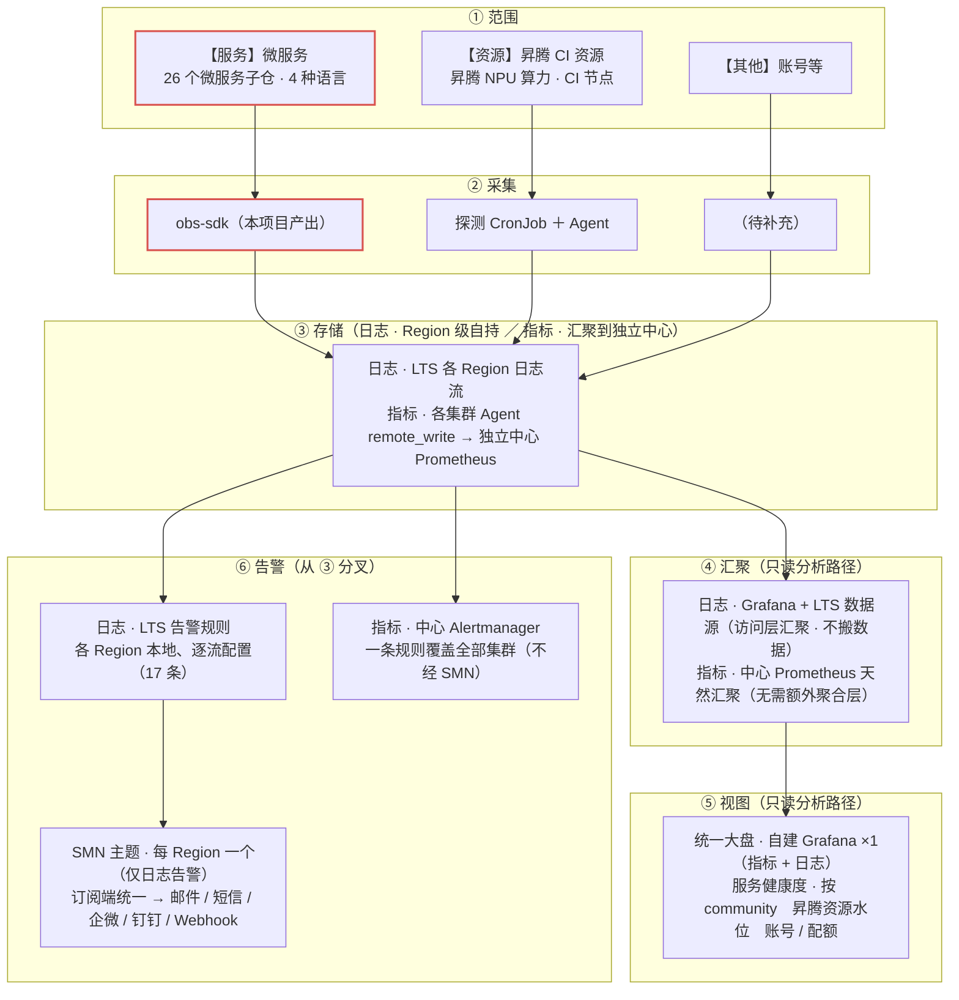
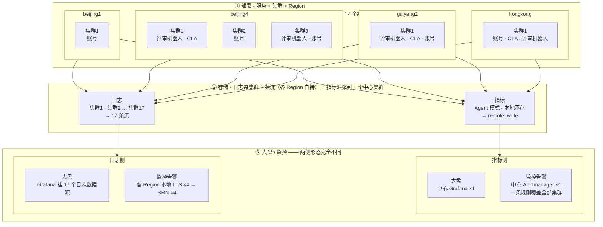
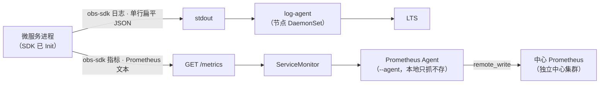

# 微服务可观测性建设技术设计

> 需求：[opensourceways/backlog#1938](https://github.com/opensourceways/backlog/issues/1938)
> 子任务 A（SDK 与试点）：[#2061](https://github.com/opensourceways/backlog/issues/2061) · B（底座与大屏告警）：[#2062](https://github.com/opensourceways/backlog/issues/2062) · C（全量铺开与验收）：[#2063](https://github.com/opensourceways/backlog/issues/2063)
> 契约与 SDK 实现仓：[opensourceways/obs-sdk](https://github.com/opensourceways/obs-sdk)

---

## 1. 背景

### 1.1 问题

基础设施团队维护的重点微服务缺乏统一可观测能力，故障定位靠人工登录机器翻日志，排障链路长、效率低，服务健康度不可见。

各社区另缺一个**统一的服务健康度大盘**（形态可对齐 [GitHub Status](https://www.githubstatus.com/)）：社区用户与运维无法一眼看到整体与各组件（如评审机器人、账号、CLA 等）是否正常、异常落在哪一段？

### 1.2 覆盖范围

以 2025-05-01 ~ 2025-07-31 三个月有 PR 合入的活跃服务为全集，剔除纯配置/部署仓、umbrella 大仓、框架库/工具仓、前端 website 仓后，保留 **15 个大仓 / 26 个微服务子仓 / 390 个合入 PR**。

语言分布不统一：Go 7 · Java 6 · Python 8（+3 待评估）· Node 1 · 编排仓 1。

### 1.3 现状基线

| 能力 | 现状 | 结论 |
| --- | --- | --- |
| 硬件级指标（CPU/内存/磁盘/网络） | 已由华为云 CCE 云原生监控插件（node-exporter / kube-state-metrics）+ icagent 上报控制台 | **复用，不建设** |
| 日志采集管道 | log-agent 插件（fluent-bit / otel-collector）已部署，全局规则 `default-stdout`（`allContainers: true`）采集所有 ns 容器 stdout | **复用，不建设** |
| 日志内容 | 已进 LTS 可全文检索，但**无结构化裸文本、无统一业务字段**（service / level / request_id 不保证、命名不统一） | **建设点：结构化 + 字段统一** |
| 业务指标 | 26 个微服务均未暴露 / 接入 `/metrics`；Prometheus 仅采系统组件 | **建设点：从零接入** |
| 告警 | 无 PrometheusRule、无 Alertmanager | **建设点：从零接入** |
| 监控大盘（对内指标视图） | 无业务级大盘 | **建设点：从零接入** |
| 服务健康度大盘（对外状态视图） | 无，各社区无统一入口，整体/组件级健康度不可见 | **建设点：从零接入** |

### 1.4 关键约束

1. **多语言**：4 种语言、框架不统一（Gin / Spring Boot / Django / FastAPI / Flask / 上游开源项目），不能用单一语言的方案覆盖。
2. **多社区、多 Region**：26 服务 prod 跨 **4 个 Region**（香港 / 北京一 / 北京四 / 贵阳二，约 17 个集群）。同一逻辑服务可能按社区拆成多套独立部署（如 `robot-universal-review` 在 **10 个社区 / 7 个集群**各有一套），需要能按社区维度切片查看健康度。
3. **不能自研 instrumentation**：各语言日志/指标生态成熟，自研只会带来维护负担与生态割裂。

---

## 2. 目标

### 2.1 建设目标

| # | 目标 | 对应验收标准 |
| --- | --- | --- |
| G1 | 26 个微服务暴露 `/metrics`（QPS / 错误率 / 业务自定义指标）并接入 Prometheus | 验收 2 |
| G2 | 26 个微服务日志统一输出**结构化 JSON**（含 service / level / community / request_id 等契约字段）到 stdout，经现有 log-agent 进 LTS，支持按 service / level / community / request_id 检索 | 验收 3 |
| G3 | 建立业务级监控大盘，重点服务健康度集中可见，**支持按 community 维度过滤/分组** | 验收 4 |
| G4 | 关键服务配置告警规则（高错误率 / 宕机 / 资源超阈值）并打通通知到负责人 | 验收 5 |
| G5 | 硬件级指标复用云上，不重复建设 | 验收 1 |

### 2.2 设计原则（方案阶段已定）

1. **薄封装，不自研 instrumentation**。每语言 1 个薄 SDK，内部引用各语言官方库（Go→`client_golang`、Python→`prometheus-client`、Java→`micrometer`+Actuator、Node→`prom-client`），SDK 只做装配：中间件挂载 + 通用字段注入 + 命名对齐 + 一行初始化。
2. **契约先行**。跨语言统一的日志 schema、通用字段、指标命名规范收敛到单一仓库的 `spec/` 目录，是唯一事实来源；四语言实现与 spec 不一致时以 spec 为准。
3. **log 与 metrics 同仓不同 package**，不拆成两个库。
4. **单仓 monorepo**：`opensourceways/obs-sdk`，顶层 `spec/` + `go/ python/ java/ node/`，各语言子目录自管版本。
5. **首期只做 log + metrics，不含 trace**。`trace_id` / `span_id` 作为**预留注入位**存在（字段可写可透传、有值才输出），二期接入 OTel 时零日志格式返工。
6. **Go SDK 独立成库，不放进 robot-framework-lib** —— 后者是机器人领域框架，SDK 需领域中立以服务 24 个非机器人服务。

---

## 3. 整体架构

### 3.1 范围与分层视图

基础设施可观测建设整体分**三块**




**本方案在底座上的四点定位**：

1. **日志 —— 复用，不新建**：继续用各集群**现有的日志流**（CCE 云原生日志采集插件为每集群建的 `k8s-log-*` 组），本方案只改**日志的内容格式**（结构化 JSON + 契约字段），**不动采集管道**。
2. **指标 —— 新建**：26 个服务目前均未暴露 `/metrics`，需从零接入；存储侧**自建 Prometheus 实例**（独立中心集群，见 §4.7），不走华为云托管。
3. **大盘 —— 自建 Grafana**：**一个**实例同时挂中心 Prometheus（指标）+ 17 个日志数据源（日志），见 §4.7.6 / §4.7.8。
4. **已有现成闭环可参照**：**昇腾 CI 资源块**已跑通 **多集群 CronJob + Agent 上报 → 中心 Prometheus 存储 → Alertmanager 告警 → 邮件接收** 的完整链路，本方案的**指标侧与之同构**（见 §4.7.1）。⚠️ 该闭环**不含大盘**（资源块 Grafana 未启用，用的是外部 DataStat 看板），故第 3 点的自建 Grafana 属**本方案新增**，不能当作资源块已验证的能力。

### 3.2 部署与流程视图



本项目的部署形态可先记住三个数：**26 个微服务子仓（4 种语言）→ 17 个 CCE 集群（4 个 Region）→ 上报 17 条日志流 + 1 个中心指标集群**。

第一个数会**放大**：**26 仓 ≠ 26 个部署实例**，同一逻辑服务按社区拆成多套——`robot-universal-review` 一个仓就有 **16 套部署**（生产 10 社区 / 7 集群），所以实际 Pod 实例数远多于 26。

**两侧的上报粒度完全不同**：日志侧**每集群 1 个日志组**（共 17 个，各 Region 自持，见 §4.6）；指标侧**17 个集群的 Agent `remote_write` 汇聚到 1 个独立中心 Prometheus**（见 §4.7）。告警路径自存储层分叉：**指标告警在中心 Alertmanager 统一（一条规则覆盖全部集群）**，**日志告警仍逐 Region 本地 LTS 配置 → SMN**（LTS 无跨流查询，见 §4.6）。**该结构与 §3.1 一致，本图不重复展开。**

**服务侧的接入形态**（每个 Pod 内）：




### 3.3 底座选型（方案阶段已确认）

| 能力 | 选型 | 说明 |
| --- | --- | --- |
| 日志存储 | **LTS**——**日志组按集群划分：每集群 1 个 `k8s-log-{集群ID}`，共 17 个** | 不自建 ES；容器日志写入 `stdout-{集群ID}` 日志流。**各 Region 自持，无跨日志组检索能力**（该限制决定了下方的日志告警形态） |
| 指标存储 | **自建中心 Prometheus**（kube-prometheus-stack）：17 集群 Agent（`--agent`，只抓不存）`remote_write` 汇聚到**1 个中心实例** | 不自研 SDK，**但自建底座**——理由与形态见 **§4.7**。原「AOM Prometheus for CCE」路线**已弃用**（官方确认多实例聚合不支持跨 Region） |
| 日志大盘 | **自建 Grafana（同一实例）挂 LTS 日志数据源 ×17** | 与指标大盘同屏、**跨账号免多登**（§4.7.8）。✅ **接入日志流已确认可行**（2026-09-14 华为云，前提是流已结构化） |
| 指标大盘 | **自建 Grafana（1 个实例）挂中心 Prometheus**。**独立 Deployment、与中心 Prometheus 同集群**（§4.7.6） | 替代原「AOM 托管 Grafana ×4」——一个实例即可覆盖全部 17 集群（§4.7.8）。**只做看板，不进告警链路**（见下行注释） |
| 日志告警 | **各 Region 本地 LTS 内逐流配置（17 条）**，出口经 SMN 统一到订阅端 | 因 LTS **无跨流查询**，一条规则无法绑定多个日志流，**明确接受「无跨集群联合告警」**。**SMN 仅日志告警仍用**（Region 级资源），「统一」落在各 Region 主题**订阅同一接收端**，而非同一主题 |
| 指标告警 | **统一在中心 Alertmanager**（一条规则覆盖全部 17 集群） | 指标侧不再逐 Region 各配；`group_by: [cluster, alertname]` 区分来源 |

**为什么指标告警统一、日志告警仍散**——两条链路能力不同，不是取舍不一致：

1. **指标侧已统一**：数据经 `remote_write` 汇入中心 Prometheus，**告警规则天然覆盖全部 17 集群**，一条规则即可（`group_by: [cluster, alertname]` 区分来源）。这是自建中心相对 AOM 路线的主要收益之一（§4.7.3）；
2. **日志侧统一不了**：LTS **没有跨日志组 / 流的检索能力**，一条告警规则无法绑定多个日志流——该限制已与华为云团队确认。因此日志规则只能**逐流在本地 LTS 内配置（17 条）**，且**跨集群联合条件写不出来**（如「某服务在所有社区的某类失败总数」）；
3. **日志告警出口仍是 SMN**：**SMN 主题是 Region 级资源**（URN 形如 `urn:smn:<region>:<project-id>:<topic>`），故「统一」不在同一个主题，而在**各 Region 主题订阅同一接收端**（邮件组 / 统一 webhook 接收服务）。

### 3.4 贯穿维度：community

`community` 是本次建设的**核心维度**——支撑「按社区查看单服务健康度」。它在日志字段与指标 label 上语义一致，采用**双层注入**：

| 层 | 场景 | 取值来源 | 日志表现 | 指标表现 |
| --- | --- | --- | --- | --- |
| **部署级默认**（静态） | 服务按社区拆实例（每实例只服务一个社区） | Init 注入：`OBS_COMMUNITY` 环境变量或显式参数 | 进程内所有日志的常驻字段 | 所有时间序列的常驻 const label |
| **请求级覆盖**（动态） | 中心化单实例服务多社区（靠路由/鉴权识别归属） | 请求上下文，由 SDK 从 context 读取 | 该请求关联日志的字段值 | 该请求打点的 series 的 label 值 |

---

## 4. 详细设计

### 4.1 契约层（`spec/`）

契约层是本次建设的**技术核心**：它把「多语言输出形态一致」这件事从「靠人自觉」变成「有据可查、可校验」。

#### 4.1.1 日志格式（`spec/log-format.md`）

**输出形态**：每行一条日志，单行 JSON（不 pretty、不换行），UTF-8 写 stdout。

**顶层字段与顺序**：

| 字段 | 必填 | 说明 |
| --- | --- | --- |
| `time` | 是 | RFC 3339 UTC，**固定毫秒精度（3 位小数）**，以 `Z` 结尾 |
| `level` | 是 | 小写枚举 `debug` / `info` / `warn` / `error` |
| `msg` | 是 | 人类可读的**常量短语** |
| `service` | 是 | 服务名（= service.yaml 的服务名） |
| `env` | 是 | `prod` / `test` / `preview` / `staging` |
| `instance` | 是 | 实例标识（k8s pod 名 / hostname） |
| `community` | 是 | 社区标识（部署级默认 + 请求级覆盖） |
| `request_id` | 否 | 单请求关联 ID |
| `trace_id` | 否（预留） | 二期 trace 接入前恒空/省略 |
| `span_id` | 否（预留） | 二期 trace 接入前恒空/省略 |
| `logger` | 否 | 调用位置 `文件:行号`（调试定位） |
| `error` | 否 | 错误信息；有异常上下文的语言可含完整 traceback |
| 其余 | 否 | 业务字段**平铺在顶层**，`snake_case`，禁止嵌套对象 |

**两条关键传参约束**：

1. **`msg` 必须是常量短语，禁止 printf 风格**（`log.Errorf("failed for user %s", uid)` 违规）。所有可查询维度通过 kv 传入：`log.ErrorContext(ctx, "get account failed", "user_id", uid, "error", err)`。
   *理由*：`msg` 一旦嵌值，同一事件每行都不同 → LTS 无法按 `msg` 聚合计数，日志告警规则**静默失效**；改文案即破坏已配置的检索。四语言 SDK **只提供 kv 形式，无 printf 变体**。
2. **业务字段扁平**，不允许嵌套对象。嵌套会给 LTS 侧字段提取带来歧义。

> `error` 字段**不适合聚合**（取值逐次不同，Python 等语言还含 traceback）。按错误类型聚合请用 `msg` 常量 + 业务字段（如 `error_code`）。

#### 4.1.2 通用字段（`spec/common-fields.md`）

7 个通用字段的来源与注入优先级：

| 字段 | 注入层级 | 静态/动态 | 环境变量 | 内置默认 |
| --- | --- | --- | --- | --- |
| `service` | Init（进程级） | 静态 | `OBS_SERVICE` | `unknown` |
| `env` | Init（进程级） | 静态 | `OBS_ENV` | `unknown` |
| `instance` | Init（进程级） | 静态 | `OBS_INSTANCE` | **hostname** |
| `community` | Init + 请求上下文 | 双态 | `OBS_COMMUNITY` | `unknown` |
| `request_id` | 请求上下文 | 动态 | — | 无 |
| `trace_id` | 请求上下文（预留） | 动态/预留 | — | 无 |
| `span_id` | 请求上下文（预留） | 动态/预留 | — | 无 |

取值优先级：**SDK Init 显式参数 > 部署环境变量 > 内置默认**。
变量名统一 `OBS_*` 前缀，四语言读同一套变量名，保证部署模板（helm values）不因语言而异。

**`request_id` 注入策略**：可信入站头（如 `X-Request-Id`，**在服务已校验可信时**）> 中间件自动生成（UUID）> 无。出站调用应向下游传播，保证全链路同 ID。

#### 4.1.3 指标格式（`spec/metrics-format.md`）

- **命名**：全小写 `snake_case`，单位后缀遵循 Prometheus 约定（`_total` / `_seconds` / `_bytes`）。
  - 业务指标强制前缀 `<service>_`（服务短名）。例：`review_http_requests_total`。
  - 共享中间件公共指标用 SDK 保留前缀 **`obs_`**（不按 service 名开头——同一条 series 已带 `service` label，查询按 label 过滤）。例：`obs_http_server_requests_total`。
- **通用 label 集**（每条 series 必须带）：`service` / `env` / `instance` / `community`。
  - 前三个是 const label；**`community` 是唯一可动态的公共 label**。
- **community 双层注入的指标实现**：对需要区分社区的指标，注册时把 `community` 声明为**普通可变 label**（service/env/instance 仍作 const label），打点时由 SDK 从上下文取覆盖值。**注册一次，单社区场景填默认值、多社区场景填覆盖值，两用。**
- **高基数禁令**：`request_id` / `trace_id` / `span_id` / PR number / commit sha 等**禁止**作 label，会撑爆时序基数。
- **暴露**：每服务一个 `/metrics` 端点，HTTP `GET`，Prometheus text format。

#### 4.1.4 community 枚举（`spec/community-values.md`）

18 个社区：`Ascend · BoostKit · CANN · Common · HiFloat · HPCKit · Infrastructure · Merlin · MindSpore · openEuler · OpenFuyao · openGauss · OpenJiuwen · openLookeng · OpenPangu · OpenUBMC · UnifiedBus · Xihe`。
权威来源是 `infrastructure` 仓 `service.yaml` 的 `communities` 段，随上游刷新。

---

### 4.2 四语言 SDK

#### 4.2.1 语言 × 能力矩阵

| 能力 | Go（`go/`） | Python（`python/`） | Java（`java/`） | Node（`node/`） |
| --- | --- | --- | --- | --- |
| 模块/包名 | `github.com/opensourceways/obs-sdk/go` | `obs-sdk-python` | `obs-sdk-java` | `obs-sdk-node` |
| log 底层 | stdlib `log/slog` + 自研 Handler | stdlib `logging` + 自定 JSON Formatter | logback + logstash JSON encoder | 自定 JSON serializer |
| metrics 底层 | `client_golang` | `prometheus-client` | `micrometer` + Prometheus registry | `prom-client` |
| Init | `log.Init(cfg)` / `metrics.New(cfg)` | `log.init(...)` / `metrics.init(...)` | `ObsLogging.init(cfg)` / `ObsMetrics.of(cfg)` | `log.init(opts)` / `new Metrics(opts)` |
| 请求上下文 | `sdkctx`（`context.Context`） | `_context`（contextvars） | `RequestContext`（MDC + ThreadLocal） | `context`（AsyncLocalStorage） |
| 中间件 | `middleware`（net/http）+ `ginmw`（gin） | `fastapi_wrap` / `flask_middleware` / `DjangoMiddleware` | `ObsFilter`（Servlet Filter） | `makeMiddleware`（express） |
| 服务端指标 | `obs_http_server_*`（中间件） | 同上 | 走 Actuator + Micrometer 官方 server instrumentation（不重复埋点） | `obs_http_server_*`（中间件） |
| UT 数量 | 31 | 15 | 19 | 10 |
| 已发版 | ✅ `go/v1.0.0` | ❌ 版本号 `0.1.0`，未打 tag | ❌ 版本号 `0.1.0`，未打 tag | ❌ 版本号 `0.1.0`，未打 tag |
| CI | `go vet` + `go test` | `pytest`（Py3.10） | `mvn test`（JDK 17） | `npm test`（Node 20） |

#### 4.2.2 Go SDK 设计要点

```go
// 启动时 Init 一次，之后全进程用包级函数（形状对齐 kratos v3，无需在每个调用点绑定 logger）
obslog.Init(obslog.Config{Service: "review", Community: "openeuler"})

// 日志：msg 常量 + kv 交替（禁止 printf）
obslog.Info("job done", "event", "release", "issue", "2061")
obslog.ErrorContext(ctx, "get account failed", "user_id", uid, "error", err) // ctx 里请求字段自动附加

// 指标：注册一次；community label 自动排首位，取请求覆盖或回退默认
m := obsmetrics.New(obsmetrics.Config{Service: "review"})
built := m.NewCounterVec("built_releases", "发布的构建数", "kind")
built.IncWithContext(ctx, "tag")

// 中间件
h := obshttpmw.New(obshttpmw.Options{Metrics: m, ResolveCommunity: fn}).Then(myHandler)
```

关键实现选择：
- **自定义 slog Handler** 而非第三方库：直接控制字段、顺序、时间格式，且无需引入额外依赖。
- **手工构造 `slog.Record` 并控制 `runtime.Callers` skip**，让 `logger` 字段指向业务调用点而非 SDK 内部包装函数。
- 包级 API 形状对齐主流生态（`log/slog`、kratos v3），降低接入心智负担。

#### 4.2.3 Java SDK 设计要点

Java 侧有一个**非显然的坑**，必须在接入文档里强调：

> 日志 JSON 输出**必须**用 `java/examples/logback-json.xml`，它只挂 SDK 的 `ObsJsonProvider`。**不要退回 encoder 自带的 provider** —— `<logLevel/>` 只能输出大写、字段名不可配、且不配 `<stackTrace/>` 会整条丢弃 throwable。

即：Java 的字段名/顺序/时间格式/级别小写/异常堆栈**由 SDK 的 provider 保证**，不能靠 logstash encoder 的配置凑。

Java 的**服务端指标不重复埋点**——走 Spring Boot Actuator + Micrometer 官方 server instrumentation，把 `m.meterRegistry()` 暴露成 bean 由 Actuator 托管。

#### 4.2.4 已知实现问题（需修复）

| 问题 | 影响 | 位置 |
| --- | --- | --- |
| Java `fromEnvironment()` **无任何兜底**：只读 `OBS_*`，未设置时为 `null`，而 provider 对空值「省略该键」 | `service` / `env` / `instance` / `community` 四个**必填**字段在未注入环境变量时**整个 Key 不出现**，违反契约。Go / Python / Node 均回退到 `unknown`（`instance` 回退 hostname） | `java/.../ObsSdkConfig.java:41` |
| Python / Node / Java 未打 tag | 消费方无法按版本引用 | 各语言子目录 |

---

### 4.3 服务接入模式（按语言）

#### 4.3.1 Go 服务（7 个）

`app-cla-server` / `cve-sa-backend` / `cve-manager-ng` / `robot-universal-label` / `review` / `repo-watcher` / `welcome`

```go
obslog.Init(obslog.Config{Service: "<name>"})
m := obsmetrics.New(obsmetrics.Config{Service: "<name>"})

// HTTP 服务端：gin 用 ginmw，net/http 用 obshttpmw.New(...).Then(handler)
r.Use(ginmw.Middleware(ginmw.Options{Metrics: m}))
r.GET("/metrics", gin.WrapH(m.Handler()))

// 指标：基础名注册，community label 由 SDK 自动补、排首位
prHandled := m.NewCounterVec("pr_handled", "处理的 PR 事件数", "action")

// 请求内：community 在可信判定点解析后覆盖，request_id 注入
ctx = sdkctx.WithCommunity(ctx, "openEuler")
ctx = sdkctx.WithRequestID(ctx, "req-123")
obslog.InfoContext(ctx, "handle request", "repo", repo)
prHandled.IncWithContext(ctx, "opened")
```

#### 4.3.2 Java 服务（6 个）

`EasySearch` / `EasySearchImport` / `om-webserver` / `certification-server` / `easysoftware-autoupgrade` / `APIMagic`，均 Spring Boot 3.x：

```java
ObsSdkConfig cfg = ObsSdkConfig.fromEnvironment();   // 读 OBS_*
ObsLogging.init(cfg);                                // 部署级字段写入 MDC
ObsMetrics m = ObsMetrics.of(cfg);                   // meterRegistry() 暴露为 bean，交 Actuator 托管

log.info("job done");                                // SLF4J 输出走 logback-json.xml（挂 ObsJsonProvider）

// 请求内：可信判定点解析 community 后 push
try (RequestContext.Scope s = RequestContext.push("openEuler", "req-123", null)) {
    m.counter("pr_handled", "处理的 PR 事件数", "action").inc("opened");
}
```

`logback-json.xml` 见 [java/examples/logback-json.xml](../java/examples/logback-json.xml)；`/metrics` 由 Actuator 暴露（打开 `prometheus` endpoint），不重复埋服务端指标。

#### 4.3.3 Python 服务（11 个）

```python
from obs_sdk import log, metrics, _context
from obs_sdk.middleware import fastapi_wrap          # Flask: flask_middleware；Django: DjangoMiddleware

log.init(service="<name>")                           # env/community 由 SDK 读 OBS_*，进程内幂等
metrics.init(service="<name>")
fastapi_wrap(app, resolver=resolve_community)        # 注入 request_id + 可信判定点解析 community + 记 obs_http_server_*

logger = log.get_logger(__name__)
logger.info("job done", extra={"event": "release", "issue": "2061"})

with _context.bind(community="openEuler", request_id="req-123"):
    metrics.counter("pr_handled", "处理的 PR 事件数", ["action"]).inc(1, action="opened")
```

`/metrics` 暴露：`return Response(content=metrics.generate_text(), media_type=metrics.content_type())`。

适配器按框架分三类：Django×3（meeting-center / meeting-platform / app-meeting-server）、FastAPI×4（oss-map / robot-issue-manage / hotopic-data-clean / om-dataarts）、Flask×1（forum-reply-robot）。**另 3 个非标准框架无现成适配器，需单独方案**：mailman（GNU Mailman）、copr_docker（Fedora COPR）、hotopic-mining（脚本/包型）。

#### 4.3.4 Node 服务（1 个）

`etherpad-lite` 是**上游开源项目**（Etherpad，Express + Socket.IO）。接入需注意与上游代码保持可合并性，改造面要尽量小。

#### 4.3.5 不直接接入

`meeting-server` 是编排/部署型子仓（Shell + Go Template），由旗下子服务（app-meeting-server / meeting-center / meeting-platform）覆盖。

---

### 4.5 部署侧字段注入

日志/指标要带上 `env` 和 `community`，必须由部署侧注入（pod 内无免费信号可推）：

- `instance` **不用注入** —— SDK 默认取 hostname（k8s 下 = pod 名）。
- `service` **不用注入** —— 编译期常量，代码 `Init` 里写死。
- **`env` / `community` 必须注入** —— 无法从 pod 名、namespace、节点名、镜像 tag 推导。
  - namespace 推不出：`openEuler` 的 prod-02 与 test 都叫 `robot-openeuler`；`OpenUBMC` 的 prod 与 test 都叫 `robot-openubmc`。
  - 集群名推不出：它是 ArgoCD 规范名，**pod 内无法自省**。

**注入方式**：在 `Open-Infra-Ops/helm-chart-value` 各部署目录的 `values.yaml` 里，给对应 deployment 加：

```yaml
    env:
      - name: OBS_ENV
        value: prod
      - name: OBS_COMMUNITY
        value: ascend
```

（chart 已支持 env 透传，同文件 `sync-bot` 在用同款写法。）

**值域口径**：
- `community` **统一小写**（依据 `spec/community-values.md`；四语言 SDK 都不做大小写归一，注入值即最终形态）。
- `env` 需 `prod*` → `prod` 的映射（service.yaml 里存在 `prod-github`、`prod-02` 等，不在契约枚举内）。

**范围（以 `robot-universal-review` 为例）**：需改 **12 个部署目录**（不是 10 个——Common 与 Ascend 各有两套部署，同社区同值）。生成脚本要**按部署目录迭代，不能按社区迭代**。

> **备选方案（已否决）**：从 `(cluster, namespace)` 二元组反推 community。实测该组合对这 4 个机器人服务零冲突，但全域 375 个组合中已有 10 个跨社区（如 `ascend-guiyang-prod-cluster/ascend` 同时跑 Ascend 与 CANN），且 cluster 名 pod 拿不到。
> **结论**：`(cluster, namespace)` 只作**校验**用途（断言注入值与映射仓一致），不作取值来源。

---

### 4.6 底座与观测消费侧

| 组件 | 设计 |
| --- | --- |
| **日志采集** | 复用 CCE 云原生日志采集插件（log-agent，基于 fluent-bit，节点 DaemonSet）。集群级 `default-stdout` 策略已覆盖**全 ns 全容器 stdout**，铺开**无需新增采集策略**——服务只要写 stdout 就进 LTS。 |
| **日志存储/检索** | LTS（各 Region 自持）。结构化后支持按 `service` / `level` / `community` / `request_id` 检索与聚合。**方案已定见 §4.6「【已定 · 2026-09-11】日志汇聚方案」**：拓扑为**每集群 1 个默认流 + Grafana 多数据源汇聚**，**采集范围先不收窄**（全量落流），结构化解析**只针对 obs-sdk 契约格式配 JSON 规则**，噪音在**查询侧**按 `service` / `community` 字段过滤。**统一检索入口走访问层汇聚**——Grafana + LTS-Grafana 数据源多源拼装，**不搬数据、保留 SQL**；**跨账号由自建 Grafana 解决**（LTS 数据源用 AK/SK 认证，一个实例可挂多套凭证，见 §4.7.8），**不再需要 LTS 多账号日志汇聚中心**。 |
| **指标采集** | 各集群 **Prometheus Agent**（`--agent`，本地只抓不存，ServiceMonitor 选目标 + `/metrics` 端口）→ `remote_write` |
| **指标存储** | **1 个独立中心 Prometheus 集群**（kube-prometheus-stack，`replicas: 2` + 反亲和，本地 30d）。**已弃用**「AOM Prometheus ×4 Region + 多账号聚合」路线——详见 **§4.7** |
| **大盘** | **已决：自建 Grafana ×1**（独立 Deployment，与中心 Prometheus 同集群），同时挂**中心 Prometheus（指标）+ LTS 数据源 ×17（日志）**——详见 **§4.7.6 / §4.7.8**。大盘内容：服务健康度（QPS / 错误率 / 延迟 / 资源）+ 日志检索，支持按 `community` 过滤/分组。**"看"与"告警"解耦**——大盘只影响可见性，采集 / 存储 / 告警均不依赖它。✅ **硬依赖已确认（2026-09-14，华为云团队）**：自建 Grafana 可接入各集群日志流，**前提是流已配置结构化**。**剩余唯一卡点是结构化解析本身**（§4.6 (a0)(i)） |
| **告警** | **指标：统一在中心 Alertmanager**——数据已汇聚，一条规则覆盖全部 17 集群（`group_by: [cluster, alertname]`），不经 SMN。**日志：仍为各 Region 本地 LTS 逐流配置（17 条）**，出口经各 Region SMN 主题 → 同一接收端（LTS 无跨流查询，**明确接受「无跨集群联合告警」**）。**告警从 ③ 存储分叉，不依赖 ④⑤**（见 §3.3）。 |

**日志采集管道的约束（影响接入与验收口径）**：

| 约束 | 影响 |
| --- | --- |
| containerd 运行时下**容器 stdout 的多行配置不生效** | 契约的「**单行**扁平 JSON」是硬约束而非风格偏好——多行日志会在 LTS 里被拆成互不相关的多条 |
| 单条日志 **≤ 512 KB**；单节点约 **10000 条/秒** | Python / Java 契约允许 `error` 字段带完整 traceback，超长堆栈需截断 |
| stdout 为**非持久化存储** | 轮转清历史、Pod 终止回收、节点磁盘压力自动清理均可能丢日志——**日志是排障手段，不作审计/账本**，需在接入文档中明示 |
| 容器存活 **< 1 分钟可能采不到** | 短命 Job / 一次性任务的日志有丢失风险 |
| 每集群最多 **100 条**采集策略；变更 **1–3 分钟**生效 | 靠 `default-stdout` 一条策略覆盖全部服务，**不应为单服务新增策略** |
| **日志流名称全局唯一**（不能跨日志组重名） | 插件默认名 `stdout-{集群ID}` 天然唯一、无冲突；**若将来自定义日志流名，需自带唯一性前缀**，否则跨集群建不出来 |
| 日志组按集群划分（`k8s-log-{集群ID}`，每集群 1 个） | 跨集群检索需在**多个日志组间**查询；LTS 的汇聚 / 检索入口要按日志组粒度设计，**不能假设「一个 Region 一个日志组」** |
| **LTS 无「跨日志组检索」**——搜索 / 快速查询 API 均以 `groups/{group_id}/topics/{topic_id}` 限定**单一组 / 流** | **17 个日志组不会自动汇成一个检索入口**，必须显式选一条汇聚路径，见下行 |

**日志汇聚：17 个集群日志组怎么收成一个检索入口**

LTS **没有「跨日志组检索」能力**——搜索、快速查询及其列表的 API 全部以 `groups/{group_id}/topics/{topic_id}` 限定在**单个日志组 / 日志流**内，控制台也是逐组进入详情页。因此 **17 个 `k8s-log-{集群ID}` 不会自动汇成一个入口**。

> **【已定 · 2026-09-11】日志汇聚方案**
>
> 经多轮现网实测与推演，日志侧收敛为下述形态。**本节以下内容（术语辨析、官方口径表、A/B/C/D 选项）是决策过程，不是方案本身。**
>
> | 维度 | 决定 | 理由 / 代价 |
> | --- | --- | --- |
> | **大盘前端** | **【2026-09-14 更新】自建 Grafana ×1**（独立 Deployment，与中心 Prometheus 同集群），同时挂**中心 Prometheus + LTS 数据源 ×17** | **原选「AOM 托管 Grafana ×4」的前提已失效**——指标侧改为自建中心后（§4.7），"避免自建"这条理由不再成立。自建还能一次解决**跨账号免多登**（AK/SK 按数据源各带一套）+ **日志指标同屏**，见 §4.7.8。✅ **硬依赖已确认（2026-09-14，华为云团队）**：自建 Grafana 可接入各集群日志流，**前提是流已配置结构化**。**剩余唯一卡点是结构化解析本身**（§4.6 (a0)(i)） |
> | **拓扑** | **每集群 1 个默认流**（`stdout-{集群ID}`）不变，Grafana 多数据源汇聚，**不搬数据** | 即原"路径 ① / 选项 C"。**D 已否决**，见下方否决记录 |
> | **采集范围** | **先不收窄**（保持 `default-stdout` 全量） | 用**配额与存储**换取**零运维复杂度**：新服务自动纳入、**无采集窗口期**、不维护 ns 白名单、**sidecar 不再需要插件支持"按容器名排除"**。代价是基础设施 / 第三方日志一并落流（容量已量化，余量一到两个数量级，暂不成问题） |
> | **结构化解析** | 只针对 **obs-sdk 契约格式**配 **JSON 规则** | 非 JSON 行（基础设施文本 / ANSI 着色文本 / Envoy access log）解析失败后**原样保留**，不污染结构化字段 |
> | **噪音过滤** | **在查询侧做**，不在采集侧 | 面板查询统一带 `WHERE service = '...'`：logrus 行与第三方 JSON 因**缺 `service` 字段**被自然排除；sidecar 与基础设施日志因**无结构化字段**被自然排除 |
> | **告警** | **日志：LTS 原生，逐流配置（17 条）**；**【2026-09-14 更新】指标：统一在中心 Alertmanager，一条规则覆盖全部 17 集群** | **日志侧明确接受「无跨集群联合告警」**——LTS 无跨日志流查询，17 条规则之间无法汇总（例如"某服务在所有社区的某类失败总数"这类**跨集群联合条件写不出来**）；换来的是**通知链路完全不变**（仍走各 Region 的 SMN → 统一订阅端），且**无需设计"Grafana 告警 → 接回 SMN"**那套适配。**指标侧无此限制**——数据已汇聚到中心，告警天然统一，这是自建中心相对 AOM 路线的主要收益（§4.7.3） |
>
> **面板筛选策略**：
>
> | 面板 | `community` | `service` | 理由 |
> | --- | --- | --- | --- |
> | 日志 · 明细/排障 | **必选（多选，至少 1）** | **必选（多选，至少 1）** | 排除误伤（全量采集下本 Region 日志流里混有基础设施 / sidecar / 第三方日志）；两字段合用 ≈ **精确定位到一个部署**。**必须多选**——单选会堵死"互调服务联合排查" |
> | 日志 · 聚合/对比 | 默认全选 | 默认全选 | 跨社区横向对比（如"某服务在所有社区的表现"）是真实需求，且结果集小 |
> | 指标 | **默认全选，不强制** | — | **中心 Prometheus 存储已聚合**（全部 17 集群汇入同一实例），不筛选无查询放大问题；`community` 是低基数 label，`sum by (community)` 成本可忽略。**必选会禁掉横向对比，而横向对比恰是指标大盘最有价值之处**。担心误读时在面板标题显示当前筛选值即可 |
>
> > 两侧策略不同不是随意的不一致——**「必选筛选」本质是给"日志存储物理分裂成 17 个流"打的补丁**；指标侧存储本就聚合，不需要这个药。
>
> **⚠️ 已知代价（需明确接受，不是意外）**：
> 1. **`robot-framework-lib` 的 121 处 logrus 打点（client 88 / config 14 / interrupts 11 / framework 6 / utils 2）在大盘上不可见**——其字段集无 `community` / `service`，被必选筛选条件排除；
> 2. **配额 / 存储不设防**——全量落流；
> 3. **聚合/对比面板要打 17 个数据源**，加载慢，任一失败则面板残缺。
>
> **本方案仍需验证的前置项**（按优先级）：
> 1. **(a0)(i) 全量流上能否配结构化解析**——**⚠️【2026-09-14 升级为唯一卡点】** 自建 Grafana 接入日志流已确认可行（见 4.7.8），**其前提正是"流已结构化"，故本项现在是日志大盘链路上唯一未解的门槛**。配不了则日志大盘整个不成立（但**指标大盘与全部指标链路不受影响**——两者已解耦）；
> 2. ~~**`hws-lts-grafana-datasource-plugin` 能否装进自建 Grafana**~~ → ✅ **【已确认 · 2026-09-14，与华为云团队沟通】** **自建 Grafana 可以接入各集群日志流**，前提是**日志流已配置结构化**。**此项已消解**——代价不再是"退回 LTS 控制台"，**日志大盘确定落在自建 Grafana**。⚠️ **卡点转移到第 1 项（结构化解析）**，它是现在**唯一**的门槛；
> 3. **多账号的实际情况**——到底几个账号、如何在组织内管理；决定**自建 Grafana 里要配几套 LTS 数据源的 AK/SK**（一个实例即可承载多套，见 §4.7.8），也决定**回退到 LTS 控制台时要登录几个账号**。
>
> ~~跨 Region 网络（(a1)(a2)(a3) 三选一）~~ **【2026-09-14 重新需要】**——原判断「每 Region 一个实例、跨 Region 网络问题自动消失」**仅对日志大盘成立**；**指标侧改为自建中心后（§4.7），跨 Region 网络是无论如何都要打通的**（§4.7.5 第 3 项，本方案**新的硬门槛**），日志侧**复用同一条即可**，不构成额外开销。下方 (a1)/(a2)/(a3) 仍然适用。
>
> **否决记录**：
> - **方案 D（按 Region 汇聚为 1 流）**——依赖太多、不确定性大。两个硬前提均未验证：**(e) 多集群能否共用同一日志流**（官方无任何记载）；**结构化解析按流配置**意味着 D 把 Region 内所有集群的**接入进度与解析配置绑死**（任何集群输出有差异即污染整个 Region 的流，且迁移期必然有差异）。另有三项确定代价：爆炸半径从 1 个集群放大到整个 Region、单流 **500 请求/秒**被多集群写入叠加、失去 CCE 控制台按 ns / 工作负载 / 容器查询的能力。
> - **自建日志前端**（把 LTS 多流引出来自绘页面）——见上表"大盘前端"行。
> - ~~**自建统一 Grafana**（1 个实例同时覆盖日志 + 指标）~~ —— **【2026-09-14 已采纳，否决撤回】**
>   原否决理由是「要付跨 Region 网络 + 自行运维」。**指标侧改为自建中心后（§4.7），这两项成本已经为指标付过了**，日志接进来是**边际成本近乎为零**（多配 17 个数据源）。现方案：**自建 Grafana ×1 同时承载指标 + 日志**，见 §4.7.6 / §4.7.8。

**先厘清术语**——「集中日志流」是官方词，指的是**每集群**，不是跨集群：

| 官方术语 | 含义 | 粒度 |
| --- | --- | --- |
| **采集到集中日志流** | 用默认 `k8s-log-{集群ID}` + `stdout-{集群ID}`，**同集群内所有容器的 stdout 汇到一个流** | **每集群 1 流 —— 即本项目今天的形态** |
| **采集到自定义日志流** | 自选日志组 + 日志流，可让不同工作负载进不同的流 | 可细分到工作负载 |

> **⚠️ 一个必须先纠正的前提**：官方对「采集到集中日志流」的缺点原文是「**不同工作负载的日志结构不一样**，采集到一个日志流后无法配置结构化解析，无法使用 SQL 可视化分析」。该缺点**在本项目当前形态下已经成立，与是否跨集群汇聚无关**——现有 `default-stdout` 策略是 `allContainers: true` + 全部命名空间，`stdout-{集群ID}` 里混着多类负载，是彻底的异构流，结构化解析本来就配不上。

> **⚠️ 实测补充（2026-09-11，来自现网 `stdout` 流的抽样）**：抽样 10 条**全部**是**日志基础设施自身**的日志，**没有一条业务服务日志**。
> **补充（同日，另一集群）**：该 10 条样本**不代表全貌**——在集群 `openeuler-hk-cce-x86` 中检到了货真价实的业务服务日志（`repo-watcher` / ns `robot-github-openeuler`），说明**业务日志确实在流里**，第一批抽样撞上的是采集器刷屏窗口。**同时，业务日志是 `robot-framework-lib` 的 logrus JSON，不是 obs-sdk 契约格式**——落库后同一流内并存两套格式（细节见待验证项 (a0-1b)），这直接影响下面的"收窄后即同构"判断：**收窄只解决"业务 vs 基础设施"的同构，不解决"logrus 行 vs obs-sdk 行"的同构**。
>
> **⚠️ 流内格式清单（2026-09-11 实测，至此已确认四种）**——这是"结构化解析配不上"最直接的证据，也是评估**结构化解析工作量的基线**：
>
> | # | 来源 | 格式 | 时间基准 |
> | --- | --- | --- | --- |
> | 1 | `fluentd-*` / `log-agent-fluent-bit-*` | 基础设施文本 | 本地 |
> | 2 | `repo-watcher`（机器人服务，走 robot-framework-lib） | **logrus JSON** | UTC **秒精度** |
> | 3 | `cve-manager`（普通 Gin 服务） | **ANSI 着色文本**（`[1;34m[I][0m [hook.go:146]`） | 本地 CST |
> | 4 | `istio-proxy`（ASM sidecar，**同 Pod 另一容器**） | **Envoy access log** | UTC 毫秒 |
>
> 第 3 种把 ANSI 转义码写进了日志——**是给终端看的 logger，不是给日志系统看的**，正是本设计要消除的形态。第 4 种由 `allContainers: true` 带入，**按 ns 收窄挡不住**，见待验证项 (a0-1d)。
> - `fluentd-*`（平台自建、写 ES 的那套）——多条 `[out_es] failed to write data into buffer by buffer overflow action=:throw_exception`、`suppressed same stacktrace`；
> - `log-agent-fluent-bit-*`（CCE 插件采集器本身）——`Get the pod list from kubelet failed: failed to unmarshal podlist`。
>
> `content` 字段格式横跨 Ruby fluentd 文本、**带 ANSI 转义码**（`[1;31m[E][0m`）的 Go 日志、k8s 容器日志路径 tag（`..._monitoring_otel-collector-...log`）——**没有任何单一 JSON 规则能吃下这些**，是对"结构化解析配不上"的直接实证。
>
> **由此多出一个此前未识别的风险——采集链路的正反馈放大**：采集器自身出问题（buffer overflow / 限流 / pod 列表抓取失败）→ 吐更多错误日志 → 这些日志**又走同一条采集链路** → 采集器压力更大。即"**故障越严重、日志越多、越可能触发『可能丢日志』的软阈值**"。在选项 D（Region 共用一个流）下该效应还会**跨集群传导**。

**第一步：把采集范围收窄**（与汇聚无关，无论最后怎么选都要做）

CCE 插件的日志采集策略支持按命名空间限定范围（插件版本 **1.6.1+**）：

```yaml
# 容器标准输出类策略
allContainers: true
namespaces: ["robot-openeuler", "robot-openubmc", ...]   # 空数组 = 全部命名空间（现状）
# excludePodLabels 可排除特定 Pod，需插件 1.7.4+
```

收窄后，流内容在「**业务日志 vs 基础设施日志**」这一维度上同构了——**但这只是同构的一半**。

> **⚠️ 更正（2026-09-11，基于现网证据）**：此前此处写的是"契约保证 26 个服务输出同一套 JSON 字段"，**该表述不成立**。现网检到的业务日志是 **`robot-framework-lib` 的 logrus JSON**（`component/error/file/func/level/msg/time`），`level: fatal`、`time` 秒精度、无 `service/env/instance/community/request_id`——**与 obs-sdk 契约行不同构**。
> 且**不是过渡期现象**：框架那 121 处 logrus 打点会长期保留，**两套格式的共存是稳态而非临时**。
> **因此"收窄 → 即可配结构化解析 → 即可 SQL 聚合"这条链，中间还缺一环**：得先明确 LTS 侧对这两套格式怎么处理（分别配解析？还是在云端做字段归一化？还是只对 obs-sdk 行做索引、logrus 行仅全文检索？）。这一点未定之前，**"结构化解析配得上"仍不成立**，只是从"多类负载混流"变成了"两类 JSON 混流"——后者好治得多，但仍需显式处理。

**第二步：选汇聚粒度**

| 路径 | 做法 | 代价 / 前提 |
| --- | --- | --- |
| **① 不汇聚（每集群 1 流）+ Grafana 多数据源** | 各集群上报到**自己的**日志流；装华为云 **LTS-Grafana 插件**（`hws-lts-grafana-datasource-plugin`），**一个数据源绑一个日志流 ID**，面板侧用 Grafana 的 Mixed 数据源一次查多个流——**统一检索入口在 Grafana 侧拼出来，不搬数据** | ① **数据源数 = 日志流数（17）**，配置量与使用体验都不轻；② 数据源 `Endpoint` 按 Region 选 → 跨 Region 至少 **4 套**，**Grafana 需网络可达 4 个 Region 的 LTS 端点**；③ 插件需 **Grafana ≥ 9.0**，且要先在 LTS 控制台**开通「可视化」功能**；④ 数据源要求日志流**已配置结构化** |
| **② 按 Region 汇聚（每 Region 1 流）+ Grafana** | 各集群的采集策略**都指向同一个**日志组 + 日志流（如 `obs-{region}` / `obs-app-stdout`）→ 每 Region 1 流 | ① Grafana 侧降到 **4 个数据源、4 个查询目标**，明显清爽；② **官方无「多集群共用同一日志流」的配置说明**——下拉框里"看起来能选"，**属未验证**；③ 失去按集群隔离；④ 单流 **100 MB/s** 上限（4 路分摊） |
| **③ 按 Region 汇聚 + 多账号日志汇聚中心** | 走 Organizations，把各日志流**复制**到聚合账号 | ~~依赖 Organizations；跨 Region 是否成立未确证~~ **【已不需要】** 跨账号已由**自建 Grafana 的 AK/SK 多数据源**解决（§4.7.8），**不再需要日志汇聚中心**；复制方案的"存储翻倍"代价也随之避免 |
| **④ 不汇聚、也不上 Grafana** | 接受 17 个日志组，控制台逐组进 | 没有统一检索入口，跨 Region 只能人工切换 —— **不建议** |

> **⚠️ 时序上有个陷阱**：Grafana 的 LTS 数据源要求绑定的日志流**已配置结构化**，所以**所有路径都以"按 namespace 收敛采集"为共同前提**，没有"不动采集"的选项。

#### 官方口径：集中日志流 vs 自定义日志流

LTS/CCE 文档对「接入时选哪种采集方式」给了一张明确的权衡表，**倾向是"集中日志流"**：

| 采集方式 | 优点 | 缺点 |
| --- | --- | --- |
| **采集到集中日志流**（插件默认） | 在 CCE 界面可按命名空间 / 工作负载 / 容器名**直接查**对应日志 | 不同工作负载日志结构不一样 → **无法配置结构化解析、无法用 SQL 可视化分析**；单流 **100 MB/s**，大流量有瓶颈 |
| **采集到自定义日志流** | 可配置结构化解析、可用 SQL；多流写入速率**线性扩增**，大流量无瓶颈 | **CCE 界面无法**按命名空间 / 工作负载 / 容器名直接查 |

官方的判据是：**"主要靠 CCE 界面翻日志、流量不大" → 集中日志流；"需要结构化解析 / SQL 分析 / 大流量" → 自定义日志流**。本项目属于后者（日志要聚合告警 → 要 SQL）。

> **⚠️ 但官方这张表漏了第三个选项**：它隐含假设「集中日志流 = 全部命名空间全部容器」，而**采集范围其实独立可调**（即上面的第一步）。于是：

（下表用 **A/B/C/D** 编号，与上面那条"汇聚粒度"表的 ①②③④ 是两回事，别串）

| 选项 | 流 | 采集范围 | 流内容同构？ | CCE 界面按 ns/负载查？ | Grafana 数据源 |
| --- | --- | --- | --- | --- | --- |
| 现状 | 默认 `stdout-{集群ID}` | 全部 ns | ❌ | ✅ | — |
| **A** 集中日志流（官方推荐） | 默认 `stdout-{集群ID}` | 全部 ns | ❌ | ✅ | 17 |
| **B** 自定义日志流（官方备选） | 自选，按工作负载拆 | 自定 | ✅ | ❌ | 17+ |
| **C** 默认流 + 收窄 ns（**建议先试**） | 默认 `stdout-{集群ID}` | `namespaces: [...]` | ✅ | ✅ | 17 |
| **D** 自定义流 + 按 Region 共享 | 各集群同一个流 | 各自收窄 | ✅ | ❌ | **4** |

**选项 C 两头都要**：流只含我们的服务 → 同构 → 结构化解析能配；同时保住 CCE 界面按 ns / 工作负载 / 容器名查看的能力（官方说自定义流会丢掉的那个）。

> **与指标链路的同构性（支持 D 的一个独立论据）**：~~AOM 侧已定"**每 Region 1 个实例**，Region 内集群都接进同一个"~~。**⚠️【2026-09-14 该论据的前提已失效】**——指标侧改为**自建中心 1 个实例**（§4.7）后，"每 Region 1 个"不再成立，D 与指标链路的同构关系**反而不如从前**（指标是 1 个中心，D 是 4 个流，仍不同构）。**D 已否决的结论不变**，此段仅作历史记录。原对比：

| | 指标（已定） | 日志 · 选项 C | 日志 · 选项 D |
| --- | --- | --- | --- |
| 服务端收敛点 | AOM Prometheus 实例 | LTS 日志流（每集群 1 个） | LTS 日志流（每 Region 1 个） |
| 存储对象数 | **4** | **17** | **4** |
| Grafana 数据源 | 4 | 17 | 4 |
| 告警规则集数 | 4 | 17 | 4 |

设计反复强调的是"日志与指标同一层级、同为 Region 级"（§3.3 整张表都按此对齐）。**C 会在日志侧开一个特例，D 保持结构一致**——这与"数据源数量少"是两个不同方向的理由，但同向支持 D。

> **⚠️ 但有一处真实不对称，且对 D 不利**：**收敛点的失败语义不同**。
> - **指标侧**：Prometheus 写入带缓冲与重试（Agent 侧 WAL），且**未见 Prometheus 有"超过 X 会丢指标"的表述**；
> - **日志侧**：LTS 官方**明确写了**单流超 100 MB/s「**可能导致日志丢失**」，**无补发语义**。
>
> 后果：**D 把"单个流被限流/写爆"的爆炸半径，从 1 个集群放大到该 Region 的全部集群**。指标侧不存在这个放大。
>
> **但按本项目场景量化后，这个放大基本不构成风险**（见待验证项 11(a5)）：契约真实示例行实测 info **289 B** / error **386 B**，100 MB/s ≈ **27–36 万条/秒**；机器人 / CLA 属事件驱动，每 Region 合计 1 万条/秒仅 **2.76 MB/s（占上限 2.76%）**，余量一到两个数量级。**所以选 D 的风险不在量，而在"多集群能否共用同一流"（(e)）与下面的请求数上限。**

> **另一处隐藏差异**：**日志流不只是存储容器，还是结构化解析的配置单位**（指标实例里靠 label 区分，加服务不用动配置）。故 D = "一个 Region 一套解析规则"，配一次全 Region 生效（比 C 的 17 次强）；但**若将来某服务需要单独解析规则，D 下做不到，得拆流并重新分配采集目标**。C 则保留单集群独立调整的余地。

> **⚠️ C 的疑点必须实测**：官方说集中日志流「无法配置结构化解析」，但它给的理由是「**不同工作负载日志结构不一样**」——C 恰好把这个前提消掉了。所以关键问题是：**那是技术上的硬禁止，还是"配了也没意义"的忠告？** 本文倾向后者不成立（云端结构化解析是对日志流配的，理论上不挑流的来源），**但这是推断，不能当结论**。**C 通了就选 C，不通退 D。**

> **官方对日志组另有规划建议**：一个日志组对应一个**项目 / 业务**，把该项目下多个应用的日志流放进同一组（日志组不存数据、只是分类容器）。若照此办，可建 `obs-sdk` 日志组、把各集群的 `stdout-{集群ID}` 流都放进去（**1 组 × 17 流**，流名不用改）。**但这只让管理边界整齐，不产生统一检索入口**——检索仍逐流，属纯整理动作。另：官方建议**不同日志类型（stdout / event / audit）用不同日志流**，别混。

> **⚠️ 与 §3.3 告警选型的连锁反应**：§3.3 把「日志聚合告警依赖 LTS 的 SQL 统计类型」当作**把日志规则留在 LTS 的理由**。该理由依赖 SQL 可用，SQL 又依赖「结构化解析配得上」，后者再依赖「采集范围已按 namespace 收敛」。**若试点期这一步验证不通过，§3.3 的日志告警选型需整体重谈**——优先级高于汇聚粒度本身。

**容量与结构化解析的准确数字（上一版有出入）**：

- **100 MB/s 是软限制**（官方标 `Not mandatory`）：超过不是拒绝写入，而是**不保证 QoS / 可能丢日志**。另有单日志流 **500 次/秒**写入次数上限、日志组 1000 次/秒。⚠️ 旧版文档写的是 **5 MB/s + 25K 条/秒**——该数字随版本变化大，**容量规划须按各 Region 实际版本文档核**。
- **一个日志流只能配一种结构化方式**（ICAgent 结构化 **或** 云端结构化，切换**必须先删除**原配置）。
- **结构化配置修改后仅对新写入生效**，历史数据不按新规则重新解析。
- 云端结构化解析**消耗 LTS 算力，官方称未来按日志量收取「日志加工流量费」**。
- 自定义日志流下 **CCE 界面不再能按 ns / 工作负载 / 容器名直接查**（官方明示缺点）。

> **附带发现（可能影响 §3.3 告警选型，此处仅记录）**：LTS-Grafana 插件除仪表盘外还**支持 Grafana 自身的告警功能**。这意味着"日志告警"多了一条候选路径（Grafana 侧统一配规则，而非逐 Region 各配一套 LTS 规则）。
>
> **【2026-09-14 已决：不采用】**——**日志告警仍走华为云 LTS 原生、逐流配置**。采用 Grafana Alerting 会把告警依赖压到 Grafana 的可用性上，**与 §4.7.6「Grafana 只做看板、不进告警链路」的故障域解耦原则相悖**（Grafana 一旦进告警链路，其 HA 就从"可选"变成"必须"）。**待逐流维护真的成为负担时再评估。**

**黑盒拨测：白盒埋点覆盖不了的那一半**

本文 §4.2–§4.3 的 SDK 埋点是**白盒**——服务自己吐「我做了什么」。它天然看不见**服务进程之外**的东西。以下类别只能靠**外部主动探测**（黑盒）覆盖，需在铺开时另行补，不在本 SDK 范围内：

| 类别 | 例子 | 为什么埋点覆盖不了 |
| --- | --- | --- |
| 外部依赖可达性 | 依赖的 GitCode / GitHub API 通不通、下游服务在不在 | 请求发生在服务进程之外 |
| 凭据可用性 | 能否从 Vault 读到 token、凭据是否临期 | 读取动作在启动期，且失败即进程退出，无日志可依 |
| 端到端可用性 | 服务整体还能不能正常响应一个真实请求 | 服务内指标全绿但外部路由/网关挂了，埋点看不出来 |

资源块已有的**探测 CronJob + Pushgateway** 基建可直接复用：CronJob 跑探测脚本 → push 到 Pushgateway → Prometheus 抓取 → `ProbeStale` 规则抓「指标过期」。**两个关键点**：

1. **`ProbeStale` 是必备的**。拨测有内生盲区——探测脚本自己挂了，指标不再更新，而「指标不再更新」看起来和「一切正常」一样。必须有一条规则专门抓指标过期。
2. **push 失败要重试后显式失败**。参考资源块做法：重试 6 次 × 45 秒吸收网络抖动，全失败则 Job 退出非零，让失败本身可被发现。

> **⚠️ 【2026-09-14】本节多项已因「指标侧改为自建中心」（§4.7）而消解**——完整消解清单见 §4.7.4。下方以 ~~删除线~~ + 【消解】/【不适用】标注。

**待验证项（建议在试点阶段并行验证）**：

1. ~~ServiceMonitor 在 4 个 Region 的实际可用性~~ → **【更新】** 改为「各集群 Agent → 中心的采集链路与网络可达性」，即 §4.7.9 第 1 项——**新的唯一硬门槛**；
2. ~~自定义指标采样点计费量级~~ → **【不适用】** 自建方案无采样点计费，改为**容量与磁盘成本核算**（§4.7.9 第 2 项）；
3. ~~聚合实例上统一告警规则跨 Region 选择 / 通知是否符合预期~~ → **【消解】** 告警统一在中心 Alertmanager，**不存在跨 Region 规则问题**；
4. log-agent 在测试/生产集群的插件与 `default-stdout` 配置是否与预览集群一致（**不确认则验收标准 3 悬空**）；
5. ~~**跨 Region 汇聚是否成立（日志与指标两侧均未验证）**~~ → **【消解】** 指标侧：`remote_write` 本身就是跨 Region 的，**无需"聚合能力"，该问题不存在**；日志侧：仍走逐流 + Grafana 多数据源，本就不依赖汇聚能力。
   ⚠️ 本文此前的表述「已验证指标侧的多区域聚合实例」**不成立**——AOM 该能力的官方名称是「多**账号**聚合」，不是「多**区域**」聚合。
6. ~~**AOM 侧日志告警是否支持 SQL 统计类型**~~ → **【不适用】** 指标告警已不再经过 AOM（改中心 Alertmanager），**AOM 告警中心整体不再使用**；日志告警仍在 LTS 内，SQL 统计能力**本就在用**，不构成待验证项。§3.3 中"把日志规则留在 LTS 的代价"一节已随之删除。
7. ~~**统一大盘能否走 AOM「多账号虚拟聚合实例」**~~ → **【消解】** 大盘改为**自建 Grafana 直连中心 Prometheus**，**完全不依赖 AOM 聚合能力**。以下推演保留备查。
   - **结论先行**：**大盘不严格依赖聚合账号**——出统一大盘有三条路，依赖程度递减：Grafana 直接配多个 Prometheus 数据源（**完全不依赖聚合实例**）> 多账号**虚拟**聚合实例（服务端联邦查询，不落库）> 多账号聚合实例（真落库）。**虚拟聚合实例足以承载大盘**，其官方定位原文即「实现不同账号下 Prometheus 实例的**统一查询和统一告警**」。
   - **(a) 告警是可商榷项**：最佳实践中确有「配置监控告警」步骤，故告警并非不可用；但该样例针对**云服务指标**，而 obs-sdk 产出的是**自定义普罗指标**——文档明确「账号接入」功能**不适用于自定义普罗指标**。因此「**自定义指标 + 虚拟聚合实例 + 告警**」这一组合的**原文步骤未找到**，属待实测。落地建议：**大盘走虚拟实例可行；告警先落真聚合实例**，或实测虚拟实例能否承载。
   - **(b) 容量上限**：**单实例最多聚合 5 个 Prometheus 实例**——当前 4 Region 刚好卡在上限内、**无余量**，新增 Region 即超限；且**不支持嵌套聚合**（不能聚合虚拟聚合实例）。
   - **(c) 无本地存储**：虚拟实例**不存储、不支持指标写入**，告警评估只能靠查询时联邦，**实际时延与稳定性未经生产验证**。
8. ~~**必须先确认 Organizations / OU 前提**~~ → **【消解】** 自建中心方案**不涉及华为云多账号机制**（`remote_write` 只需网络可达 + 鉴权，与账号归属无关），**该前提整个不再需要**。以下推演保留备查。原内容：AOM 与 LTS 的多账号能力均要求：已创建组织、已将对应服务设为可信服务、由管理账号或委托管理员配置；且 **AOM 仅支持接入 OU 下的成员账号**，组织与成员账号关系变更时**不会自动同步**。**若 17 个集群涉及的账号不在同一组织 / OU 下，第 ④ 层汇聚路线整体不成立**——需在试点阶段最优先确认。**影响面已收敛至「统一大盘」**：存储为 Region 级、告警从存储分叉，二者均不受牵连。
9. **SMN 主题的 Region 级约束与「统一接收端」方案**【2026-09-14：**仅日志告警适用**，指标告警已走中心 Alertmanager】——主题 URN 含区域名（`urn:smn:<region>:<project-id>:<topic>`），LTS / AOM 创建通知规则时只能选**本 Region** 主题，故「同一个 SMN 主题」跨 Region **不成立**。需确认：(a) 每 Region 各建一个主题、订阅同一接收端是否满足现有运维习惯（告警收敛、值班轮转）；(b) SMN「订阅用户」的**跨区域统一管理仅支持国内站点**，香港 Region 是否适用；(c) 接收端统一走邮件组还是自建 webhook 接收服务。
10. ~~**AOM Prometheus 单实例可接入的集群数上限**~~ → **【不适用】** 已不用 AOM。自建中心的容量约束改为 **Prometheus 单实例的 series 承载与磁盘**（§4.7.9 第 2 项）。原内容保留备查：已确认「1 个实例可接多个集群」（在实例的「集成中心 → 接入集群」逐个「一键安装」，非自动），故按 4 个实例走；但官方未给出单实例可接入集群数的上限。
11. **LTS 日志汇聚走哪条路（决定统一日志检索入口是否成立）**——LTS **无跨日志组检索**，17 个 `k8s-log-{集群ID}` 不会自动成统一入口。
    - **(a0) 【最高优先级】全量默认流上能否配结构化解析**——见 §4.6「【已定】日志汇聚方案」：**已决定不收窄采集范围**，故本项不再以"按 namespace 收敛"为前提，而是验证**在异构全量流上配 JSON 结构化解析**是否可行（官方原文对其持负面口径，理由是"不同工作负载日志结构不一样"）。需实测三问：
      (i) **配置动作本身是否被禁止**（硬门槛——配不了则整个"已定方案"不成立，须退回自定义日志流）；
      (ii) **非 JSON 行解析失败后是保留原样还是被丢弃**（影响配额，不影响大盘）；
      (iii) **合法 JSON 但字段集不同的行**（logrus / 第三方）解析成什么（只要不产生 `service` 字段即无害，查询侧会自然排除）。
      原"按 namespace 收窄"路线**未被否决、仅暂缓**：若 (i) 为"配不了"，退路是①改自定义日志流（配得上解析，代价是失去 CCE 控制台查询）或②恢复按 ns 收窄；两条退路都**不影响服务侧**。
    - **(a0-1) 【已确认】业务服务日志确实在 LTS 里**——2026-09-11 在集群 `openeuler-hk-cce-x86`（香港 Region，`clusterId=1efda3f6-0cab-11ed-9c17-0255ac101f29`）的 `stdout` 流中检到 `repo-watcher` 的业务日志（`nameSpace: robot-github-openeuler`）。**采集接入这一环是通的，后续讨论成立。**
      - 同一条数据**实证了「每集群一个日志组」**：字段 `__host_group__: k8s-log-1efda3f6-0cab-11ed-9c17-0255ac101f29` 与同批次的 `clusterId` **完全一致**；
      - 也实证了**按 namespace 收窄是可行的**——但 **⚠️ 不能用前缀规则**：业务日志的 ns 既有 `robot-github-openeuler`（机器人服务），也有 `cve-manager`（**ns 名 = 服务名**）。与基础设施 ns（`monitoring` 等）可分，但**必须按服务清单逐个枚举**，写 `robot-*` 会漏掉 `cve-manager` 这一整类。
    - **(a0-1b) 【新发现·消费侧】同一流内会并存两套日志格式**——检到的 `repo-watcher` 日志是 **`robot-framework-lib` 的 logrus JSON**，不是 obs-sdk 输出。两处与契约冲突，会直接落到 LTS 的检索 / 聚合 / 告警规则上：
      - **`level: fatal`** —— **不在契约枚举** `debug/info/warn/error` 内（§4.1.1 只对 fatal 做了"不强制"的开放表述）；
      - **`time: 2026-09-11T08:18:07Z`** —— **秒精度、无毫秒**，违反契约"固定毫秒精度"（§4.1.1）；
      - 字段名是 `component / error / file / func / level / msg / time`，**没有** `service / env / instance / community / request_id`。
      **接入 obs-sdk 后，同一个流里将并存"框架 logrus 行"与"obs-sdk 行"**——这是**消费侧的真实代价**，此前只在生产侧讨论过。**待定：告警规则与大盘查询是否接受同时兼容 `fatal` 与秒/毫秒两种时间格式**，或需在 LTS 侧做归一化。
    - **(a0-1c) 【需确认】stdout 与 stderr 是否都被采集**——该条业务日志的 `pathFile` 是 **`/stderr.log`**（logrus 的 error/fatal 默认写 stderr），而基础设施日志那批是 `stdout.log`。**若采集策略只覆盖 stdout，则 error / fatal 级日志会整体缺失**——而告警最依赖的恰是这两级。需确认 `default-stdout` 策略对 stderr 的覆盖情况。
    - **(a0-1d) 【新发现·采集侧】`allContainers: true` 会把注入 Sidecar 一起采进来**——2026-09-11 在 ns `cve-manager` 的样本中，3 条里 **2 条是 `containerName: istio-proxy`**（ASM sidecar，镜像 `asm/proxyv2`）的 **Envoy access log**，只有 1 条是业务容器 `cve-manager`。影响三处：
      1. **按 namespace 收窄挡不住 sidecar**——sidecar 与业务容器**同 Pod 同 ns**，ns 白名单对它无效；需确认插件是否支持**按容器名排除**（`namespaces` 只管 ns，`excludePodLabels` 只管 Pod label，二者都够不着"排除 Pod 内某个容器"）；
      2. **日志量被乘性放大，此前估算偏低**——Envoy access log **每请求至少 1 条**（样本中为 `inbound`；若 outbound 亦开启则 2 条）。§4.6 容量结论（每 Region 2.76 MB/s）**只算了业务日志，未含 sidecar**，机器人 / CLA 这类 webhook 驱动、请求集中的场景需重估；
      3. **时间基准不一致**——同一条流内 istio-proxy 输出 **UTC**（`2026-09-11T09:59:30.943Z`），而业务容器输出**本地时间 CST**（`2026/09/11 17:59:30.943`，同一毫秒）。做时序分析前须先统一。
      顺带：**是否保留 Envoy access log 需定夺**——HTTP 层可观测性有价值，但它与 SDK 中间件产出的 `obs_http_server_*` 指标高度重叠，且格式独立；若保留，`(a0-1b)` 的"两套格式"就要改成"N 套"。
    - **(a0-1e) 【需澄清】`cve-manager` 与清单里的 `cve-manager-ng` 是否同一服务**——§4.3.1 的 Go Gin 服务写的是 `cve-manager-ng`，现网 pod 的 `appName: cve-manager`、镜像 `openeuler/cve-manager:both_0910-311906`。若为两个服务，则「26 仓」清单本身要更新，铺开范围随之变。
    - **(a0-2) 【关键分叉】默认流上到底能不能配云端结构化解析**——决定选"默认流 + 收窄 ns"还是"自定义流"：
      - **能配**（本文倾向）→ 选**默认流 + 收窄 ns**：流同构、可 SQL、**同时保住 CCE 界面按 ns / 工作负载 / 容器名查看的能力**，且不用动接入方式；
      - **配不上**（官方原文的措辞指向这个）→ 只能退**自定义日志流**，接受失去 CCE 界面那个查看能力。
      ⚠️ 官方「无法配置结构化解析」**给的理由是"不同工作负载日志结构不一样"**，收窄 ns 后该前提已消掉——**所以问题的实质是：这是技术硬禁止，还是"配了没意义"的忠告？** 本文的回答是推断，**必须实测**。
    - (a) **【2026-09-14 重新适用】Grafana 实例能否同时可达各 Region 的 LTS 端点**——~~原为"1 个统一 Grafana"方案的硬前提，曾因"改为每 Region 1 个实例"而不再需要~~；**现因大盘改回自建 Grafana ×1（§4.7.8）而重新成为前置项**。⚠️ **性质已变**：指标侧**无论如何**都要打通「各集群 → 中心」的跨 Region 网络（§4.7.5 第 3 项），日志侧**复用同一条网络**，不再是一笔额外开销——这也是自建 Grafana 这次能通过的原因之一。以下三条路线仍然适用：
      - **(a1) LTS 公网 Endpoint + AK/SK**——零网络改造，只要 Grafana 出网即可；**但需确认 4 个 Region（尤其香港）都有可用的公网 Endpoint，且安全合规允许出公网**（本文未能查到 `ap-southeast-1` 的具体端点地址）；
      - **(a2) 云连接 CC 打通 4 个 Region 的 VPC**——走内网更安全，**但按带宽计费**。⚠️ **VPC 对等连接不支持跨 Region**（仅同 Region 内 VPC 互连），跨 Region 只能走 CC 或 CC + 企业路由器。**【2026-09-14】这条同时是指标链路的候选路径**（§4.7.5 第 3 项）——**一次打通，指标与日志两侧共用**；
      - **(a3) 放弃跨 Region，改为每 Region 各 1 个 Grafana（共 4 个）**——无跨 Region 网络需求，代价是 4 个入口。**"统一"可另做**：入口反代聚合成一个 URL + 用同一份 dashboard JSON（GitOps 下发）保证 4 处口径一致——**统一来自"同一份配置"，不必来自"同一个进程"**。
    - **(a4) 【2026-09-14 已推翻】Grafana 数量 = 4 → 改为 1（自建）**。~~原决：每 Region 1 个 AOM 托管实例，不承担告警。~~ **推翻原因**：指标侧改为自建中心后（§4.7），「避免跨 Region 网络与自建运维」这条理由失效——**这两项成本已经为指标付过了**；且自建还能解决**跨账号免多登 + 日志指标同屏**（§4.7.8）。**「Grafana 不承担告警」这点沿用**，故故障域仍与告警解耦——单点只影响"看"。**原「单点问题随之消失」的结论改为**：单点风险由「中心 Grafana 的 HA」承接（§4.7.6）。
    - **(a5) 【已决】汇聚粒度取 17 流（选项 C）还是 4 流（选项 D）**——**已选 C（每集群 1 默认流 + Grafana 汇聚），D 已否决**，见 §4.6「【已定】日志汇聚方案」的否决记录。以下推演保留作为决策依据：
      原两论据**同向支持 D**，但有一条代价指向 C：
      - **论据一（省事）**：**一个 Grafana 数据源绑一个 `Log StreamId`**。C = **17 个数据源**且每个面板要挂多个查询目标；D = **4 个数据源**，明显清爽；
      - **论据二（结构一致）**：**D 与指标链路同构**——AOM 侧是"每 Region 1 实例"，D 与之在**存储对象数 / 数据源数 / 告警规则集数**三项上全部对齐（都是 4）；C 会在日志侧开 17 的特例；
      - **⚠️ 指向 C 的代价**：**收敛点的失败语义不对称**——指标侧写入带缓冲重试且**未见 Prometheus 有"超限丢指标"表述**；日志侧官方**明说**单流超 100 MB/s「可能导致日志丢失」、**无补发**。**D 会把"单流写爆"的爆炸半径从 1 个集群放大到该 Region 全部集群。**
      **容量已量化，结论：容量不是 D 的门槛**。按契约真实示例行实测（info **289 B** / error **386 B**），**100 MB/s ≈ 27–36 万条/秒**。机器人 / CLA 是**事件驱动**服务，按每 Region 合计 1 万条/秒算仅 **2.76 MB/s（占上限 2.76%）**——**有一到两个数量级余量**。打满 100 MB/s 需要 ~36 万条/秒，折「每请求 5 条日志」即 **7.2 万请求/秒持续不断**，对这类服务不现实。
      **因此 D 的真正门槛不是量，而是 (e)「多集群能否共用同一日志流」这条未验证项**（与数据量无关），外加下面 (a6) 的请求数上限。仍需实测确认写入速率，但**验证目的是拿到真实数字而非筛掉 D**。另注意 C/D 都要改采集策略（见 a0），差别只在目标流选哪个。
    - **(a6) 【D 独有，与数据量无关】单日志流 500 次/秒的 API 请求数上限**——官方上限是**日志流级 500 次/秒**（日志组级 1000 次/秒）。选项 D 下 **17 个集群的 log-agent 都往同一个流写，各集群的 flush 请求数是叠加的**：若每个集群约 1 次/秒 flush 则 17 次/秒（无压力），但 flush 频率、批量大小需确认。**这是一条与日志大小无关的约束**——即使日志很小、MB/s 远低于上限，也可能先撞这条。选项 C 下每流只有 1 个集群写入，不存在叠加。
    - (b) **LTS-Grafana 插件的可用性**：LTS 控制台的「可视化」功能能否开通、插件对 Grafana 版本的要求（≥ 9.0）、以及**一个数据源绑一个日志流 ID** 带来的实际配置量可否脚本化；
    - (c) **结构化解析的运维成本**：**一个日志流只能配一种结构化方式**（切换要先删原配置）、**改配置不回溯**（只对新写入生效）——契约字段若变更，17 处（或 4 处）都要重配且历史数据不可分析，需评估能否 API 批量下发；
    - (e) **多集群能否共用同一日志流**（按 Region 汇聚路径）——官方**无**此配置说明，仅「采集到自定义日志流」的下拉框似可手动选到同一目标，属未验证；
    - (f) **各 Region 实际版本文档里的写入上限**——本文查到的 100 MB/s 是软限制，**旧版文档写的是 5 MB/s + 25K 条/秒**，差异极大，**容量规划不能引用本文数字**，须按各 Region 实际版本核。

---

### 4.7 中心指标集群：选型与形态

> **【已定 · 2026-09-14】指标侧改为「自建中心 Prometheus 集群」，弃用 AOM Prometheus for CCE + 多账号聚合。**
>
> 该决定**推翻了 §3.3 此前「不采用资源块自建栈」的结论**。**日志侧采集/存储方案不变**（仍为每集群 1 个 LTS 流，见 §4.6「【已定】日志汇聚方案」），但**大盘归属随之调整**——日志大盘一并并入自建 Grafana，见下「日志大盘的归属更新」。

#### 4.7.1 先例：资源块已跑通同一形态

昇腾 CI 在 [ascend-ci-deployment/monitoring](https://github.com/opensourceways/ascend-ci-deployment) 的自建栈，**实测形态**如下（非推演）：

| 组件 | 实测配置 |
| --- | --- |
| **中心 Prometheus** | kube-prometheus-stack，`replicas: 1`、`retention: 15d`、100Gi EVS、`scrapeInterval: 60s`、`enableRemoteWriteReceiver: true`，位于 `infra-monitoring` ns |
| **暴露方式** | Service `type: LoadBalancer` + ELB → **公网 `113.44.182.82:9090`**，`http://` **明文** + Basic Auth（`agent` / `password_file`） |
| **各集群 Agent** | 本地只抓不存（`--agent`），`remote_write` 到上述**同一 URL**。贵阳 `guiyang-001`/`guiyang-006`、香港 `hk-001` 的 configmap **逐字相同**，只差 `cluster` 标签 |
| **中心 Grafana** | 13.0.1，`replicas: 1`，10Gi PVC。**`grafana.enabled: false`——独立 Deployment**，与中心 Prometheus **同集群同 ns、复用同一 ELB**（`elb.id: 8625d057…`，端口分开）；数据源**只有 1 个**（指向中心 Prometheus 的 svc） |
| **Alertmanager** | chart 自带，`replicas: 1`，QQ SMTP 邮件；路由 `group_by: [cluster, alertname]`——**说明告警已在全局视图上运行，一条规则覆盖所有集群** |
| **长期存储** | 中心再 `remote_write`，但**只 keep `custom_npu_.*`** → VictoriaMetrics（`vminsert.infra-monitoring.svc:8480`） |

> **跨 Region 是怎么打通的**：**一个中心 Prometheus 挂在公网 IP 上，各集群 Agent 通过 `remote_write` 直接写它。** 不走云连接 CC、不走 VPC 对等、不做多实例聚合。`enableRemoteWriteReceiver: true` 即为此而开。

#### 4.7.2 目标拓扑

```text
17 个 CCE 集群（4 Region）
  └─ Prometheus Agent（--agent，本地只抓不存）
       │ remote_write（生产须 TLS + 鉴权）
       ▼
  【中心集群 · 独立】──────────────────────────┐
    ├─ 中心 Prometheus（replicas: 2 + 反亲和）  │  指标链路
    │    └─ Alertmanager（告警统一在此）        │
    └─ Grafana（独立 Deployment，仅看板）       ┘
         ├─ 数据源 ×1：中心 Prometheus
         └─ 数据源 ×17：LTS 日志流（可选，见 4.7.5）
```

#### 4.7.3 与 AOM 路线的对比

| 维度 | AOM Prometheus for CCE（原路线） | 自建中心 Prometheus（现路线） |
| --- | --- | --- |
| **跨 Region 统一大盘** | ❌ 官方已确认**多实例聚合不支持跨 Region** | ✅ 天然成立（就是**一个**实例） |
| **跨 Region 统一告警** | ❌ 需逐 Region 各配一套（4 套规则） | ✅ **一条规则覆盖全部集群** |
| **Organizations / OU 前提** | **强依赖**（多账号聚合要求同组织 / OU） | ✅ **完全不依赖**——`remote_write` 只需网络可达 + 鉴权 |
| **跨账号** | 走华为云多账号机制 | ✅ 每个 Agent 各带一套凭证即可，**与账号归属无关** |
| **单实例集群数上限** | 官方未给出，17 集群分配有风险 | ✅ 无此约束（仅受 Prometheus 自身容量限制） |
| **运维** | 云托管，**零运维** | ❌ **自行运维**（HA / 容量 / 升级 / 备份） |
| **网络** | 零改造 | ❌ **需打通各集群 → 中心**并解决合规 |
| **成本** | 按采样点计费 | 自建集群底座 + 存储 + **跨 Region 流量费** |

**取舍**：用**运维与网络成本**，换**统一大盘、统一告警、以及摆脱 Organizations / OU 前提**。

#### 4.7.4 由此消解的前置项（重要）

原 AOM 路线上卡住的若干条，在自建方案下**不再成立**：

| 原前置项 | 状态 |
| --- | --- |
| §4.6 待验证项 5 —— 跨 Region 汇聚是否成立 | **消解**：`remote_write` 本身就是跨 Region 的，无需"聚合能力" |
| §4.6 待验证项 7 —— 统一大盘能否走多账号虚拟聚合实例 | **消解**：依赖消失 |
| §4.6 待验证项 8 —— Organizations / OU 前提 | **消解**：自建方案不涉及华为云多账号机制 |
| §4.6 待验证项 10 —— AOM 单实例可接入集群数上限 | **不适用** |
| §6 风险 R10 —— 第 ④ 层汇聚两条前提未确证 | **风险消失** |

> 这一条是本次决策最大的收益：**原路线把"统一大盘"押在华为云两套未确证的机制上（Organizations / OU + 跨 Region），自建方案把这两条前提整个移除了。**

#### 4.7.5 中心集群的形态规划（四项）

1. **HA**：中心 Prometheus **`replicas: 2` + pod 反亲和**（资源块当前为 `1`，其 values 注释已写明"正式上线时恢复 `replicas: 2`"）。**它是单点，挂了全网指标断线。**
2. **存储**：**一期用本地存储（30d），不上 VictoriaMetrics**——见 4.7.7。
3. **网络**：⚠️ **生产不能照搬资源块的公网明文 HTTP**。各集群 Agent → 中心这条链路必须解决：(a) 传输加密（至少 HTTPS）；(b) 合规（生产指标数据出公网需确认）；(c) 带宽与成本。候选路径：**云连接 CC**（按带宽计费、不过公网）/ **专线** / **HTTPS + 公网 EIP**。
4. **安全**：`enableRemoteWriteReceiver: true` + 公网端口 = **拿到 basic auth 就能往中心写任意指标**。生产至少要做：强凭据 + 轮换、源 IP 白名单 / 安全组收敛、只放行 `/api/v1/write`。**独立集群的好处正是把风险面收敛到这一个集群上。**

#### 4.7.6 Grafana 形态：独立 Deployment，与中心 Prometheus 同集群

**照搬资源块的形态：Grafana 独立于 chart（`grafana.enabled: false`），与中心 Prometheus 同集群、同 ns。**

| 理由 | 说明 |
| --- | --- |
| **"独立"的价值在生命周期解耦，不在物理位置** | 独立 Deployment 已让 Grafana 的升级 / 重启 / 回滚不碰 Prometheus，反之亦然——这是真正需要的隔离 |
| **同集群走集群内 svc 查询** | `prometheus-kube-prometheus-prometheus.infra-monitoring.svc:9090`，零网络成本、零延迟。Grafana 是查询密集型无状态服务，离 Prometheus 越近越好 |
| **故障域本来就解耦** | 关键在**告警用 Alertmanager、不用 Grafana Alerting**——Grafana 挂了只是看不了图，**告警不受影响** |
| **单开一个集群只为 Grafana 不划算** | 多一份集群底座成本，还**新增一条跨集群链路**（Grafana → Prometheus） |

**例外**：Grafana 要对外开放给多租户、或有独立安全域要求时，才值得独立集群——**那是安全需求，不是可用性需求**。

**两点可照抄**：Grafana PVC 只要 **10Gi**（dashboard 走 ConfigMap provisioning，PVC 只存状态）；**和 Prometheus 复用同一个 ELB、端口分开**，省一个 ELB。

#### 4.7.7 VictoriaMetrics：一期不上

资源块里 VM 的角色**不是"全量长期存储"，而是"少数需要长期趋势的指标的冷存储"**（只接 `custom_npu_.*`）。据此：

| 保留期要求 | 建议 |
| --- | --- |
| **≤ 30d** | 中心 Prometheus 本地存储够用，**不上 VM**。预留 `remoteWrite` 配置位（改一行的事） |
| **> 30d** | 上 VM，但**只 keep 需要长期的指标**，不要全量转发 |

**容量粗算**（`磁盘 ≈ 保留秒数 × 每秒样本数 × 1.7 B`，按 `scrapeInterval: 60s`）：

| active series | 日增 | 30d 占用 |
| --- | --- | --- |
| 20 万 | ≈ 0.5 GB/天 | ≈ 15 GB |
| 200 万 | ≈ 4.9 GB/天 | ≈ 147 GB |

**series 数是这里唯一的未知量**，取决于 26 个服务的指标设计——**尤其不要把高基数塞进 label**（§4.1.3 铁律：`request_id` / `trace_id` / `span_id` 禁止当 label）。

> **建议**：一期先不配 VM，中心 Prometheus 本地存 30d，**跑一两个月看真实 series 增长再定**，避免过早引入一个额外组件。
>
> ⚠️ **若必须上 VM，注意一个坑**：中心 Prometheus 上 `replicas: 2` 后，**两个副本会各写一份相同数据到 VM**，必须在 vminsert / vmselect 侧配 `-dedup.minScrapeInterval` 去重，否则**数据翻倍、查询结果异常**。VM 自身的 HA（vminsert / vmselect / vmstorage）也要一并考虑。

#### 4.7.8 日志大盘的归属更新

本决策**改变了 §4.6「日志汇聚方案」中"大盘前端"的前提**——原方案选 AOM 托管 Grafana ×4 的两个理由之一是"避免自建"，而**指标侧已经要自建了，该理由不再成立**。

| | AOM 托管 Grafana ×4（原） | 自建 Grafana ×1（现） |
| --- | --- | --- |
| **多账号** | 账号级资源，N 个账号要**登录 N 次** | 一个 Grafana 挂 N 套 AK/SK，**不用多登** ✅ |
| **日志 + 指标同屏** | ✗ 日志在 LTS，需插件才连得上 | ✓ 同屏 |
| **指标数据源** | 只能连本账号本 Region AOM | 挂中心 Prometheus |
| **实例数** | 4 个 | 1 个 |
| **运维** | 云托管，零运维 | 自行运维（已有资源块模板） |

> **LTS 插件用 AK/SK 认证，每个数据源可带自己的一套凭证**——所以一个自建 Grafana 就能横跨 N 个华为云账号，把 17 个日志流全挂上。**AOM 托管 Grafana 做不到这点**（它是账号级资源）。这恰好解决了此前"多账号登录麻烦"的痛点。

> ### ✅ 【已确认 · 2026-09-14】自建 Grafana 可接入各集群日志流
>
> **与华为云团队沟通确认**：**自建 Grafana 可以接入各集群的日志流**——**前提是日志流已配置结构化解析**。
>
> 这解开了本方案此前的**最后一个硬依赖**（原为「`hws-lts-grafana-datasource-plugin` 能否装进自建 Grafana」，且对资源块在用的 13.0.1 的兼容性无任何背书）。**至此，日志大盘链路上的唯一卡点就是「结构化解析」本身**——直接指向 §4.6 待验证项 **(a0)(i)**：
>
> ```text
> 日志大盘能否落地  =  自建 Grafana 接入 ✅（已确认）  AND  流已结构化 ❓（唯一卡点）
> ```

**告警归属不变（同日确认）**：**日志告警仍走华为云 LTS 原生、逐流配置（17 条）**，**不迁到 Grafana Alerting**——Grafana **只做看板**，与 4.7.6「Grafana 不进告警链路」一致，**故障域保持解耦**（Grafana 挂了不影响告警）。若将来要用 Grafana Alerting 跨 17 数据源做一条规则，则**必须同步把 Grafana 的 HA 做起来**。

#### 4.7.9 本方案仍需验证的前置项

| # | 项 | 影响 |
| --- | --- | --- |
| 1 | **各集群 → 中心集群的网络与合规**（CC / 专线 / 公网 HTTPS 三选一） | **本方案的唯一硬门槛**，不成立则整个中心方案不成立 |
| 2 | **中心集群的容量与压测**：17 集群 × 26 服务的真实 series 量、30d 保留所需磁盘、单实例能否承载 | 决定存储规格与 VM 是否必要 |
| 3 | **HA 验证**：`replicas: 2` + 反亲和下的去重与告警行为 | 中心是单点，必须 |
| 4 | **安全加固**：TLS、凭据轮换、源 IP 白名单 | 生产合规 |
| 5 | ~~`hws-lts-grafana-datasource-plugin` 对 Grafana 13 的兼容性~~ → ✅ **【已确认 · 2026-09-14】** 华为云确认**自建 Grafana 可接入各集群日志流**，前提是**流已配置结构化** | **已消解**。⚠️ 但**结构化解析随之成为日志大盘链路上唯一的卡点**（§4.6 (a0)(i) 升级为**最高优先级**） |

---

## 5. 工作量预估

> **口径说明**：以下为**粗估**，单位人天，含开发 + 自测 + 联调，不含需求评审与排期等待。
> 单价基于试点实测数据校准前的一般经验；**建议在子任务 A 的试点完成后回填真实数据再修正 C 的估算**。

### 5.1 子任务 A —— SDK 建设与试点接入（#2061）

| 项 | 状态 | 剩余人天 |
| --- | --- | --- |
| 契约层 `spec/`（4 份文档） | ✅ 已完成 | 0 |
| obs-sdk-go（log / metrics / sdkctx / middleware+ginmw，31 UT） | ✅ 已完成，已发 `go/v1.0.0` | 0.5 |
| obs-sdk-python（15 UT） | ✅ 代码完成 | 0.5（打 tag + 安装验证） |
| obs-sdk-java（19 UT） | ✅ 代码完成，**存在无兜底缺陷** | 1.5（缺陷修复 + UT + 打 tag） |
| obs-sdk-node（10 UT） | ✅ 代码完成 | 0.5（打 tag） |
| 试点接入：`robot-universal-review` 日志（[#2161](https://github.com/opensourceways/backlog/issues/2161)） | 📋 已开 issue | 1.5 |
| 试点接入：`robot-universal-review` 指标（[#2162](https://github.com/opensourceways/backlog/issues/2162)） | 📋 已开 issue | 1.5 |
| 部署侧 `OBS_*` 注入（helm-chart-value，12 个目录） | 📋 待办 | 2～3（含跨团队确认） |
| **小计** | | **8～9.5** |

### 5.2 子任务 B —— 底座搭建与大盘告警（#2062）

| 项 | 人天 |
| --- | --- |
| 中心 Prometheus 集群搭建（kube-prometheus-stack + HA + 存储 + Alertmanager） | 5～8 |
| 各集群 Prometheus Agent 铺开（17 集群）+ 采集链路验证 | 4～6 |
| **跨 Region 网络打通**（CC / 专线 / 公网 HTTPS 三选一）+ 安全加固 | 3～6 |
| 自建 Grafana 部署（独立 Deployment + 持久化 + 入口） | 2～3 |
| Grafana 大盘（服务健康度 + community 维度 + 日志检索面板） | 6～9 |
| 中心 Alertmanager 指标告警规则 + LTS 日志告警（17 条）+ SMN 通知 | 4～6 |
| 容量与成本核算（series 量 / 磁盘 / 跨 Region 流量） | 1～2 |
| **小计** | **25～40** |

> **⚠️ 【2026-09-14】本节已随指标路线改为自建中心而重估**（原 17～27 人天基于 AOM 托管路线）。**成本上升是真实的**——自建多出「中心集群搭建」「Agent 铺开」「跨 Region 网络」「安全加固」四项，而省掉的只有「采样点计费评估」一项。**这是换取统一大盘 + 统一告警所付的显式代价**（§4.7.3）。

### 5.3 子任务 C —— 26 仓全量铺开与验收（#2063）

按语言与框架的改造复杂度分档：

| 服务分组 | 数量 | 单价（人天） | 小计 |
| --- | --- | --- | --- |
| Go · 机器人服务（robot-universal-label / repo-watcher / welcome + 试点已做的 review） | 3 | 1～1.5 | 3～4.5 |
| Go · 普通 Gin（app-cla-server / cve-sa-backend / cve-manager-ng） | 3 | 0.5～1 | 1.5～3 |
| Java · Spring Boot（Actuator 原生路径） | 6 | 1～1.5 | 6～9 |
| Python · Django + DRF | 3 | 1～1.5 | 3～4.5 |
| Python · FastAPI | 4 | 0.5～1 | 2～4 |
| Python · Flask | 1 | 0.5～1 | 0.5～1 |
| Python · **非标准框架待评估**（mailman / copr_docker / hotopic-mining） | 3 | 3～5 | 9～15 |
| Node · etherpad-lite（上游开源，需保持可合并） | 1 | 2～3 | 2～3 |
| 编排仓 meeting-server（由子服务覆盖） | 1 | 0 | 0 |
| 逐服务验收核对（字段 / label / 大盘） | — | — | 3～5 |
| **小计** | **26** | | **30.5～49** |

### 5.4 汇总

| 子任务 | 人天 | 对应 issue |
| --- | --- | --- |
| A · SDK 建设与试点接入 | 8～9.5 | #2061 |
| B · 底座搭建与大盘告警 | 25～40 | #2062 |
| C · 26 仓全量铺开与验收 | 30.5～49 | #2063 |
| **合计** | **63.5～98.5** | 约 **3.1～4.8 人月** |

**估算的最大不确定性**在 C 的「非标准框架待评估」三项（9～15 人天）与 Java 组（6～9 人天）。建议：
1. 试点完成后用实测数据回填单价；
2. 三项非标准框架服务（mailman / copr_docker / hotopic-mining）与 Node 的 etherpad-lite **先做技术验证再报价**，避免按经验值低估；
3. 「26 仓」中 `hotopic-data-clean` / `hotopic-mining` 的 prod 目前挂在 **test 集群**（`infra-hk-test-cluster-001`），`oss-map` / `om-dataarts` 在 service.md 无 prod 部署记录 —— **这 4 个是否纳入本次铺开需先澄清**，否则 C 的范围可能变动。

---

## 6. 风险与待确认

| # | 项 | 影响 | 处置 |
| --- | --- | --- | --- |
| R1 | ~~**15 天存储窗口**：AOM 指标默认存 15 天（超期按量计费）~~ → **【2026-09-14 转换】** 自建中心 Prometheus **保留期可自定**（建议 30d），不再受 15 天约束（§4.7.7） | ~~故障回溯窗口可能不足~~ **风险消除**；但**磁盘容量成为新的约束** | 按 §4.7.7 公式核算 series 量 → 定保留期与磁盘规格；>30d 需求再上 VictoriaMetrics |
| R2 | ~~ServiceMonitor 在 4 Region 的可用性~~ → **【转换】各集群 Agent → 中心集群的采集链路与网络可达性**未经生产验证 | 指标可能采不上——**且这次没有云托管兜底** | 试点阶段**逐集群**验证 Agent 与 `remote_write` 连通性；网络方案见 §4.7.5 第 3 项 |
| R3 | ~~自定义指标采样点计费量级未知~~ → **【转换】自建中心的容量与成本**：series 量、磁盘、**跨 Region 流量费**三项均未测算 | 26 仓铺开成本不可控（原为按量计费，现为**自建资源 + 出网流量**） | 试点阶段实测 17 集群真实 series 量后外推（§4.7.7 已给容量公式）；跨 Region 流量按所选网络方案（CC 按带宽 / 公网按流量）分别核算 |
| R4 | log-agent 在生产集群的配置是否与预览集群一致未确认 | 结构化日志可能采不到字段 | 铺开前抽查生产集群插件配置 |
| R5 | **Java SDK 无兜底**，未注入环境变量时 4 个必填字段整个缺失 | 违反契约，Java 服务日志字段不全 | 单独立项修复（加 hostname / `unknown` 兜底 + 补 UT，断言落在真实 JSON 输出上） |
| R6 | Python / Node / Java 未打 tag，Java 进私服路径未验证 | 消费方无法按版本引用 | 随各语言首次接入服务时一并处理 |
| R7 | **#1938 覆盖范围表的机器人部分与实际部署不符** | 影响 community 取值与大盘分维度 | 见下 |
| R8 | Java SDK 的 logstash-logback-encoder / jackson-core 在 SDK 内为 `provided` | 接入服务运行时必须自带，否则日志不可用 | 接入文档中明确要求，或改为传递依赖 |
| R9 | 请求级 community 的安全约束（禁止裸读 URL/Header） | 误用会导致 community 被外部可控 | 代码 review 检查点 + 接入文档强调 |
| R10 | ~~**第 ④ 层汇聚的两条前提均未确证**：Organizations / OU 归属、跨 Region 是否成立~~ → **【2026-09-14 消解】** 自建中心**不涉及华为云多账号机制**，两条前提整个不再需要（§4.7.4） | ~~汇聚层整体不成立，失去统一大盘~~ **风险消除** | 无需处置 |
| R11 | ~~**告警规则逐 Region 各配一份**（4 Region × 日志/指标 ≈ 8 套）~~ → **【2026-09-14 收敛为日志单侧】**：**指标告警已在中心统一为 1 套**；**日志仍为 4 Region × 逐流 17 条**，SMN 主题亦每 Region 一个 | 阈值 / 规则变更需多点同步，易产生配置漂移；跨 Region 无单一配置入口 | 规则**模板化 / IaC 生成**（脚本或 Terraform 统一产出后下发各 Region），避免手工逐 Region 修改；接入文档中固化规则清单。**指标侧已无此问题** |
| R12 | **【新增 · 2026-09-14】跨 Region 网络与安全合规**：各集群 → 中心集群的链路是本方案的**唯一硬门槛**（§4.7.5 第 3 项 / §4.7.9 第 1 项） | 不成立则**整个指标自建方案不成立**——比 R10 更严重（R10 只损失大盘，本项损失**全部指标**） | 试点阶段**最优先**确定网络方案（CC / 专线 / 公网 HTTPS）；同步做传输加密与源 IP 收敛。⚠️ **不得照搬资源块的公网明文 HTTP**（`http://113.44.182.82:9090`） |

### R7 明细：`robot-universal-review` 的部署口径

实测 `infrastructure` 仓 `service.yaml`，该服务的**生产部署是 10 个社区 / 7 个集群**（不是一一对应，`infra-cn4-x86-common-cluster` 一台跑 3 个社区）。

而 #1938 覆盖范围表中该服务列了 7 个集群，与实测有**两处出入**：

1. **多算了 `mindspore-cn-north-4-x86-cluster`** —— 该集群上的 `deployment-keeper-approve-v2` 的「镜像构建源码仓」列被误填为 `robot-universal-review`（`:74` 的 `robot-universal-keeper-approve` 同样误填），疑为映射表生成时的数据问题；
2. **漏了 `openeuler-cn-north4-x86-cluster`** —— openEuler 社区的实际 prod-02 部署。

另外 `service.yaml` 中 openEuler 的 `prod` 那条记录是**残缺记录**（集群/命名空间/ArgoCD 应用三列全空，部署仓还指向已迁移的旧仓 `opensourceways/helm-chart-value`），实际生效的是 `prod-02`。

**建议**：请映射表维护方校正 R7 相关行；铺开时若按「一行一条部署」生成配置，需显式跳过该残缺记录。

---

## 附录

### A. 相关链接

| 项 | 链接 |
| --- | --- |
| SDK 仓 | https://github.com/opensourceways/obs-sdk |
| 契约层 | [spec/](../spec/README.md) |
| Go 用法 | [go/README.md](../go/README.md) |
| Python 用法 | [python/README.md](../python/README.md) |
| Java 用法 | [java/README.md](../java/README.md) |
| Node 用法 | [node/README.md](../node/README.md) |
| 服务与社区映射 | https://github.com/opensourceways/infrastructure/blob/main/service.yaml |
| 试点日志 issue | [#2161](https://github.com/opensourceways/backlog/issues/2161) |
| 试点指标 issue | [#2162](https://github.com/opensourceways/backlog/issues/2162) |

### B. 术语

| 术语 | 含义 |
| --- | --- |
| **community** | 社区标识（openEuler / Ascend / MindSpore 等 18 个），本次建设的核心切片维度 |
| **部署级 vs 请求级** | 字段/label 的两种取值来源：前者是 Init 一次注入的进程常量，后者是每请求从 context 覆盖 |
| **契约层** | `spec/` 目录，四语言输出格式的唯一权威定义 |
| **薄封装** | SDK 不自研 instrumentation，只做官方库的装配与字段注入 |
| **高基数** | 取值近乎唯一（request_id、trace_id、PR number 等），不能作 metrics label |
| **log-agent** | CCE 云原生日志采集插件的旧名，基于 fluent-bit + OTel，以 DaemonSet 部署在每个节点 |
| **default-stdout** | 该插件下的集群级日志采集策略名，内容为「全 ns 全容器 stdout」，业务日志进 LTS 的通道 |
| **聚合账号** | 汇聚方账号——是**跨账号**（基于 Organizations）而非「跨区域」。原设计通过 LTS 多账号日志汇聚中心 / AOM 多账号聚合实例承接各 Region 上报的日志与指标。**【2026-09-14】该路线已弃用**：指标侧改为**自建中心 Prometheus**（§4.7，不涉及华为云多账号机制）；日志侧跨账号由**自建 Grafana 的 AK/SK 多数据源**解决（§4.7.8）。**本术语保留备查** |
| **中心指标集群** | 【2026-09-14 新增】独立部署的 Prometheus 中心集群，17 个集群的 Agent 经 `remote_write` 汇入，承载**统一指标大盘与统一告警**。形态参考资源块 `ascend-ci-deployment/monitoring`，**但独立部署、不复用其实例**（§4.7） |
| **Prometheus Agent** | `--agent` 模式，本地只抓取不存储，通过 `remote_write` 把数据推给中心——**汇聚发生在存储时，不是查询时** |
| **remote_write** | Prometheus 的远程写协议，本方案跨 Region 汇聚指标的**唯一机制**。⚠️ 资源块当前走**公网明文 HTTP**，生产不得照搬（§4.7.5） |
| **SMN** | 消息通知服务，告警的通知出口。**SMN 是 Region 级资源**；**【2026-09-14】现在仅日志告警使用**——指标告警已统一在中心 Alertmanager，不经 SMN |
