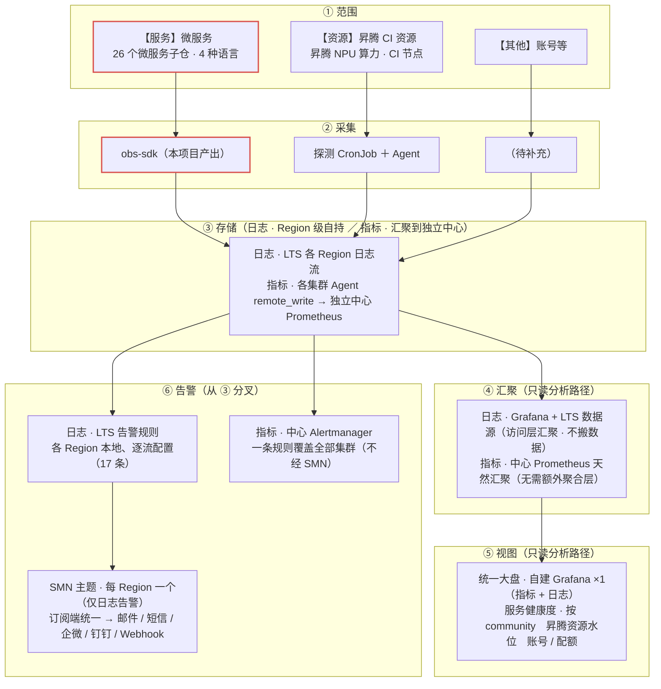
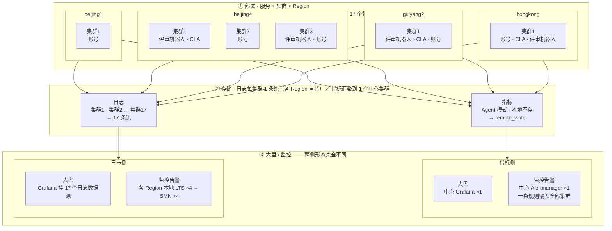
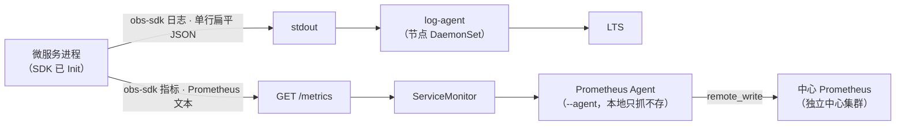
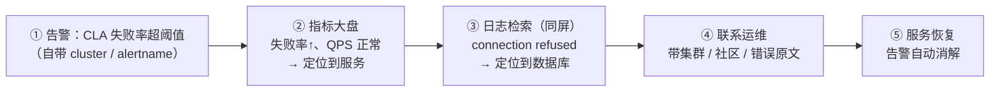

# 微服务可观测性建设技术设计

> 需求：[opensourceways/backlog#1938](https://github.com/opensourceways/backlog/issues/1938)
> 子任务 A（SDK 与试点）：[#2061](https://github.com/opensourceways/backlog/issues/2061) · B（底座与大屏告警）：[#2062](https://github.com/opensourceways/backlog/issues/2062) · C（全量铺开与验收）：[#2063](https://github.com/opensourceways/backlog/issues/2063)
> 契约与 SDK 实现仓：[opensourceways/obs-sdk](https://github.com/opensourceways/obs-sdk)

---

## 1. 背景

### 1.1 问题

基础设施团队维护的重点微服务缺乏统一可观测能力，故障定位靠人工登录机器翻日志，排障链路长、效率低，服务健康度不可见。

各社区另缺一个**统一的服务健康度大盘**（形态可对齐 [GitHub Status](https://www.githubstatus.com/)）：社区用户与运维无法一眼看到整体与各组件（如评审机器人、账号、CLA 等）是否正常、异常落在哪一段？

### 1.2 覆盖范围

以 2025-05-01 ~ 2025-07-31 三个月有 PR 合入的活跃服务为全集，剔除纯配置/部署仓、umbrella 大仓、框架库/工具仓、前端 website 仓后，保留 **15 个大仓 / 26 个微服务子仓 / 390 个合入 PR**。

语言分布不统一：Go 7 · Java 6 · Python 8（+3 待评估）· Node 1 · 编排仓 1。

### 1.3 现状基线

| 能力 | 现状 | 结论 |
| --- | --- | --- |
| 硬件级指标（CPU/内存/磁盘/网络） | 已由华为云 CCE 云原生监控插件（node-exporter / kube-state-metrics）+ icagent 上报控制台 | **复用，不建设** |
| 日志采集管道 | log-agent 插件（fluent-bit / otel-collector）已部署，全局规则 `default-stdout`（`allContainers: true`）采集所有 ns 容器 stdout | **复用，不建设** |
| 日志内容 | 已进 LTS 可全文检索，但**无结构化裸文本、无统一业务字段**（service / level / request_id 不保证、命名不统一） | **建设点：结构化 + 字段统一** |
| 业务指标 | 26 个微服务均未暴露 / 接入 `/metrics`；Prometheus 仅采系统组件 | **建设点：从零接入** |
| 告警 | 无 PrometheusRule、无 Alertmanager | **建设点：从零接入** |
| 监控大盘（对内指标视图） | 无业务级大盘 | **建设点：从零接入** |
| 服务健康度大盘（对外状态视图） | 无，各社区无统一入口，整体/组件级健康度不可见 | **建设点：从零接入** |

### 1.4 关键约束

1. **多语言**：4 种语言、框架不统一（Gin / Spring Boot / Django / FastAPI / Flask / 上游开源项目），不能用单一语言的方案覆盖。
2. **多社区、多 Region**：26 服务 prod 跨 **4 个 Region**（香港 / 北京一 / 北京四 / 贵阳二，约 17 个集群）。同一逻辑服务可能按社区拆成多套独立部署（如 `robot-universal-review` 在 **10 个社区 / 7 个集群**各有一套），需要能按社区维度切片查看健康度。
3. **不能自研 instrumentation**：各语言日志/指标生态成熟，自研只会带来维护负担与生态割裂。

---

## 2. 目标

### 2.1 建设目标

| # | 目标 | 对应验收标准 |
| --- | --- | --- |
| G1 | 26 个微服务暴露 `/metrics`（QPS / 错误率 / 业务自定义指标）并接入 Prometheus | 验收 2 |
| G2 | 26 个微服务日志统一输出**结构化 JSON**（含 service / level / community / request_id 等契约字段）到 stdout，经现有 log-agent 进 LTS，支持按 service / level / community / request_id 检索 | 验收 3 |
| G3 | 建立业务级监控大盘，重点服务健康度集中可见，**支持按 community 维度过滤/分组** | 验收 4 |
| G4 | 关键服务配置告警规则（高错误率 / 宕机 / 资源超阈值）并打通通知到负责人 | 验收 5 |
| G5 | 硬件级指标复用云上，不重复建设 | 验收 1 |

**目标达成后，落到具体的人身上是这样两件事**（完整处理路径见 §4.8.1 / §4.8.2）：

| 视角 | 场景 | 目标态下 |
| --- | --- | --- |
| **用户** | MindSpore 社区评审机器人不响应 | 查**社区健康度大盘**即知是机器人侧异常、落在哪一个社区——**不盲猜、不逐个私聊研发** |
| **研发** | CLA 签署失败（`app-cla-server`） | **告警先于用户报障**（自带 `cluster`）→ 指标大盘确认是服务自身异常 → 同屏日志检索定位到数据库 → 带证据转运维处理 |

> ⚠️ 用户视角依赖 §4.7.5 社区健康度大盘，而它**不在 G1–G5 之列**（§1.1 已将其列为要解决的问题）；是否纳入本期交付待定，见 §6 R21。

### 2.2 设计原则（方案阶段已定）

1. **薄封装，不自研 instrumentation**。每语言 1 个薄 SDK，内部引用各语言官方库（Go→`client_golang`、Python→`prometheus-client`、Java→`micrometer`+Actuator、Node→`prom-client`），SDK 只做装配：中间件挂载 + 通用字段注入 + 命名对齐 + 一行初始化。
2. **契约先行**。跨语言统一的日志 schema、通用字段、指标命名规范收敛到单一仓库的 `spec/` 目录，是唯一事实来源；四语言实现与 spec 不一致时以 spec 为准。
3. **log 与 metrics 同仓不同 package**，不拆成两个库。
4. **单仓 monorepo**：`opensourceways/obs-sdk`，顶层 `spec/` + `go/ python/ java/ node/`，各语言子目录自管版本。
5. **首期只做 log + metrics，不含 trace**。`trace_id` / `span_id` 作为**预留注入位**存在（字段可写可透传、有值才输出），二期接入 OTel 时零日志格式返工。
6. **Go SDK 独立成库，不放进 robot-framework-lib** —— 后者是机器人领域框架，SDK 需领域中立以服务 24 个非机器人服务。

---

## 3. 整体架构

### 3.1 范围与分层视图

基础设施可观测建设整体分**三块**




**本方案在底座上的四点定位**：

1. **日志 —— 复用，不新建**：继续用各集群**现有的日志流**（CCE 云原生日志采集插件为每集群建的 `k8s-log-*` 组），本方案只改**日志的内容格式**（结构化 JSON + 契约字段），**不动采集管道**。
2. **指标 —— 新建**：26 个服务目前均未暴露 `/metrics`，需从零接入；存储侧**自建 Prometheus 实例**（独立中心集群，见 §4.7），不走华为云托管。
3. **大盘 —— 自建 Grafana**：**一个**实例同时挂中心 Prometheus（指标）+ 17 个日志数据源（日志），见 §4.7.4 / §4.6.4。
4. **已有现成闭环可参照**：**昇腾 CI 资源块**已跑通 **多集群 CronJob + Agent 上报 → 中心 Prometheus 存储 → Alertmanager 告警 → 邮件接收** 的完整链路，本方案的**指标侧与之同构**（见 §4.7.2）。⚠️ 该闭环**不含大盘**（资源块 Grafana 未启用，用的是外部 DataStat 看板），故第 3 点的自建 Grafana 属**本方案新增**，不能当作资源块已验证的能力。

### 3.2 部署与流程视图



本项目的部署形态可先记住三个数：**26 个微服务子仓（4 种语言）→ 17 个 CCE 集群（4 个 Region）→ 上报 17 条日志流 + 1 个中心指标集群**。

第一个数会**放大**：**26 仓 ≠ 26 个部署实例**，同一逻辑服务按社区拆成多套——`robot-universal-review` 一个仓就有 **16 套部署**（生产 10 社区 / 7 集群），所以实际 Pod 实例数远多于 26。

**两侧的上报粒度完全不同**：日志侧**每集群 1 个日志组**（共 17 个，各 Region 自持，见 §4.6）；指标侧**17 个集群的 Agent `remote_write` 汇聚到 1 个独立中心 Prometheus**（见 §4.7）。告警路径自存储层分叉：**指标告警在中心 Alertmanager 统一（一条规则覆盖全部集群）**，**日志告警仍逐 Region 本地 LTS 配置 → SMN**（LTS 无跨流查询，见 §4.6）。**该结构与 §3.1 一致，本图不重复展开。**

**服务侧的接入形态**（每个 Pod 内）：




### 3.3 底座选型（方案阶段已确认）

| 能力 | 选型 | 说明 |
| --- | --- | --- |
| 日志存储 | **LTS**——**日志组按集群划分：每集群 1 个 `k8s-log-{集群ID}`，共 17 个** | 不自建 ES；容器日志写入 `stdout-{集群ID}` 日志流。**各 Region 自持，无跨日志组检索能力**（该限制决定了下方的日志告警形态） |
| 指标存储 | **自建中心 Prometheus**（kube-prometheus-stack）：17 集群 Agent（`--agent`，只抓不存）`remote_write` 汇聚到**1 个中心实例** | 不自研 SDK，**但自建底座**——理由与形态见 **§4.7**。原「AOM Prometheus for CCE」路线**已弃用**（官方确认多实例聚合不支持跨 Region） |
| 日志大盘 | **自建 Grafana（同一实例）挂 LTS 日志数据源 ×17** | 与指标大盘同屏、**跨账号免多登**（§4.6.4）。✅ **接入日志流已确认可行**（2026-09-14 华为云，前提是流已结构化） |
| 指标大盘 | **自建 Grafana（1 个实例）挂中心 Prometheus**。**独立 Deployment、与中心 Prometheus 同集群**（§4.7.4） | 替代原「AOM 托管 Grafana ×4」——一个实例即可覆盖全部 17 集群（§4.7.4 / §4.6.4）。**只做看板，不进告警链路**（见下行注释） |
| 日志告警 | **各 Region 本地 LTS 内逐流配置（17 条）**，出口经 SMN 统一到订阅端 | 因 LTS **无跨流查询**，一条规则无法绑定多个日志流，**明确接受「无跨集群联合告警」**。**SMN 仅日志告警仍用**（Region 级资源），「统一」落在各 Region 主题**订阅同一接收端**，而非同一主题 |
| 指标告警 | **统一在中心 Alertmanager**（一条规则覆盖全部 17 集群） | 指标侧不再逐 Region 各配；`group_by: [cluster, alertname]` 区分来源 |

**为什么指标告警统一、日志告警仍散**——两条链路能力不同，不是取舍不一致：

1. **指标侧已统一**：数据经 `remote_write` 汇入中心 Prometheus，**告警规则天然覆盖全部 17 集群**，一条规则即可（`group_by: [cluster, alertname]` 区分来源）。这是自建中心相对 AOM 路线的主要收益之一（§4.7.3）；
2. **日志侧统一不了**：LTS **没有跨日志组 / 流的检索能力**，一条告警规则无法绑定多个日志流——该限制已与华为云团队确认。因此日志规则只能**逐流在本地 LTS 内配置（17 条）**，且**跨集群联合条件写不出来**（如「某服务在所有社区的某类失败总数」）；
3. **日志告警出口仍是 SMN**：**SMN 主题是 Region 级资源**（URN 形如 `urn:smn:<region>:<project-id>:<topic>`），故「统一」不在同一个主题，而在**各 Region 主题订阅同一接收端**（邮件组 / 统一 webhook 接收服务）。

### 3.4 贯穿维度：community

`community` 是本次建设的**核心维度**——支撑「按社区查看单服务健康度」。它在日志字段与指标 label 上语义一致，采用**双层注入**：

| 层 | 场景 | 取值来源 | 日志表现 | 指标表现 |
| --- | --- | --- | --- | --- |
| **部署级默认**（静态） | 服务按社区拆实例（每实例只服务一个社区） | Init 注入：`OBS_COMMUNITY` 环境变量或显式参数 | 进程内所有日志的常驻字段 | 所有时间序列的常驻 const label |
| **请求级覆盖**（动态） | 中心化单实例服务多社区（靠路由/鉴权识别归属） | 请求上下文，由 SDK 从 context 读取 | 该请求关联日志的字段值 | 该请求打点的 series 的 label 值 |

---

## 4. 详细设计

### 4.1 契约层（`spec/`）

契约层是本次建设的**技术核心**：它把「多语言输出形态一致」这件事从「靠人自觉」变成「有据可查、可校验」。

#### 4.1.1 日志格式（`spec/log-format.md`）

**输出形态**：每行一条日志，单行 JSON（不 pretty、不换行），UTF-8 写 stdout。

**顶层字段与顺序**：

| 字段 | 必填 | 说明 |
| --- | --- | --- |
| `time` | 是 | RFC 3339 UTC，**固定毫秒精度（3 位小数）**，以 `Z` 结尾 |
| `level` | 是 | 小写枚举 `debug` / `info` / `warn` / `error` |
| `msg` | 是 | 人类可读的**常量短语** |
| `service` | 是 | 服务名（= service.yaml 的服务名） |
| `env` | 是 | `prod` / `test` / `preview` / `staging` |
| `instance` | 是 | 实例标识（k8s pod 名 / hostname） |
| `community` | 是 | 社区标识（部署级默认 + 请求级覆盖） |
| `request_id` | 否 | 单请求关联 ID |
| `trace_id` | 否（预留） | 二期 trace 接入前恒空/省略 |
| `span_id` | 否（预留） | 二期 trace 接入前恒空/省略 |
| `logger` | 否 | 调用位置 `文件:行号`（调试定位） |
| `error` | 否 | 错误信息；有异常上下文的语言可含完整 traceback |
| 其余 | 否 | 业务字段**平铺在顶层**，`snake_case`，禁止嵌套对象 |

**两条关键传参约束**：

1. **`msg` 必须是常量短语，禁止 printf 风格**（`log.Errorf("failed for user %s", uid)` 违规）。所有可查询维度通过 kv 传入：`log.ErrorContext(ctx, "get account failed", "user_id", uid, "error", err)`。
   *理由*：`msg` 一旦嵌值，同一事件每行都不同 → LTS 无法按 `msg` 聚合计数，日志告警规则**静默失效**；改文案即破坏已配置的检索。四语言 SDK **只提供 kv 形式，无 printf 变体**。
2. **业务字段扁平**，不允许嵌套对象。嵌套会给 LTS 侧字段提取带来歧义。

> `error` 字段**不适合聚合**（取值逐次不同，Python 等语言还含 traceback）。按错误类型聚合请用 `msg` 常量 + 业务字段（如 `error_code`）。

#### 4.1.2 通用字段（`spec/common-fields.md`）

7 个通用字段的来源与注入优先级：

| 字段 | 注入层级 | 静态/动态 | 环境变量 | 内置默认 |
| --- | --- | --- | --- | --- |
| `service` | Init（进程级） | 静态 | `OBS_SERVICE` | `unknown` |
| `env` | Init（进程级） | 静态 | `OBS_ENV` | `unknown` |
| `instance` | Init（进程级） | 静态 | `OBS_INSTANCE` | **hostname** |
| `community` | Init + 请求上下文 | 双态 | `OBS_COMMUNITY` | `unknown` |
| `request_id` | 请求上下文 | 动态 | — | 无 |
| `trace_id` | 请求上下文（预留） | 动态/预留 | — | 无 |
| `span_id` | 请求上下文（预留） | 动态/预留 | — | 无 |

取值优先级：**SDK Init 显式参数 > 部署环境变量 > 内置默认**。
变量名统一 `OBS_*` 前缀，四语言读同一套变量名，保证部署模板（helm values）不因语言而异。

**`request_id` 注入策略**：可信入站头（如 `X-Request-Id`，**在服务已校验可信时**）> 中间件自动生成（UUID）> 无。出站调用应向下游传播，保证全链路同 ID。

#### 4.1.3 指标格式（`spec/metrics-format.md`）

- **命名**：全小写 `snake_case`，单位后缀遵循 Prometheus 约定（`_total` / `_seconds` / `_bytes`）。
  - 业务指标强制前缀 `<service>_`（服务短名）。例：`review_http_requests_total`。
  - 共享中间件公共指标用 SDK 保留前缀 **`obs_`**（不按 service 名开头——同一条 series 已带 `service` label，查询按 label 过滤）。例：`obs_http_server_requests_total`。
- **通用 label 集**（每条 series 必须带）：`service` / `env` / `instance` / `community`。
  - 前三个是 const label；**`community` 是唯一可动态的公共 label**。
- **community 双层注入的指标实现**：对需要区分社区的指标，注册时把 `community` 声明为**普通可变 label**（service/env/instance 仍作 const label），打点时由 SDK 从上下文取覆盖值。**注册一次，单社区场景填默认值、多社区场景填覆盖值，两用。**
- **高基数禁令**：`request_id` / `trace_id` / `span_id` / PR number / commit sha 等**禁止**作 label，会撑爆时序基数。
- **暴露**：每服务一个 `/metrics` 端点，HTTP `GET`，Prometheus text format。

#### 4.1.4 community 枚举（`spec/community-values.md`）

18 个社区：`Ascend · BoostKit · CANN · Common · HiFloat · HPCKit · Infrastructure · Merlin · MindSpore · openEuler · OpenFuyao · openGauss · OpenJiuwen · openLookeng · OpenPangu · OpenUBMC · UnifiedBus · Xihe`。
权威来源是 `infrastructure` 仓 `service.yaml` 的 `communities` 段，随上游刷新。

---

### 4.2 四语言 SDK

#### 4.2.1 语言 × 能力矩阵

| 能力 | Go（`go/`） | Python（`python/`） | Java（`java/`） | Node（`node/`） |
| --- | --- | --- | --- | --- |
| 模块/包名 | `github.com/opensourceways/obs-sdk/go` | `obs-sdk-python` | `obs-sdk-java` | `obs-sdk-node` |
| log 底层 | stdlib `log/slog` + 自研 Handler | stdlib `logging` + 自定 JSON Formatter | logback + logstash JSON encoder | 自定 JSON serializer |
| metrics 底层 | `client_golang` | `prometheus-client` | `micrometer` + Prometheus registry | `prom-client` |
| Init | `log.Init(cfg)` / `metrics.New(cfg)` | `log.init(...)` / `metrics.init(...)` | `ObsLogging.init(cfg)` / `ObsMetrics.of(cfg)` | `log.init(opts)` / `new Metrics(opts)` |
| 请求上下文 | `sdkctx`（`context.Context`） | `_context`（contextvars） | `RequestContext`（MDC + ThreadLocal） | `context`（AsyncLocalStorage） |
| 中间件 | `middleware`（net/http）+ `ginmw`（gin） | `fastapi_wrap` / `flask_middleware` / `DjangoMiddleware` | `ObsFilter`（Servlet Filter） | `makeMiddleware`（express） |
| 服务端指标 | `obs_http_server_*`（中间件） | 同上 | 走 Actuator + Micrometer 官方 server instrumentation（不重复埋点） | `obs_http_server_*`（中间件） |
| UT 数量 | 31 | 15 | 19 | 10 |
| 已发版 | ✅ `go/v1.0.0` | ❌ 版本号 `0.1.0`，未打 tag | ❌ 版本号 `0.1.0`，未打 tag | ❌ 版本号 `0.1.0`，未打 tag |
| CI | `go vet` + `go test` | `pytest`（Py3.10） | `mvn test`（JDK 17） | `npm test`（Node 20） |

#### 4.2.2 Go SDK 设计要点

```go
// 启动时 Init 一次，之后全进程用包级函数（形状对齐 kratos v3，无需在每个调用点绑定 logger）
obslog.Init(obslog.Config{Service: "review", Community: "openeuler"})

// 日志：msg 常量 + kv 交替（禁止 printf）
obslog.Info("job done", "event", "release", "issue", "2061")
obslog.ErrorContext(ctx, "get account failed", "user_id", uid, "error", err) // ctx 里请求字段自动附加

// 指标：注册一次；community label 自动排首位，取请求覆盖或回退默认
m := obsmetrics.New(obsmetrics.Config{Service: "review"})
built := m.NewCounterVec("built_releases", "发布的构建数", "kind")
built.IncWithContext(ctx, "tag")

// 中间件
h := obshttpmw.New(obshttpmw.Options{Metrics: m, ResolveCommunity: fn}).Then(myHandler)
```

关键实现选择：
- **自定义 slog Handler** 而非第三方库：直接控制字段、顺序、时间格式，且无需引入额外依赖。
- **手工构造 `slog.Record` 并控制 `runtime.Callers` skip**，让 `logger` 字段指向业务调用点而非 SDK 内部包装函数。
- 包级 API 形状对齐主流生态（`log/slog`、kratos v3），降低接入心智负担。

#### 4.2.3 Java SDK 设计要点

Java 侧有一个**非显然的坑**，必须在接入文档里强调：

> 日志 JSON 输出**必须**用 `java/examples/logback-json.xml`，它只挂 SDK 的 `ObsJsonProvider`。**不要退回 encoder 自带的 provider** —— `<logLevel/>` 只能输出大写、字段名不可配、且不配 `<stackTrace/>` 会整条丢弃 throwable。

即：Java 的字段名/顺序/时间格式/级别小写/异常堆栈**由 SDK 的 provider 保证**，不能靠 logstash encoder 的配置凑。

Java 的**服务端指标不重复埋点**——走 Spring Boot Actuator + Micrometer 官方 server instrumentation，把 `m.meterRegistry()` 暴露成 bean 由 Actuator 托管。

#### 4.2.4 已知实现问题（需修复）

| 问题 | 影响 | 位置 |
| --- | --- | --- |
| Java `fromEnvironment()` **无任何兜底**：只读 `OBS_*`，未设置时为 `null`，而 provider 对空值「省略该键」 | `service` / `env` / `instance` / `community` 四个**必填**字段在未注入环境变量时**整个 Key 不出现**，违反契约。Go / Python / Node 均回退到 `unknown`（`instance` 回退 hostname） | `java/.../ObsSdkConfig.java:41` |
| Python / Node / Java 未打 tag | 消费方无法按版本引用 | 各语言子目录 |

---

### 4.3 服务接入模式（按语言）

#### 4.3.1 Go 服务（7 个）

`app-cla-server` / `cve-sa-backend` / `cve-manager-ng` / `robot-universal-label` / `review` / `repo-watcher` / `welcome`

```go
obslog.Init(obslog.Config{Service: "<name>"})
m := obsmetrics.New(obsmetrics.Config{Service: "<name>"})

// HTTP 服务端：gin 用 ginmw，net/http 用 obshttpmw.New(...).Then(handler)
r.Use(ginmw.Middleware(ginmw.Options{Metrics: m}))
r.GET("/metrics", gin.WrapH(m.Handler()))

// 指标：基础名注册，community label 由 SDK 自动补、排首位
prHandled := m.NewCounterVec("pr_handled", "处理的 PR 事件数", "action")

// 请求内：community 在可信判定点解析后覆盖，request_id 注入
ctx = sdkctx.WithCommunity(ctx, "openEuler")
ctx = sdkctx.WithRequestID(ctx, "req-123")
obslog.InfoContext(ctx, "handle request", "repo", repo)
prHandled.IncWithContext(ctx, "opened")
```

#### 4.3.2 Java 服务（6 个）

`EasySearch` / `EasySearchImport` / `om-webserver` / `certification-server` / `easysoftware-autoupgrade` / `APIMagic`，均 Spring Boot 3.x：

```java
ObsSdkConfig cfg = ObsSdkConfig.fromEnvironment();   // 读 OBS_*
ObsLogging.init(cfg);                                // 部署级字段写入 MDC
ObsMetrics m = ObsMetrics.of(cfg);                   // meterRegistry() 暴露为 bean，交 Actuator 托管

log.info("job done");                                // SLF4J 输出走 logback-json.xml（挂 ObsJsonProvider）

// 请求内：可信判定点解析 community 后 push
try (RequestContext.Scope s = RequestContext.push("openEuler", "req-123", null)) {
    m.counter("pr_handled", "处理的 PR 事件数", "action").inc("opened");
}
```

`logback-json.xml` 见 [java/examples/logback-json.xml](../java/examples/logback-json.xml)；`/metrics` 由 Actuator 暴露（打开 `prometheus` endpoint），不重复埋服务端指标。

#### 4.3.3 Python 服务（11 个）

```python
from obs_sdk import log, metrics, _context
from obs_sdk.middleware import fastapi_wrap          # Flask: flask_middleware；Django: DjangoMiddleware

log.init(service="<name>")                           # env/community 由 SDK 读 OBS_*，进程内幂等
metrics.init(service="<name>")
fastapi_wrap(app, resolver=resolve_community)        # 注入 request_id + 可信判定点解析 community + 记 obs_http_server_*

logger = log.get_logger(__name__)
logger.info("job done", extra={"event": "release", "issue": "2061"})

with _context.bind(community="openEuler", request_id="req-123"):
    metrics.counter("pr_handled", "处理的 PR 事件数", ["action"]).inc(1, action="opened")
```

`/metrics` 暴露：`return Response(content=metrics.generate_text(), media_type=metrics.content_type())`。

适配器按框架分三类：Django×3（meeting-center / meeting-platform / app-meeting-server）、FastAPI×4（oss-map / robot-issue-manage / hotopic-data-clean / om-dataarts）、Flask×1（forum-reply-robot）。**另 3 个非标准框架无现成适配器，需单独方案**：mailman（GNU Mailman）、copr_docker（Fedora COPR）、hotopic-mining（脚本/包型）。

#### 4.3.4 Node 服务（1 个）

`etherpad-lite` 是**上游开源项目**（Etherpad，Express + Socket.IO）。接入需注意与上游代码保持可合并性，改造面要尽量小。

#### 4.3.5 不直接接入

`meeting-server` 是编排/部署型子仓（Shell + Go Template），由旗下子服务（app-meeting-server / meeting-center / meeting-platform）覆盖。

---

### 4.5 部署侧字段注入

日志/指标要带上 `env` 和 `community`，必须由部署侧注入（pod 内无免费信号可推）：

- `instance` **不用注入** —— SDK 默认取 hostname（k8s 下 = pod 名）。
- `service` **不用注入** —— 编译期常量，代码 `Init` 里写死。
- **`env` / `community` 必须注入** —— 无法从 pod 名、namespace、节点名、镜像 tag 推导。
  - namespace 推不出：`openEuler` 的 prod-02 与 test 都叫 `robot-openeuler`；`OpenUBMC` 的 prod 与 test 都叫 `robot-openubmc`。
  - 集群名推不出：它是 ArgoCD 规范名，**pod 内无法自省**。

**注入方式**：在 `Open-Infra-Ops/helm-chart-value` 各部署目录的 `values.yaml` 里，给对应 deployment 加：

```yaml
    env:
      - name: OBS_ENV
        value: prod
      - name: OBS_COMMUNITY
        value: ascend
```

（chart 已支持 env 透传，同文件 `sync-bot` 在用同款写法。）

**值域口径**：
- `community` **统一小写**（依据 `spec/community-values.md`；四语言 SDK 都不做大小写归一，注入值即最终形态）。
- `env` 需 `prod*` → `prod` 的映射（service.yaml 里存在 `prod-github`、`prod-02` 等，不在契约枚举内）。

**范围（以 `robot-universal-review` 为例）**：需改 **12 个部署目录**（不是 10 个——Common 与 Ascend 各有两套部署，同社区同值）。生成脚本要**按部署目录迭代，不能按社区迭代**。


---

### 4.6 日志链路

日志侧**复用现有底座，不新建**：采集管道沿用 CCE 云原生日志采集插件，存储沿用 LTS。本方案只改**日志的内容格式**（结构化 JSON + 契约字段），不动采集管道。

#### 4.6.1 日志采集

**形态**：复用 CCE 云原生日志采集插件（`log-agent`，基于 fluent-bit，节点 DaemonSet）。集群级 `default-stdout` 策略已覆盖**全 ns 全容器 stdout**，铺开**无需新增采集策略**——服务只要写 stdout 就进 LTS。

日志读写限制：https://support.huaweicloud.com/productdesc-lts/lts-0718.html

#### 4.6.2 日志存储

**形态：LTS，各 Region 自持**，不自建 ES。日志组按集群划分，每集群 1 个 `k8s-log-{集群ID}`，容器日志写入 `stdout-{集群ID}` 流——**共 17 组 / 17 流**。

**⚠️ LTS 无「跨日志组检索」**：搜索、快速查询及其列表的 API 全部以 `groups/{group_id}/topics/{topic_id}` 限定在**单个日志组 / 流**内，控制台也是逐组进入详情页。因此 **17 个 `k8s-log-{集群ID}` 不会自动汇成一个检索入口**，统一入口只能靠 Grafana 多数据源拼装（§4.6.4）。

**结构化解析**：只针对 **obs-sdk 契约格式**配 **JSON 规则**。非 JSON 行（基础设施文本 / ANSI 着色文本 / Envoy access log）解析失败后**原样保留**，不污染结构化字段。

**容量口径**：单流 **100 MB/s** 为**软限制**（官方标 `Not mandatory`，超限不是拒绝写入，而是**不保证 QoS / 可能丢日志**，且**无补发语义**）；另有单流 **500 次/秒**写入次数上限。⚠️ 该数字随版本变化大（旧版文档写的是 5 MB/s + 25K 条/秒），**容量规划须按各 Region 实际版本文档核，不要引用本文数字**。

**其他约束**：一个日志流只能配**一种**结构化方式（ICAgent 结构化**或**云端结构化，切换**必须先删除**原配置）；**结构化配置修改只对新写入生效**，历史数据不按新规则重新解析；云端结构化解析**消耗 LTS 算力**，官方称未来按日志量收取「日志加工流量费」。

#### 4.6.3 日志告警

**形态：仍走华为云 LTS 原生，各 Region 逐流配置（17 条）**，出口经**各 Region 的 SMN 主题** → 同一接收端（邮件组 / 统一 webhook 接收服务）。

**为什么统一不了**：LTS **没有跨日志组 / 流的检索能力**，一条告警规则无法绑定多个日志流——该限制已与华为云团队确认。因此**明确接受「无跨集群联合告警」**：像「某服务在所有社区的某类失败总数」这类跨集群联合条件**写不出来**。

**SMN 是 Region 级资源**（URN 形如 `urn:smn:<region>:<project-id>:<topic>`），故「统一」不在同一个主题，而在**各 Region 主题订阅同一接收端**。

**不迁到 Grafana Alerting**：LTS-Grafana 插件虽支持 Grafana 自身的告警功能，但采用它会让 **Grafana 进入告警链路**，与 §4.7.4「Grafana 只做看板、故障域解耦」相悖——Grafana 一旦进告警链路，其 HA 就从「可选」变成「必须」。**待逐流维护真的成为负担时再评估。**

> **⚠️ 前置依赖**：日志聚合告警依赖 LTS 的 **SQL 统计类型**，而 SQL 依赖**结构化解析配得上**（§4.6.2）。**若试点期这一步验证不通过，本节的日志告警选型需整体重谈**——优先级高于其他事项。

#### 4.6.4 日志大盘

**形态：并入自建 Grafana（1 个实例），挂 LTS 数据源 ×17**（每个数据源绑一个日志流 ID，各带一套 AK/SK 凭证）。

> ✅ **硬依赖已确认（2026-09-14，华为云团队）**：**自建 Grafana 可以接入各集群的日志流**，**前提是日志流已配置结构化解析**。
> 至此日志大盘链路上的**唯一卡点就是「结构化解析」本身**：
>
> ```text
> 日志大盘能否落地  =  自建 Grafana 接入 ✅（已确认）  AND  流已结构化 ❓（唯一卡点）
> ```

**为什么用自建 Grafana 而不是 AOM 托管 Grafana ×4**：LTS 插件用 **AK/SK 认证，每个数据源可带自己的一套凭证**，所以**一个实例就能横跨 N 个华为云账号**、把 17 个日志流全挂上，**免多登**；而 AOM 托管 Grafana 是**账号级资源**，N 个账号要登录 N 次。且指标侧本就要自建 Grafana（§4.7.4），日志接进来是**边际成本近乎为零**（多配 17 个数据源）。

**面板筛选策略**：

| 面板 | `community` | `service` | 理由 |
| --- | --- | --- | --- |
| 明细 / 排障 | **必选（多选，至少 1）** | **必选（多选，至少 1）** | 排除误伤（全量采集下流里混有基础设施 / sidecar / 第三方日志）；两字段合用 ≈ **精确定位到一个部署**。**必须多选**——单选会堵死「互调服务联合排查」 |
| 聚合 / 对比 | 默认全选 | 默认全选 | 跨社区横向对比（如「某服务在所有社区的表现」）是真实需求，且结果集小 |

> **为什么日志侧必选、指标侧不强制**：**「必选筛选」本质是给「日志存储物理分裂成 17 个流」打的补丁**；指标侧存储本就聚合（§4.7.4），不需要这个药。

**已知代价（需明确接受，不是意外）**：

1. **`robot-framework-lib` 的 121 处 logrus 打点（client 88 / config 14 / interrupts 11 / framework 6 / utils 2）在大盘上不可见**——其字段集无 `community` / `service`，被必选筛选条件排除；
2. **配额 / 存储不设防**——全量落流；
3. **聚合 / 对比面板要打 17 个数据源**，加载慢，任一失败则面板残缺。

---

### 4.7 指标链路

指标侧**与日志侧相反：底座新建**。26 个服务目前均未暴露 `/metrics`，存储侧自建 Prometheus 实例，不走华为云托管。

核心结论：**弃用「AOM Prometheus for CCE + 多账号聚合」路线，改为「自建中心 Prometheus 集群」**——原路线经官方确认**不支持跨 Region 聚合**，拿不到统一大盘与统一告警。

#### 4.7.1 指标采集

**形态**：各集群部署 **Prometheus Agent**（`--agent`，**本地只抓不存**，本地只有 WAL），以 ServiceMonitor 选目标、抓各服务 `/metrics`，再 `remote_write` 到中心。形态照搬资源块（见 §4.7.2），但**独立部署、不复用其实例**——资源块 Agent 覆盖的是 CI 集群，与服务块 prod 集群基本不重叠；资源块的价值是**形态先例与配置模板**。

**⚠️ 跨 Region 链路是本方案的唯一硬门槛**（各集群 Agent → 中心）：

- 必须解决：(a) 传输加密（至少 HTTPS）；(b) 合规（生产指标数据出公网需确认）；(c) 带宽与成本。
- 候选路径：**云连接 CC**（按带宽计费、不过公网）/ **专线** / **HTTPS + 公网 EIP**。
- ⚠️ **不得照搬资源块的公网明文 HTTP**（`http://113.44.182.82:9090` + Basic Auth）。**该链路不成立则整个中心方案不成立。**

**黑盒拨测：白盒埋点覆盖不了的那一半**

§4.2–§4.3 的 SDK 埋点是**白盒**——服务自己吐「我做了什么」，天然看不见**服务进程之外**的东西。以下类别只能靠**外部主动探测**覆盖，需在铺开时另行补，不在本 SDK 范围内：

| 类别 | 例子 | 为什么埋点覆盖不了 |
| --- | --- | --- |
| 外部依赖可达性 | 依赖的 GitCode / GitHub API 通不通、下游服务在不在 | 请求发生在服务进程之外 |
| 凭据可用性 | 能否从 Vault 读到 token、凭据是否临期 | 读取动作在启动期，且失败即进程退出，无日志可依 |
| 端到端可用性 | 服务整体还能不能正常响应一个真实请求 | 服务内指标全绿但外部路由 / 网关挂了，埋点看不出来 |

资源块已有的**探测 CronJob + Pushgateway** 基建可直接复用：CronJob 跑探测脚本 → push 到 Pushgateway → Prometheus 抓取 → `ProbeStale` 规则抓「指标过期」。**两个关键点**：

1. **`ProbeStale` 是必备的**。拨测有内生盲区——探测脚本自己挂了，指标不再更新，而「指标不再更新」看起来和「一切正常」一样。必须有一条规则专门抓指标过期。
2. **push 失败要重试后显式失败**。参考资源块做法：重试 6 次 × 45 秒吸收网络抖动，全失败则 Job 退出非零，让失败本身可被发现。

#### 4.7.2 指标存储

**形态：1 个独立中心 Prometheus 集群**（kube-prometheus-stack，放独立中心集群）。17 个集群的 Agent 经 `remote_write` 汇入同一实例，`enableRemoteWriteReceiver: true`。

| 项 | 决定 |
| --- | --- |
| **HA** | `replicas: 2` + pod 反亲和（资源块当前为 `1`，其 values 注释已写明「正式上线时恢复 `replicas: 2`」）。**它是单点，挂了全网指标断线** |
| **保留期** | 一期**本地存储 30d，不上 VictoriaMetrics**——先跑一两个月看真实 series 增长再定，避免过早引入额外组件 |
| **安全** | `enableRemoteWriteReceiver: true` + 公网端口 = **拿到 basic auth 就能往中心写任意指标**。生产至少要做：强凭据 + 轮换、源 IP 白名单 / 安全组收敛、只放行 `/api/v1/write`。**独立集群的好处正是把风险面收敛到这一个集群上** |

**形态先例**：昇腾 CI 资源块在 [ascend-ci-deployment/monitoring](https://github.com/opensourceways/ascend-ci-deployment) 已跑通同一形态（中心 Prometheus + Alertmanager + 各集群 Agent `remote_write`），**本方案指标侧与之同构**。两处**不可照搬**：资源块走**公网明文 HTTP + Basic Auth**（见 §4.7.1）；其 Grafana **未启用**（用的是外部 DataStat 看板），故本方案的自建 Grafana 属新增能力。

**为什么弃用 AOM 路线**：

| 维度 | AOM Prometheus for CCE（原路线） | 自建中心 Prometheus（现路线） |
| --- | --- | --- |
| **跨 Region 统一大盘** | ❌ 官方已确认**多实例聚合不支持跨 Region** | ✅ 天然成立（就是**一个**实例） |
| **跨 Region 统一告警** | ❌ 需逐 Region 各配一套（4 套规则） | ✅ **一条规则覆盖全部集群** |
| **Organizations / OU 前提** | **强依赖**（多账号聚合要求同组织 / OU） | ✅ **完全不依赖**——`remote_write` 只需网络可达 + 鉴权 |
| **跨账号** | 走华为云多账号机制 | ✅ 每个 Agent 各带一套凭证即可，**与账号归属无关** |
| **单实例集群数上限** | 官方未给出，17 集群分配有风险 | ✅ 无此约束（仅受 Prometheus 自身容量限制） |
| **运维** | 云托管，**零运维** | ❌ **自行运维**（HA / 容量 / 升级 / 备份） |
| **网络** | 零改造 | ❌ **需打通各集群 → 中心**并解决合规 |
| **成本** | 按采样点计费 | 自建集群底座 + 存储 + **跨 Region 流量费** |

**取舍**：用**运维与网络成本**，换**统一大盘、统一告警、以及摆脱 Organizations / OU 前提**。

**容量粗算**（`磁盘 ≈ 保留秒数 × 每秒样本数 × 1.7 B`，按 `scrapeInterval: 60s`）：

| active series | 日增 | 30d 占用 |
| --- | --- | --- |
| 20 万 | ≈ 0.5 GB/天 | ≈ 15 GB |
| 200 万 | ≈ 4.9 GB/天 | ≈ 147 GB |

**series 数是这里唯一的未知量**，取决于 26 个服务的指标设计——**尤其不要把高基数塞进 label**（§4.1.3 铁律：`request_id` / `trace_id` / `span_id` 禁止当 label）。

> ⚠️ **若将来必须上 VictoriaMetrics**：资源块里 VM 的角色**不是「全量长期存储」，而是「少数需要长期趋势的指标的冷存储」**（只接 `custom_npu_.*`），照此办即可（保留期 > 30d 才上）。**一个坑**：中心 Prometheus `replicas: 2` 后，**两个副本会各写一份相同数据到 VM**，必须在 vminsert / vmselect 侧配 `-dedup.minScrapeInterval` 去重，否则**数据翻倍、查询结果异常**。

#### 4.7.3 指标告警

**形态：统一在中心 Alertmanager**——数据已经汇聚，**一条规则覆盖全部 17 集群**，用 `group_by: [cluster, alertname]` 区分来源。**不经 SMN**（SMN 仅日志告警仍用）。

这是自建中心相对 AOM 路线的**主要收益之一**：原路线需逐 Region 各配一套，阈值与规则变更要多点同步、易产生配置漂移。

#### 4.7.4 指标大盘

**形态：自建 Grafana（1 个实例）挂中心 Prometheus**，**独立 Deployment、与中心 Prometheus 同集群同 ns**。

| 设计点 | 说明 |
| --- | --- |
| **「独立」的价值在生命周期解耦，不在物理位置** | 独立 Deployment 已让 Grafana 的升级 / 重启 / 回滚不碰 Prometheus，反之亦然——这是真正需要的隔离 |
| **同集群走集群内 svc 查询** | `prometheus-kube-prometheus-prometheus.infra-monitoring.svc:9090`，零网络成本、零延迟。Grafana 是查询密集型无状态服务，离 Prometheus 越近越好 |
| **故障域与告警解耦** | 关键在**告警用 Alertmanager、不用 Grafana Alerting**——Grafana 挂了只是看不了图，**告警不受影响** |
| **不单开一个集群** | 多一份集群底座成本，还**新增一条跨集群链路**（Grafana → Prometheus） |

**两点可照抄资源块**：Grafana PVC 只要 **10Gi**（dashboard 走 ConfigMap provisioning，PVC 只存状态）；**和 Prometheus 复用同一个 ELB、端口分开**，省一个 ELB。

**面板筛选策略**：`community` **默认全选、不强制**——中心 Prometheus 存储已聚合（全部 17 集群汇入同一实例），不筛选无查询放大问题；`community` 是低基数 label，`sum by (community)` 成本可忽略。**必选会禁掉横向对比，而横向对比恰是指标大盘最有价值之处**；担心误读时在面板标题显示当前筛选值即可。

**大盘内容**：服务健康度（QPS / 错误率 / 延迟 / 资源）+ 日志检索（与 §4.6.4 同屏，跨账号免多登），支持按 `community` 过滤 / 分组。**「看」与「告警」解耦**——大盘只影响可见性，采集 / 存储 / 告警均不依赖它。

#### 4.7.5 社区大盘

这是**与内部指标大盘并列的另一个视图**，本方案需同时给出：

| | 指标大盘（§4.7.4） | 社区大盘（本节） |
| --- | --- | --- |
| **读者** | 运维 / 研发 | 社区用户 |
| **回答的问题** | **为什么坏**（QPS / 错误率 / 延迟 / 资源） | **哪块坏了**（组件是否正常、异常落在哪一段） |
| **形态** | Grafana 面板 | GitHub Status 形态的状态页 |
| **粒度** | 服务 × community × 集群 | **按社区聚合的组件级健康度** |

**目标**：一眼看到**整体与各组件**（从重点微服务中挑选，如评审机器人、账号、CLA 等）是否正常、异常落在哪一段，替代当前「靠零散告警与人肉打听拼凑判断」。

**数据来源**：

- **白盒**：§4.2–§4.3 的 SDK 指标（服务自报的 QPS / 错误率）；
- **黑盒**：§4.7.1 的探测 CronJob 指标——**端到端可用性这类「服务内指标全绿、但外部路由 / 网关挂了」的情况只有拨测能发现**，而它恰好最直接回答「这个组件还能不能用」。

**与 Grafana 解耦**：状态页是**对外**入口，不应把内部 Grafana 直接暴露出去（多租户、安全域、可用性要求都不同）。落地形态（静态页 + 定时拉取 / 轻量服务）另议。

**待定**：

1. **组件级健康的判定口径**——几个指标、什么阈值算「异常」，需与各社区运维对齐；
2. **异常事件的发布流程**——谁改状态、是否人工确认；状态页的价值在可信，不能纯靠自动抖动；
3. **是否纳入本期交付范围**——§1.1 已把它列为要解决的问题，而 §2.1 的 G1–G5 尚未覆盖它，需明确。

---

### 4.8 典型场景的问题处理路径

本节给出**两个端到端场景**——一个从**用户**出发，一个从**研发**出发——串起 §4.6 日志链路与 §4.7 指标链路，说明这套建设落地后**「问题怎么被发现、怎么被定位」**与今天有什么不同。

> 两个场景描述的是**目标态**。凡依赖「日志流已配结构化解析」的环节，均受 §6 R13 制约——该前提不成立时，日志检索与日志告警路径需按 §4.6.2 / §4.6.3 重谈。场景一额外依赖 §4.7.5 社区大盘落地（其交付范围待定，见 §4.7.5 待定第 3 项 / §6 R21）。

#### 4.8.1 用户视角：MindSpore 社区的评审机器人不响应

**场景**：贡献者向 MindSpore 社区提交 PR，机器人评审迟迟没有响应。

**今天**（§1.1 描述的问题）：贡献者**无法区分**三种可能——机器人挂了、PR 还在排队、还是自己的提交方式有问题。唯一的办法是到社区群里问，或**逐个私聊研发**「机器人是不是又挂了」；研发同样没有全局视图，被问到了才去登机器翻日志。

**建设后**：

| 步骤 | 动作 | 用到的建设成果 |
| --- | --- | --- |
| 1 | 打开**社区健康度大盘** | §4.7.5 社区大盘（对外状态页） |
| 2 | 看到 **MindSpore 社区的「评审机器人」组件异常**，同屏其余组件正常 | 按社区聚合的**组件级**健康度 |
| 3 | 得出结论：**是机器人侧的问题，不是自己 PR 的问题**；同时看到异常落在哪一个社区 | 状态页回答的是「**哪块坏了**」，而非「为什么坏」 |
| 4 | 按状态页指引等待或上报，**不再逐个联系研发** | — |

**为什么用户视角必须靠黑盒**：这个场景里服务**进程内的指标可能全绿**——问题出在外部路由 / 网关 / 凭据，§4.2–§4.3 的白盒埋点天然看不见这一层，**只有 §4.7.1 的探测 CronJob 能发现**。这正是社区大盘要**同时**接白盒与黑盒两类数据的原因（§4.7.5）。

**收益**：把「用户盲猜 + 骚扰研发」变成「用户自助查询状态页」；研发也从「是不是挂了」这类问询中解放出来。

#### 4.8.2 研发视角：CLA 签署失败

**场景**：`app-cla-server`（§4.3.1）出现 CLA 签署失败率上升。

**今天**：只能等**用户来报障**（「签不了 CLA」）。研发拿到的是一个模糊现象，需要登机器**逐个实例 grep 日志**，且很难判断问题落在**自己的代码**还是**下游数据库**。



| 步骤 | 动作 | 用到的建设成果 |
| --- | --- | --- |
| 1 | 收到 **CLA 失败率告警**（邮件 / 统一 webhook），告警自带 `cluster` / `alertname` 标签 | §4.7.3 中心 Alertmanager，`group_by: [cluster, alertname]` |
| 2 | 打开**指标大盘**，按 `service=app-cla-server` + `community=<受影响社区>` 筛选 | §4.7.4 指标大盘（G3：支持按 community 过滤 / 分组） |
| 3 | 看到**失败率曲线抬升、QPS 与延迟正常** → 排除流量突增与上游调用，**确认是服务自身异常** | §4.2–§4.3 SDK 埋点的业务指标 |
| 4 | 同屏切到**日志检索**，沿用同一组筛选条件，看到 `error: get account from db: connection refused` → **确认故障在数据库，而非代码逻辑** | §4.6.4 日志大盘（Grafana 同实例挂 LTS ×17，免多登） |
| 5 | 带着「哪个集群 / 哪个社区 / 什么错误原文」**直接联系运维**处理 DB | — |
| 6 | 运维处理后**失败率回落、告警自动消解**，无需人工消警 | §4.7.3 告警基于实时汇聚的指标 |

**关键在第 3→4 步**：这是今天耗时最长、也最靠人肉的一段。建设后它变成**同一个 Grafana 界面内的连续下钻**——用指标定位「是哪个服务」，用日志定位「是什么原因」，且**跨社区 / 跨集群无需切换登录**（§4.6.4 的 AK/SK 多数据源）。

**本场景对 §4.6 / §4.7 的覆盖**：

| 链路 | 在本场景中的作用 |
| --- | --- |
| §4.7.1 指标采集 | 服务指标上报到中心 |
| §4.7.3 指标告警 | 失败率超阈值触发，且带 `cluster` 定位来源 |
| §4.7.4 指标大盘 | 确认「是服务异常、不是流量问题」 |
| §4.6.4 日志大盘 | 确认「异常在数据库、不是代码」 |
| §4.6.2 日志存储（结构化解析） | 日志能按 `service` / `community` 检索的**前提**（⚠️ 受 R13 制约） |

#### 4.8.3 两个场景的共同变化

| 维度 | 今天 | 建设后 |
| --- | --- | --- |
| **发现** | 等用户报障、靠人肉打听 | 告警主动推送 + 看板随时可查 |
| **定位** | 登机器逐个实例翻日志 | 大盘 → 日志**同屏下钻** |
| **协作** | 靠口头描述现象，信息在传递中衰减 | 带 label 与日志原文的**定位结论**，可直接转交运维 |

三个维度的共同指向是同一个东西：**把「不可见的系统」变成「可查证的系统」**——用户不必猜，研发不必翻，跨团队协作不必靠复述。

---

## 5. 工作量预估

> **口径说明**：以下为**粗估**，单位人天，含开发 + 自测 + 联调，不含需求评审与排期等待。
> 单价基于试点实测数据校准前的一般经验；**建议在子任务 A 的试点完成后回填真实数据再修正 C 的估算**。

### 5.1 子任务 A —— SDK 建设与试点接入（#2061）

| 项 | 状态 | 剩余人天 |
| --- | --- | --- |
| 契约层 `spec/`（4 份文档） | ✅ 已完成 | 0 |
| obs-sdk-go（log / metrics / sdkctx / middleware+ginmw，31 UT） | ✅ 已完成，已发 `go/v1.0.0` | 0.5 |
| obs-sdk-python（15 UT） | ✅ 代码完成 | 0.5（打 tag + 安装验证） |
| obs-sdk-java（19 UT） | ✅ 代码完成，**存在无兜底缺陷** | 1.5（缺陷修复 + UT + 打 tag） |
| obs-sdk-node（10 UT） | ✅ 代码完成 | 0.5（打 tag） |
| 试点接入：`robot-universal-review` 日志（[#2161](https://github.com/opensourceways/backlog/issues/2161)） | 📋 已开 issue | 1.5 |
| 试点接入：`robot-universal-review` 指标（[#2162](https://github.com/opensourceways/backlog/issues/2162)） | 📋 已开 issue | 1.5 |
| 部署侧 `OBS_*` 注入（helm-chart-value，12 个目录） | 📋 待办 | 2～3（含跨团队确认） |
| **小计** | | **8～9.5** |

### 5.2 子任务 B —— 底座搭建与大盘告警（#2062）

| 项 | 人天 |
| --- | --- |
| 中心 Prometheus 集群搭建（kube-prometheus-stack + HA + 存储 + Alertmanager） | 5～8 |
| 各集群 Prometheus Agent 铺开（17 集群）+ 采集链路验证 | 4～6 |
| **跨 Region 网络打通**（CC / 专线 / 公网 HTTPS 三选一）+ 安全加固 | 3～6 |
| 自建 Grafana 部署（独立 Deployment + 持久化 + 入口） | 2～3 |
| Grafana 大盘（服务健康度 + community 维度 + 日志检索面板） | 6～9 |
| 中心 Alertmanager 指标告警规则 + LTS 日志告警（17 条）+ SMN 通知 | 4～6 |
| 容量与成本核算（series 量 / 磁盘 / 跨 Region 流量） | 1～2 |
| **小计** | **25～40** |

> **⚠️ 【2026-09-14】本节已随指标路线改为自建中心而重估**（原 17～27 人天基于 AOM 托管路线）。**成本上升是真实的**——自建多出「中心集群搭建」「Agent 铺开」「跨 Region 网络」「安全加固」四项，而省掉的只有「采样点计费评估」一项。**这是换取统一大盘 + 统一告警所付的显式代价**（§4.7.2）。

### 5.3 子任务 C —— 26 仓全量铺开与验收（#2063）

按语言与框架的改造复杂度分档：

| 服务分组 | 数量 | 单价（人天） | 小计 |
| --- | --- | --- | --- |
| Go · 机器人服务（robot-universal-label / repo-watcher / welcome + 试点已做的 review） | 3 | 1～1.5 | 3～4.5 |
| Go · 普通 Gin（app-cla-server / cve-sa-backend / cve-manager-ng） | 3 | 0.5～1 | 1.5～3 |
| Java · Spring Boot（Actuator 原生路径） | 6 | 1～1.5 | 6～9 |
| Python · Django + DRF | 3 | 1～1.5 | 3～4.5 |
| Python · FastAPI | 4 | 0.5～1 | 2～4 |
| Python · Flask | 1 | 0.5～1 | 0.5～1 |
| Python · **非标准框架待评估**（mailman / copr_docker / hotopic-mining） | 3 | 3～5 | 9～15 |
| Node · etherpad-lite（上游开源，需保持可合并） | 1 | 2～3 | 2～3 |
| 编排仓 meeting-server（由子服务覆盖） | 1 | 0 | 0 |
| 逐服务验收核对（字段 / label / 大盘） | — | — | 3～5 |
| **小计** | **26** | | **30.5～49** |

### 5.4 汇总

| 子任务 | 人天 | 对应 issue |
| --- | --- | --- |
| A · SDK 建设与试点接入 | 8～9.5 | #2061 |
| B · 底座搭建与大盘告警 | 25～40 | #2062 |
| C · 26 仓全量铺开与验收 | 30.5～49 | #2063 |
| **合计** | **63.5～98.5** | 约 **3.1～4.8 人月** |

**估算的最大不确定性**在 C 的「非标准框架待评估」三项（9～15 人天）与 Java 组（6～9 人天）。建议：
1. 试点完成后用实测数据回填单价；
2. 三项非标准框架服务（mailman / copr_docker / hotopic-mining）与 Node 的 etherpad-lite **先做技术验证再报价**，避免按经验值低估；
3. 「26 仓」中 `hotopic-data-clean` / `hotopic-mining` 的 prod 目前挂在 **test 集群**（`infra-hk-test-cluster-001`），`oss-map` / `om-dataarts` 在 service.md 无 prod 部署记录 —— **这 4 个是否纳入本次铺开需先澄清**，否则 C 的范围可能变动。

---

## 6. 风险与待确认

| # | 项 | 影响 | 处置 |
| --- | --- | --- | --- |
| R1 | ~~**15 天存储窗口**：AOM 指标默认存 15 天（超期按量计费）~~ → **【2026-09-14 转换】** 自建中心 Prometheus **保留期可自定**（建议 30d），不再受 15 天约束（§4.7.2） | ~~故障回溯窗口可能不足~~ **风险消除**；但**磁盘容量成为新的约束** | 按 §4.7.2 公式核算 series 量 → 定保留期与磁盘规格；>30d 需求再上 VictoriaMetrics |
| R2 | ~~ServiceMonitor 在 4 Region 的可用性~~ → **【转换】各集群 Agent → 中心集群的采集链路与网络可达性**未经生产验证 | 指标可能采不上——**且这次没有云托管兜底** | 试点阶段**逐集群**验证 Agent 与 `remote_write` 连通性；网络方案见 §4.7.1 |
| R3 | ~~自定义指标采样点计费量级未知~~ → **【转换】自建中心的容量与成本**：series 量、磁盘、**跨 Region 流量费**三项均未测算 | 26 仓铺开成本不可控（原为按量计费，现为**自建资源 + 出网流量**） | 试点阶段实测 17 集群真实 series 量后外推（§4.7.2 已给容量公式）；跨 Region 流量按所选网络方案（CC 按带宽 / 公网按流量）分别核算 |
| R4 | log-agent 在生产集群的配置是否与预览集群一致未确认 | 结构化日志可能采不到字段 | 铺开前抽查生产集群插件配置 |
| R5 | **Java SDK 无兜底**，未注入环境变量时 4 个必填字段整个缺失 | 违反契约，Java 服务日志字段不全 | 单独立项修复（加 hostname / `unknown` 兜底 + 补 UT，断言落在真实 JSON 输出上） |
| R6 | Python / Node / Java 未打 tag，Java 进私服路径未验证 | 消费方无法按版本引用 | 随各语言首次接入服务时一并处理 |
| R7 | **#1938 覆盖范围表的机器人部分与实际部署不符** | 影响 community 取值与大盘分维度 | 见下 |
| R8 | Java SDK 的 logstash-logback-encoder / jackson-core 在 SDK 内为 `provided` | 接入服务运行时必须自带，否则日志不可用 | 接入文档中明确要求，或改为传递依赖 |
| R9 | 请求级 community 的安全约束（禁止裸读 URL/Header） | 误用会导致 community 被外部可控 | 代码 review 检查点 + 接入文档强调 |
| R10 | ~~**第 ④ 层汇聚的两条前提均未确证**：Organizations / OU 归属、跨 Region 是否成立~~ → **【2026-09-14 消解】** 自建中心**不涉及华为云多账号机制**，两条前提整个不再需要（§4.7.2） | ~~汇聚层整体不成立，失去统一大盘~~ **风险消除** | 无需处置 |
| R11 | ~~**告警规则逐 Region 各配一份**（4 Region × 日志/指标 ≈ 8 套）~~ → **【2026-09-14 收敛为日志单侧】**：**指标告警已在中心统一为 1 套**；**日志仍为 4 Region × 逐流 17 条**，SMN 主题亦每 Region 一个 | 阈值 / 规则变更需多点同步，易产生配置漂移；跨 Region 无单一配置入口 | 规则**模板化 / IaC 生成**（脚本或 Terraform 统一产出后下发各 Region），避免手工逐 Region 修改；接入文档中固化规则清单。**指标侧已无此问题** |
| R12 | **【新增 · 2026-09-14】跨 Region 网络与安全合规**：各集群 → 中心集群的链路是本方案的**唯一硬门槛**（§4.7.1） | 不成立则**整个指标自建方案不成立**——比 R10 更严重（R10 只损失大盘，本项损失**全部指标**） | 试点阶段**最优先**确定网络方案（CC / 专线 / 公网 HTTPS）；同步做传输加密与源 IP 收敛。⚠️ **不得照搬资源块的公网明文 HTTP**（`http://113.44.182.82:9090`） |
| R13 | **【日志侧唯一卡点】全量默认流上能否配置云端结构化解析**（§4.6.2） | 配不上则**日志大盘与日志聚合告警整体不成立**（指标侧不受影响，两者已解耦）。退路：改自定义日志流（失去 CCE 控制台按 ns / 负载查询）或恢复按 ns 收窄 | **最高优先级**，试点期第一步。实测三问：① 配置动作本身是否被禁止（硬门槛）；② 非 JSON 行解析失败后是保留原样还是被丢弃；③ 合法 JSON 但字段集不同的行（logrus / 第三方）解析成什么（只要不产生 `service` 字段即无害） |
| R14 | **同一日志流内并存两套格式**：obs-sdk 契约行与 `robot-framework-lib` 的 logrus JSON（后者无 `service` / `env` / `community`，且 `level: fatal`、`time` 秒精度均与契约冲突）（§4.6.2） | LTS 侧的检索 / 聚合 / 告警规则要同时兼容两种格式；且**不是过渡期现象**——框架那 121 处打点会长期保留，两套格式的共存是稳态 | 明确 LTS 侧怎么处理这两套（分别配解析？云端做字段归一化？只对 obs-sdk 行做索引、logrus 行仅全文检索？）。**这一点未定之前，「结构化解析配得上」仍不成立** |
| R15 | **stdout 与 stderr 是否都被采集**未确认——现网检到的业务日志 `pathFile` 是 `/stderr.log`（logrus 的 error / fatal 默认写 stderr）（§4.6.1） | 若采集策略只覆盖 stdout，则 **error / fatal 级日志整体缺失**——而告警最依赖的恰是这两级 | 试点期确认 `default-stdout` 策略对 stderr 的覆盖情况 |
| R16 | **`allContainers: true` 会把注入的 Sidecar 一并采进来**——现网样本中 `istio-proxy` 的 Envoy access log 占 2/3，且**按 ns 收窄挡不住**（与业务容器同 Pod 同 ns）（§4.6.1） | 三处：① 日志量被乘性放大（每请求至少 1 条），此前容量估算只算了业务日志；② 时间基准不一致（sidecar 走 UTC、业务容器走本地 CST）；③ 是否保留 Envoy access log 需定夺——它与 SDK 的 `obs_http_server_*` 高度重叠 | 确认插件是否支持**按容器名排除**（`namespaces` 只管 ns、`excludePodLabels` 只管 Pod label，二者都够不着「排除 Pod 内某个容器」）；据此重估日志量 |
| R17 | 「26 仓」清单可能变化：现网 pod 的 `appName: cve-manager`，而清单里写的是 `cve-manager-ng`（§4.3.1） | 若为两个服务，铺开范围随之变 | 澄清二者是否同一服务；一并确认 §5.4 列出的 4 个部署口径存疑的服务是否纳入本次铺开 |
| R18 | **各 Region 实际版本文档里的 LTS 写入上限未核**——本文的 100 MB/s 是软限制，旧版文档写的是 5 MB/s + 25K 条/秒，差异极大（§4.6.2） | 容量规划若引用本文数字会严重偏差 | **按各 Region 实际版本文档核，不要沿用本文数字** |
| R19 | **SMN 的 Region 级约束下「统一接收端」方案待确认**：主题 URN 含区域名（`urn:smn:<region>:<project-id>:<topic>`），跨 Region 只能各建主题（§4.6.3） | 影响告警收敛与值班轮转 | 确认 ① 每 Region 各建主题 + 订阅同一接收端是否满足现有运维习惯；② SMN 订阅用户的跨区域统一管理（仅国内站点支持）香港是否适用；③ 接收端走邮件组还是自建 webhook 接收服务 |
| R20 | **中心集群的 HA 未验证**：`replicas: 2` + pod 反亲和下的去重与告警行为（§4.7.2） | 中心是单点，挂了全网指标断线 | 试点期验证。若将来上 VictoriaMetrics，必须同时配 `-dedup.minScrapeInterval`，否则两个副本各写一份、**数据翻倍** |
| R21 | **社区大盘（§4.7.5）的判定口径与发布流程未定** | 影响对外可视性；纯自动抖动会损害状态页的可信度 | 与各社区运维对齐「组件级健康」用哪几个指标、什么阈值算异常；确定谁改状态、是否人工确认；并明确是否纳入本期交付范围 |

### R7 明细：`robot-universal-review` 的部署口径

实测 `infrastructure` 仓 `service.yaml`，该服务的**生产部署是 10 个社区 / 7 个集群**（不是一一对应，`infra-cn4-x86-common-cluster` 一台跑 3 个社区）。

而 #1938 覆盖范围表中该服务列了 7 个集群，与实测有**两处出入**：

1. **多算了 `mindspore-cn-north-4-x86-cluster`** —— 该集群上的 `deployment-keeper-approve-v2` 的「镜像构建源码仓」列被误填为 `robot-universal-review`（`:74` 的 `robot-universal-keeper-approve` 同样误填），疑为映射表生成时的数据问题；
2. **漏了 `openeuler-cn-north4-x86-cluster`** —— openEuler 社区的实际 prod-02 部署。

另外 `service.yaml` 中 openEuler 的 `prod` 那条记录是**残缺记录**（集群/命名空间/ArgoCD 应用三列全空，部署仓还指向已迁移的旧仓 `opensourceways/helm-chart-value`），实际生效的是 `prod-02`。

**建议**：请映射表维护方校正 R7 相关行；铺开时若按「一行一条部署」生成配置，需显式跳过该残缺记录。

---

## 附录

### A. 相关链接

| 项 | 链接 |
| --- | --- |
| SDK 仓 | https://github.com/opensourceways/obs-sdk |
| 契约层 | [spec/](../spec/README.md) |
| Go 用法 | [go/README.md](../go/README.md) |
| Python 用法 | [python/README.md](../python/README.md) |
| Java 用法 | [java/README.md](../java/README.md) |
| Node 用法 | [node/README.md](../node/README.md) |
| 服务与社区映射 | https://github.com/opensourceways/infrastructure/blob/main/service.yaml |
| 试点日志 issue | [#2161](https://github.com/opensourceways/backlog/issues/2161) |
| 试点指标 issue | [#2162](https://github.com/opensourceways/backlog/issues/2162) |

### B. 术语

| 术语 | 含义 |
| --- | --- |
| **community** | 社区标识（openEuler / Ascend / MindSpore 等 18 个），本次建设的核心切片维度 |
| **部署级 vs 请求级** | 字段/label 的两种取值来源：前者是 Init 一次注入的进程常量，后者是每请求从 context 覆盖 |
| **契约层** | `spec/` 目录，四语言输出格式的唯一权威定义 |
| **薄封装** | SDK 不自研 instrumentation，只做官方库的装配与字段注入 |
| **高基数** | 取值近乎唯一（request_id、trace_id、PR number 等），不能作 metrics label |
| **log-agent** | CCE 云原生日志采集插件的旧名，基于 fluent-bit + OTel，以 DaemonSet 部署在每个节点 |
| **default-stdout** | 该插件下的集群级日志采集策略名，内容为「全 ns 全容器 stdout」，业务日志进 LTS 的通道 |
| **聚合账号** | 汇聚方账号——是**跨账号**（基于 Organizations）而非「跨区域」。原设计通过 LTS 多账号日志汇聚中心 / AOM 多账号聚合实例承接各 Region 上报的日志与指标。**【2026-09-14】该路线已弃用**：指标侧改为**自建中心 Prometheus**（§4.7，不涉及华为云多账号机制）；日志侧跨账号由**自建 Grafana 的 AK/SK 多数据源**解决（§4.6.4）。**本术语保留备查** |
| **中心指标集群** | 【2026-09-14 新增】独立部署的 Prometheus 中心集群，17 个集群的 Agent 经 `remote_write` 汇入，承载**统一指标大盘与统一告警**。形态参考资源块 `ascend-ci-deployment/monitoring`，**但独立部署、不复用其实例**（§4.7） |
| **Prometheus Agent** | `--agent` 模式，本地只抓取不存储，通过 `remote_write` 把数据推给中心——**汇聚发生在存储时，不是查询时** |
| **remote_write** | Prometheus 的远程写协议，本方案跨 Region 汇聚指标的**唯一机制**。⚠️ 资源块当前走**公网明文 HTTP**，生产不得照搬（§4.7.1） |
| **SMN** | 消息通知服务，告警的通知出口。**SMN 是 Region 级资源**；**【2026-09-14】现在仅日志告警使用**——指标告警已统一在中心 Alertmanager，不经 SMN |
