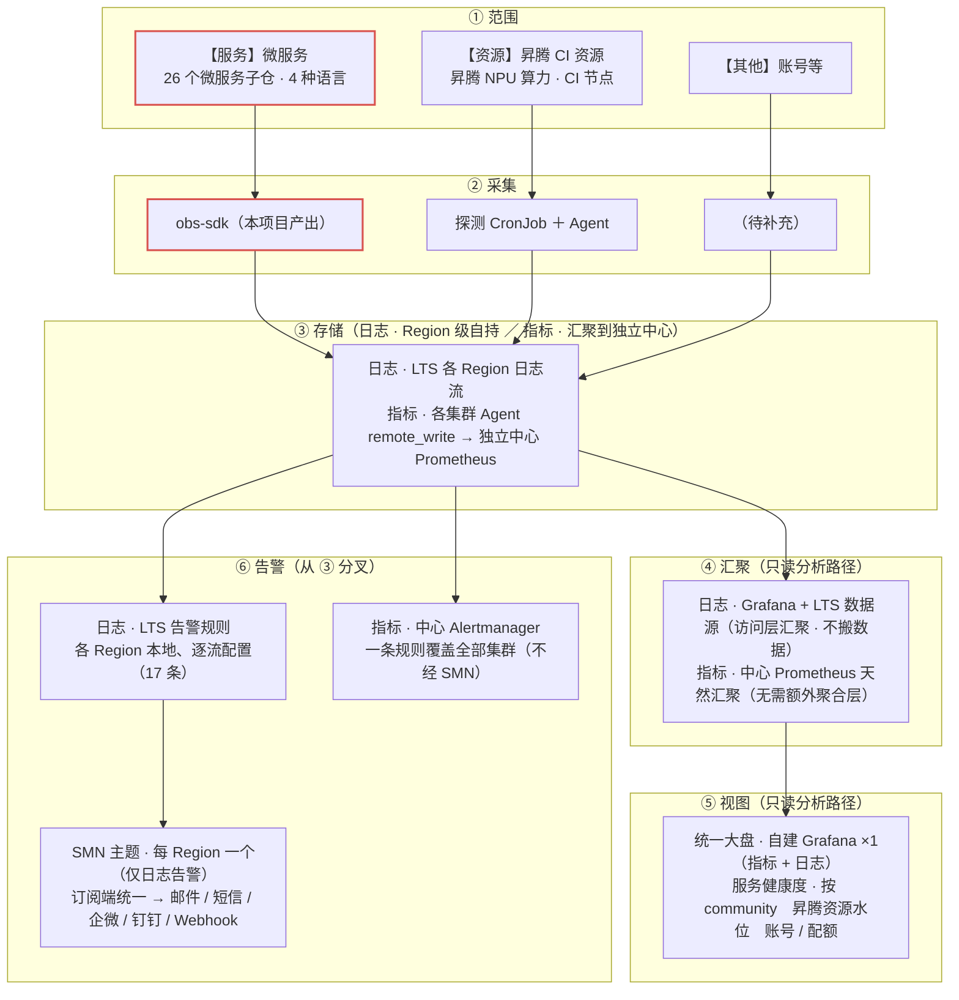
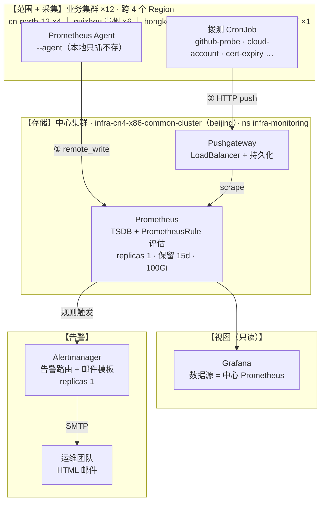
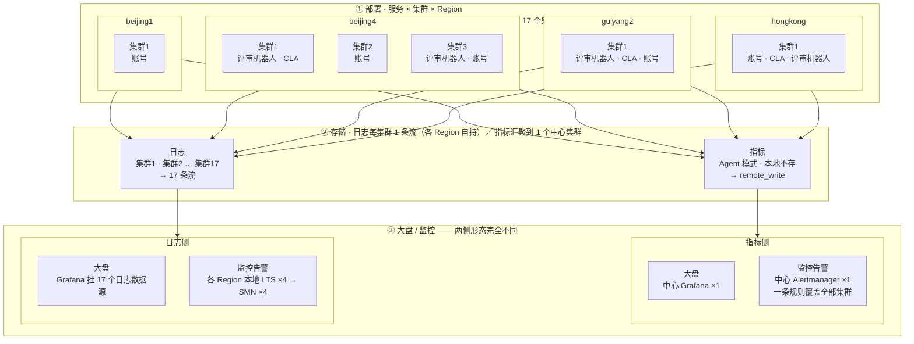
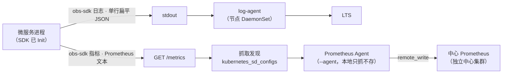
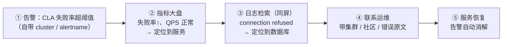

# 微服务可观测性建设技术设计

> 需求：[opensourceways/backlog#1938](https://github.com/opensourceways/backlog/issues/1938)
> 子任务 A（SDK 与试点）：[#2061](https://github.com/opensourceways/backlog/issues/2061) · B（底座与大屏告警）：[#2062](https://github.com/opensourceways/backlog/issues/2062) · C（全量铺开与验收）：[#2063](https://github.com/opensourceways/backlog/issues/2063)
> 契约与 SDK 实现仓：[opensourceways/obs-sdk](https://github.com/opensourceways/obs-sdk)

---

## 1. 背景

### 1.1 问题

基础设施团队维护的重点微服务缺乏统一可观测能力，故障定位靠人工登录机器翻日志，排障链路长、效率低，服务健康度不可见。

各社区另缺一个**统一的服务健康度大盘**（形态可对齐 [GitHub Status](https://www.githubstatus.com/)）：社区用户与运维无法一眼看到整体与各组件（如评审机器人、账号、CLA 等）是否正常、异常落在哪一段？

### 1.2 覆盖范围

以 2025-05-01 ~ 2025-07-31 三个月有 PR 合入的活跃服务为全集，剔除纯配置/部署仓、umbrella 大仓、框架库/工具仓、前端 website 仓后，保留 **15 个大仓 / 26 个微服务子仓 / 390 个合入 PR**。

语言分布不统一：Go 7 · Java 6 · Python 8（+3 待评估）· Node 1 · 编排仓 1。

### 1.3 现状基线

| 能力 | 现状 | 结论 |
| --- | --- | --- |
| 硬件级指标（CPU/内存/磁盘/网络） | 已由华为云 CCE 云原生监控插件（node-exporter / kube-state-metrics）+ icagent 上报控制台 | **复用，不建设** |
| 日志采集管道 | log-agent 插件（fluent-bit / otel-collector）已部署，全局规则 `default-stdout`（`allContainers: true`）采集所有 ns 容器 stdout | **复用，不建设** |
| 日志内容 | 已进 LTS 可全文检索，但**无结构化裸文本、无统一业务字段**（service / level / request_id 不保证、命名不统一） | **建设点：结构化 + 字段统一** |
| 业务指标 | 26 个微服务均未暴露 / 接入 `/metrics`；Prometheus 仅采系统组件 | **建设点：从零接入** |
| 告警 | 无 PrometheusRule、无 Alertmanager | **建设点：从零接入** |
| 监控大盘（对内指标视图） | 无业务级大盘 | **建设点：从零接入** |
| 服务健康度大盘（对外状态视图） | 无，各社区无统一入口，整体/组件级健康度不可见 | **建设点：从零接入** |

### 1.4 关键约束

1. **多语言**：4 种语言、框架不统一（Gin / Spring Boot / Django / FastAPI / Flask / 上游开源项目），不能用单一语言的方案覆盖。
2. **多社区、多 Region**：26 服务 prod 跨 **4 个 Region**（香港 / 北京一 / 北京四 / 贵阳二，约 17 个集群）。同一逻辑服务可能按社区拆成多套独立部署（如 `robot-universal-review` 在 **10 个社区 / 7 个集群**各有一套），需要能按社区维度切片查看健康度。
3. **不能自研 instrumentation**：各语言日志/指标生态成熟，自研只会带来维护负担与生态割裂。

---

## 2. 目标

### 2.1 建设目标

| # | 目标 | 对应验收标准 |
| --- | --- | --- |
| G1 | 26 个微服务暴露 `/metrics`（QPS / 错误率 / 业务自定义指标）并接入 Prometheus | 验收 2 |
| G2 | 26 个微服务日志统一输出**结构化 JSON**（含 service / level / community / request_id 等契约字段）到 stdout，经现有 log-agent 进 LTS，支持按 service / level / community / request_id 检索 | 验收 3 |
| G3 | 建立业务级监控大盘，重点服务健康度集中可见，**支持按 community 维度过滤/分组** | 验收 4 |
| G4 | 关键服务配置告警规则（高错误率 / 宕机 / 资源超阈值）并打通通知到负责人 | 验收 5 |
| G5 | 硬件级指标复用云上，不重复建设 | 验收 1 |
| G6 | 建立**社区健康度大盘**（对外状态页），按社区聚合展示重点组件（评审机器人 / 账号 / CLA 等）的健康度 | **验收 6** |

**目标达成后，落到具体的人身上是这样两件事**（完整处理路径见 §4.10.1 / §4.10.2）：

| 视角 | 场景 | 目标态下 |
| --- | --- | --- |
| **用户** | MindSpore 社区评审机器人不响应 | 查**社区健康度大盘**即知是机器人侧异常、落在哪一个社区——**不盲猜、不逐个私聊研发** |
| **研发** | CLA 签署失败（`app-cla-server`） | **告警先于用户报障**（自带 `cluster`）→ 指标大盘确认是服务自身异常 → 同屏日志检索定位到数据库 → 带证据转运维处理 |

### 2.2 设计原则（方案阶段已定）

1. **薄封装，不自研 instrumentation**。每语言 1 个薄 SDK，内部引用各语言官方库（Go→`client_golang`、Python→`prometheus-client`、Java→`micrometer`+Actuator、Node→`prom-client`），SDK 只做装配：中间件挂载 + 通用字段注入 + 命名对齐 + 一行初始化。
2. **契约先行**。跨语言统一的日志 schema、通用字段、指标命名规范收敛到单一仓库的 `spec/` 目录，是唯一事实来源；四语言实现与 spec 不一致时以 spec 为准。
3. **log 与 metrics 同仓不同 package**，不拆成两个库。
4. **单仓 monorepo**：`opensourceways/obs-sdk`，顶层 `spec/` + `go/ python/ java/ node/`，各语言子目录自管版本。
5. **首期只做 log + metrics，不含 trace**。`trace_id` / `span_id` 作为**预留注入位**存在（字段可写可透传、有值才输出），二期接入 OTel 时零日志格式返工。
6. **Go SDK 独立成库，不放进 robot-framework-lib** —— 后者是机器人领域框架，SDK 需领域中立以服务 24 个非机器人服务。

---

## 3. 整体架构

### 3.1 范围与分层视图

基础设施可观测建设整体分**三块**




**本方案在底座上的四点定位**：

1. **日志 —— 复用，不新建**：继续用各集群**现有的日志流**（CCE 云原生日志采集插件为每集群建的 `k8s-log-*` 组），本方案只改**日志的内容格式**（结构化 JSON + 契约字段），**不动采集管道**。
2. **指标 —— 新建**：26 个服务目前均未暴露 `/metrics`，需从零接入；存储侧**自建 Prometheus 实例**（独立中心集群，见 §4.7），不走华为云托管。
3. **大盘 —— 自建 Grafana**：**一个**实例同时挂中心 Prometheus（指标）+ 17 个日志数据源（日志），见 §4.7.4 / §4.6.4。
4. **已有现成闭环可参照**：**昇腾 CI 资源块**已跑通 **多集群 CronJob + Agent 上报 → 中心 Prometheus 存储 → Grafana 大盘 + Alertmanager 告警 → 邮件接收** 的完整链路，本方案的**指标侧与之同构**（架构图见 §3.1.1，参数对照见 §4.7.2）。

#### 3.1.1 形态先例：昇腾 CI 资源块**现有**架构

> ⚠️ 本图描述的是**已跑通的存量系统**（`ascend-ci-deployment` 仓 `monitoring/`），**不是本方案要建的东西**。本方案建成后的形态见 §3.2。



**图的读法（三层，自上而下）**：

| 层 | 内容 | 与下层的连接 |
| --- | --- | --- |
| **上层 · 范围 + 采集** | 业务集群里的两类采集者——Agent（拉）与拨测 CronJob（推） | 各自把数据送进中层 |
| **中层 · 存储** | 中心集群的 Pushgateway + Prometheus | 存入中心后，**只读地**分出左右两条 |
| **下层 · 视图 ／ 告警** | **左：视图**（Grafana）；**右：告警**（Alertmanager → 邮件） | 两条**并列、互不依赖**——Grafana 挂了不影响告警（§4.7.4） |

**两条上报路径**是本图的关键，也是本方案要复用的形态：

| 路径 | 机制 | 数据来源 |
| --- | --- | --- |
| **① 采集** | 各集群 **Prometheus Agent**（`--agent`，本地只抓不存）`scrape` 后 `remote_write` 到中心 | 系统 / 基础设施指标（kube-state-metrics、node-exporter） |
| **② 拨测** | 各集群 **CronJob** 跑探测脚本，产出的指标 **push 到中心 Pushgateway**，再由中心 Prometheus `scrape` | 服务进程之外的东西：外部 API 可达性、云账号余额、证书有效期、共享盘 |

### 3.2 部署与流程视图



本项目的部署形态可先记住三个数：**26 个微服务子仓（4 种语言）→ 17 个 CCE 集群（4 个 Region）→ 上报 17 条日志流 + 1 个中心指标集群**。

第一个数会**放大**：**26 仓 ≠ 26 个部署实例**，同一逻辑服务按社区拆成多套——`robot-universal-review` 一个仓就有 **16 套部署**（生产 10 社区 / 7 集群），所以实际 Pod 实例数远多于 26。

**两侧的上报粒度完全不同**：日志侧**每集群 1 个日志组**（共 17 个，各 Region 自持，见 §4.6）；指标侧**17 个集群的 Agent `remote_write` 汇聚到 1 个独立中心 Prometheus**（见 §4.7）。告警路径自存储层分叉：**指标告警在中心 Alertmanager 统一（一条规则覆盖全部集群）**，**日志告警仍逐 Region 本地 LTS 配置 → SMN**（LTS 无跨流查询，见 §4.6）。**该结构与 §3.1 一致，本图不重复展开。**

**服务侧的接入形态**（每个 Pod 内）：




### 3.3 底座选型（方案阶段已确认）

| 能力 | 选型 | 说明 |
| --- | --- | --- |
| 日志存储 | **LTS**——**日志组按集群划分：每集群 1 个 `k8s-log-{集群ID}`，共 17 个** | 不自建 ES；容器日志写入 `stdout-{集群ID}` 日志流。**各 Region 自持，无跨日志组检索能力**（该限制决定了下方的日志告警形态） |
| 指标存储 | **自建中心 Prometheus**（**手写 Helm chart，不用 Operator**）：17 集群 Agent（`--agent`，只抓不存）`remote_write` 汇聚到**1 个中心实例** | 不自研 SDK，**但自建底座**——理由与形态见 **§4.7**。原「AOM Prometheus for CCE」路线**已弃用**（官方确认多实例聚合不支持跨 Region） |
| 日志大盘 | **自建 Grafana（同一实例）挂 LTS 日志数据源 ×17** | 与指标大盘同屏、**跨账号免多登**（§4.6.4）。✅ **接入日志流已确认可行**（2026-09-14 华为云，前提是流已结构化） |
| 指标大盘 | **自建 Grafana（1 个实例）挂中心 Prometheus**。**独立 Deployment、与中心 Prometheus 同集群**（§4.7.4） | 替代原「AOM 托管 Grafana ×4」——一个实例即可覆盖全部 17 集群（§4.7.4 / §4.6.4）。**只做看板，不进告警链路**（见下行注释） |
| 日志告警 | **各 Region 本地 LTS 内逐流配置（17 条）**，出口经 SMN 统一到订阅端 | 因 LTS **无跨流查询**，一条规则无法绑定多个日志流，**明确接受「无跨集群联合告警」**。**SMN 仅日志告警仍用**（Region 级资源），「统一」落在各 Region 主题**订阅同一接收端**，而非同一主题 |
| 指标告警 | **统一在中心 Alertmanager**（一条规则覆盖全部 17 集群） | 指标侧不再逐 Region 各配；`group_by: [cluster, alertname]` 区分来源 |

**为什么指标告警统一、日志告警仍散**——两条链路能力不同，不是取舍不一致：

1. **指标侧已统一**：数据经 `remote_write` 汇入中心 Prometheus，**告警规则天然覆盖全部 17 集群**，一条规则即可（`group_by: [cluster, alertname]` 区分来源）。这是自建中心相对 AOM 路线的主要收益之一（§4.7.3）；
2. **日志侧统一不了**：LTS **没有跨日志组 / 流的检索能力**，一条告警规则无法绑定多个日志流——该限制已与华为云团队确认。因此日志规则只能**逐流在本地 LTS 内配置（17 条）**，且**跨集群联合条件写不出来**（如「某服务在所有社区的某类失败总数」）；
3. **日志告警出口仍是 SMN**：**SMN 主题是 Region 级资源**（URN 形如 `urn:smn:<region>:<project-id>:<topic>`），故「统一」不在同一个主题，而在**各 Region 主题订阅同一接收端**（邮件组 / 统一 webhook 接收服务）。

### 3.4 贯穿维度：community

`community` 是本次建设的**核心维度**——支撑「按社区查看单服务健康度」。它在日志字段与指标 label 上语义一致，采用**双层注入**：

| 层 | 场景 | 取值来源 | 日志表现 | 指标表现 |
| --- | --- | --- | --- | --- |
| **部署级默认**（静态） | 服务按社区拆实例（每实例只服务一个社区） | Init 注入：`OBS_COMMUNITY` 环境变量或显式参数 | 进程内所有日志的常驻字段 | 所有时间序列的常驻 const label |
| **请求级覆盖**（动态） | 中心化单实例服务多社区（靠路由/鉴权识别归属） | 请求上下文，由 SDK 从 context 读取 | 该请求关联日志的字段值 | 该请求打点的 series 的 label 值 |

---

## 4. 详细设计

### 4.1 契约层（`spec/`）

契约层是本次建设的**技术核心**：它把「多语言输出形态一致」这件事从「靠人自觉」变成「有据可查、可校验」。

#### 4.1.1 日志格式（`spec/log-format.md`）

**输出形态**：每行一条日志，单行 JSON（不 pretty、不换行），UTF-8 写 stdout。

**顶层字段与顺序**：

| 字段 | 必填 | 说明 |
| --- | --- | --- |
| `time` | 是 | RFC 3339 UTC，**固定毫秒精度（3 位小数）**，以 `Z` 结尾 |
| `level` | 是 | 小写枚举 `debug` / `info` / `warn` / `error` |
| `msg` | 是 | 人类可读的**常量短语** |
| `service` | 是 | 服务名（= service.yaml 的服务名） |
| `env` | 是 | `prod` / `test` / `preview` / `staging` |
| `instance` | 是 | 实例标识（k8s pod 名 / hostname） |
| `community` | 是 | 社区标识（部署级默认 + 请求级覆盖） |
| `request_id` | 否 | 单请求关联 ID |
| `trace_id` | 否（预留） | 二期 trace 接入前恒空/省略 |
| `span_id` | 否（预留） | 二期 trace 接入前恒空/省略 |
| `logger` | 否 | 调用位置 `文件:行号`（调试定位） |
| `error` | 否 | 错误信息；有异常上下文的语言可含完整 traceback |
| 其余 | 否 | 业务字段**平铺在顶层**，`snake_case`，禁止嵌套对象 |

**两条关键传参约束**：

1. **`msg` 必须是常量短语，禁止 printf 风格**（`log.Errorf("failed for user %s", uid)` 违规）。所有可查询维度通过 kv 传入：`log.ErrorContext(ctx, "get account failed", "user_id", uid, "error", err)`。
   *理由*：`msg` 一旦嵌值，同一事件每行都不同 → LTS 无法按 `msg` 聚合计数，日志告警规则**静默失效**；改文案即破坏已配置的检索。四语言 SDK **只提供 kv 形式，无 printf 变体**。
2. **业务字段扁平**，不允许嵌套对象。嵌套会给 LTS 侧字段提取带来歧义。

> `error` 字段**不适合聚合**（取值逐次不同，Python 等语言还含 traceback）。按错误类型聚合请用 `msg` 常量 + 业务字段（如 `error_code`）。

#### 4.1.2 通用字段（`spec/common-fields.md`）

7 个通用字段的来源与注入优先级：

| 字段 | 注入层级 | 静态/动态 | 环境变量 | 内置默认 |
| --- | --- | --- | --- | --- |
| `service` | Init（进程级） | 静态 | `OBS_SERVICE` | `unknown` |
| `env` | Init（进程级） | 静态 | `OBS_ENV` | `unknown` |
| `instance` | Init（进程级） | 静态 | `OBS_INSTANCE` | **hostname** |
| `community` | Init + 请求上下文 | 双态 | `OBS_COMMUNITY` | `unknown` |
| `request_id` | 请求上下文 | 动态 | — | 无 |
| `trace_id` | 请求上下文（预留） | 动态/预留 | — | 无 |
| `span_id` | 请求上下文（预留） | 动态/预留 | — | 无 |

取值优先级：**SDK Init 显式参数 > 部署环境变量 > 内置默认**。
变量名统一 `OBS_*` 前缀，四语言读同一套变量名，保证部署模板（helm values）不因语言而异。

**`request_id` 注入策略**：可信入站头（如 `X-Request-Id`，**在服务已校验可信时**）> 中间件自动生成（UUID）> 无。出站调用应向下游传播，保证全链路同 ID。

#### 4.1.3 指标格式（`spec/metrics-format.md`）

- **命名**：全小写 `snake_case`，单位后缀遵循 Prometheus 约定（`_total` / `_seconds` / `_bytes`）。
  - 业务指标强制前缀 `<service>_`（服务短名）。例：`review_http_requests_total`。
  - 共享中间件公共指标**不加任何前缀**（不按 service 名开头，也不加 SDK 保留前缀——同一条 series 已带 `service` label，查询按 label 过滤）。例：`http_server_requests_total`。
- **通用 label 集**（每条 series 必须带）：`service` / `env` / `instance` / `community`。
  - 前三个是 const label；**`community` 是唯一可动态的公共 label**。
- **community 双层注入的指标实现**：对需要区分社区的指标，注册时把 `community` 声明为**普通可变 label**（service/env/instance 仍作 const label），打点时由 SDK 从上下文取覆盖值。**注册一次，单社区场景填默认值、多社区场景填覆盖值，两用。**
- **高基数禁令**：`request_id` / `trace_id` / `span_id` / PR number / commit sha 等**禁止**作 label，会撑爆时序基数。
- **暴露**：每服务一个 `/metrics` 端点，HTTP `GET`，Prometheus text format。

#### 4.1.4 community 枚举（`spec/community-values.md`）

18 个社区：`Ascend · BoostKit · CANN · Common · HiFloat · HPCKit · Infrastructure · Merlin · MindSpore · openEuler · OpenFuyao · openGauss · OpenJiuwen · openLookeng · OpenPangu · OpenUBMC · UnifiedBus · Xihe`。
权威来源是 `infrastructure` 仓 `service.yaml` 的 `communities` 段，随上游刷新。

---

### 4.2 四语言 SDK

#### 4.2.1 语言 × 能力矩阵

| 能力 | Go（`go/`） | Python（`python/`） | Java（`java/`） | Node（`node/`） |
| --- | --- | --- | --- | --- |
| 模块/包名 | `github.com/opensourceways/obs-sdk/go` | `obs-sdk-python` | `obs-sdk-java` | `obs-sdk-node` |
| log 底层 | stdlib `log/slog` + 自研 Handler | stdlib `logging` + 自定 JSON Formatter | logback + logstash JSON encoder | 自定 JSON serializer |
| metrics 底层 | `client_golang` | `prometheus-client` | `micrometer` + Prometheus registry | `prom-client` |
| Init | `log.Init(cfg)` / `metrics.New(cfg)` | `log.init(...)` / `metrics.init(...)` | `ObsLogging.init(cfg)` / `ObsMetrics.of(cfg)` | `log.init(opts)` / `new Metrics(opts)` |
| 请求上下文 | `sdkctx`（`context.Context`） | `_context`（contextvars） | `RequestContext`（MDC + ThreadLocal） | `context`（AsyncLocalStorage） |
| 中间件 | `middleware`（net/http）+ `ginmw`（gin） | `fastapi_wrap` / `flask_middleware` / `DjangoMiddleware` | `ObsFilter`（Servlet Filter） | `makeMiddleware`（express） |
| 服务端指标 | `http_server_*`（中间件） | 同上 | 走 Actuator + Micrometer 官方 server instrumentation（不重复埋点） | `http_server_*`（中间件） |
| UT 数量 | 31 | 15 | 19 | 10 |
| 已发版 | ✅ `go/v1.0.0` | ❌ 版本号 `0.1.0`，未打 tag | ❌ 版本号 `0.1.0`，未打 tag | ❌ 版本号 `0.1.0`，未打 tag |
| CI | `go vet` + `go test` | `pytest`（Py3.10） | `mvn test`（JDK 17） | `npm test`（Node 20） |

#### 4.2.2 Go SDK 设计要点

```go
// 启动时 Init 一次，之后全进程用包级函数（形状对齐 kratos v3，无需在每个调用点绑定 logger）
obslog.Init(obslog.Config{Service: "review", Community: "openeuler"})

// 日志：msg 常量 + kv 交替（禁止 printf）
obslog.Info("job done", "event", "release", "issue", "2061")
obslog.ErrorContext(ctx, "get account failed", "user_id", uid, "error", err) // ctx 里请求字段自动附加

// 指标：注册一次；community label 自动排首位，取请求覆盖或回退默认
m := obsmetrics.New(obsmetrics.Config{Service: "review"})
built := m.NewCounterVec("built_releases", "发布的构建数", "kind")
built.IncWithContext(ctx, "tag")

// 中间件
h := obshttpmw.New(obshttpmw.Options{Metrics: m, ResolveCommunity: fn}).Then(myHandler)
```

关键实现选择：
- **自定义 slog Handler** 而非第三方库：直接控制字段、顺序、时间格式，且无需引入额外依赖。
- **手工构造 `slog.Record` 并控制 `runtime.Callers` skip**，让 `logger` 字段指向业务调用点而非 SDK 内部包装函数。
- 包级 API 形状对齐主流生态（`log/slog`、kratos v3），降低接入心智负担。

#### 4.2.3 Java SDK 设计要点

Java 侧有一个**非显然的坑**，必须在接入文档里强调：

> 日志 JSON 输出**必须**用 `java/examples/logback-json.xml`，它只挂 SDK 的 `ObsJsonProvider`。**不要退回 encoder 自带的 provider** —— `<logLevel/>` 只能输出大写、字段名不可配、且不配 `<stackTrace/>` 会整条丢弃 throwable。

即：Java 的字段名/顺序/时间格式/级别小写/异常堆栈**由 SDK 的 provider 保证**，不能靠 logstash encoder 的配置凑。

Java 的**服务端指标不重复埋点**——走 Spring Boot Actuator + Micrometer 官方 server instrumentation，把 `m.meterRegistry()` 暴露成 bean 由 Actuator 托管。

#### 4.2.4 已知实现问题（需修复）

| 问题 | 影响 | 位置 |
| --- | --- | --- |
| Java `fromEnvironment()` **无任何兜底**：只读 `OBS_*`，未设置时为 `null`，而 provider 对空值「省略该键」 | `service` / `env` / `instance` / `community` 四个**必填**字段在未注入环境变量时**整个 Key 不出现**，违反契约。Go / Python / Node 均回退到 `unknown`（`instance` 回退 hostname） | `java/.../ObsSdkConfig.java:41` |
| Python / Node / Java 未打 tag | 消费方无法按版本引用 | 各语言子目录 |

---

### 4.3 服务接入模式（按语言）

#### 4.3.1 Go 服务（7 个）

`app-cla-server` / `cve-sa-backend` / `cve-manager-ng` / `robot-universal-label` / `review` / `repo-watcher` / `welcome`

```go
obslog.Init(obslog.Config{Service: "<name>"})
m := obsmetrics.New(obsmetrics.Config{Service: "<name>"})

// HTTP 服务端：gin 用 ginmw，net/http 用 obshttpmw.New(...).Then(handler)
r.Use(ginmw.Middleware(ginmw.Options{Metrics: m}))
r.GET("/metrics", gin.WrapH(m.Handler()))

// 指标：基础名注册，community label 由 SDK 自动补、排首位
prHandled := m.NewCounterVec("pr_handled", "处理的 PR 事件数", "action")

// 请求内：community 在可信判定点解析后覆盖，request_id 注入
ctx = sdkctx.WithCommunity(ctx, "openEuler")
ctx = sdkctx.WithRequestID(ctx, "req-123")
obslog.InfoContext(ctx, "handle request", "repo", repo)
prHandled.IncWithContext(ctx, "opened")
```

#### 4.3.2 Java 服务（6 个）

`EasySearch` / `EasySearchImport` / `om-webserver` / `certification-server` / `easysoftware-autoupgrade` / `APIMagic`，均 Spring Boot 3.x：

```java
ObsSdkConfig cfg = ObsSdkConfig.fromEnvironment();   // 读 OBS_*
ObsLogging.init(cfg);                                // 部署级字段写入 MDC
ObsMetrics m = ObsMetrics.of(cfg);                   // meterRegistry() 暴露为 bean，交 Actuator 托管

log.info("job done");                                // SLF4J 输出走 logback-json.xml（挂 ObsJsonProvider）

// 请求内：可信判定点解析 community 后 push
try (RequestContext.Scope s = RequestContext.push("openEuler", "req-123", null)) {
    m.counter("pr_handled", "处理的 PR 事件数", "action").inc("opened");
}
```

`logback-json.xml` 见 [java/examples/logback-json.xml](../java/examples/logback-json.xml)；`/metrics` 由 Actuator 暴露（打开 `prometheus` endpoint），不重复埋服务端指标。

#### 4.3.3 Python 服务（11 个）

```python
from obs_sdk import log, metrics, _context
from obs_sdk.middleware import fastapi_wrap          # Flask: flask_middleware；Django: DjangoMiddleware

log.init(service="<name>")                           # env/community 由 SDK 读 OBS_*，进程内幂等
metrics.init(service="<name>")
fastapi_wrap(app, resolver=resolve_community)        # 注入 request_id + 可信判定点解析 community + 记 http_server_*

logger = log.get_logger(__name__)
logger.info("job done", extra={"event": "release", "issue": "2061"})

with _context.bind(community="openEuler", request_id="req-123"):
    metrics.counter("pr_handled", "处理的 PR 事件数", ["action"]).inc(1, action="opened")
```

`/metrics` 暴露：`return Response(content=metrics.generate_text(), media_type=metrics.content_type())`。

适配器按框架分三类：Django×3（meeting-center / meeting-platform / app-meeting-server）、FastAPI×4（oss-map / robot-issue-manage / hotopic-data-clean / om-dataarts）、Flask×1（forum-reply-robot）。**另 3 个非标准框架无现成适配器，需单独方案**：mailman（GNU Mailman）、copr_docker（Fedora COPR）、hotopic-mining（脚本/包型）。

#### 4.3.4 Node 服务（1 个）

`etherpad-lite` 是**上游开源项目**（Etherpad，Express + Socket.IO）。接入需注意与上游代码保持可合并性，改造面要尽量小。

#### 4.3.5 不直接接入

`meeting-server` 是编排/部署型子仓（Shell + Go Template），由旗下子服务（app-meeting-server / meeting-center / meeting-platform）覆盖。

---

### 4.5 部署侧字段注入

日志/指标要带上 `env` 和 `community`，必须由部署侧注入（pod 内无免费信号可推）：

- `instance` **不用注入** —— SDK 默认取 hostname（k8s 下 = pod 名）。
- `service` **不用注入** —— 编译期常量，代码 `Init` 里写死。
- **`env` / `community` 必须注入** —— 无法从 pod 名、namespace、节点名、镜像 tag 推导。
  - namespace 推不出：`openEuler` 的 prod-02 与 test 都叫 `robot-openeuler`；`OpenUBMC` 的 prod 与 test 都叫 `robot-openubmc`。
  - 集群名推不出：它是 ArgoCD 规范名，**pod 内无法自省**。

**注入方式**：在 `opensourceways/helm-chart-value` 各部署目录的 `values.yaml` 里，给对应 deployment 加：

```yaml
    env:
      - name: OBS_ENV
        value: prod
      - name: OBS_COMMUNITY
        value: ascend
```

（chart 已支持 env 透传，同文件 `sync-bot` 在用同款写法。）

**值域口径**：
- `community` **统一小写**（依据 `spec/community-values.md`；四语言 SDK 都不做大小写归一，注入值即最终形态）。
- `env` 需 `prod*` → `prod` 的映射（service.yaml 里存在 `prod-github`、`prod-02` 等，不在契约枚举内）。

**范围（以 `robot-universal-review` 为例）**：需改 **12 个部署目录**（不是 10 个——Common 与 Ascend 各有两套部署，同社区同值）。生成脚本要**按部署目录迭代，不能按社区迭代**。


---

### 4.6 日志链路

日志侧**复用现有底座，不新建**：采集管道沿用 CCE 云原生日志采集插件，存储沿用 LTS。本方案只改**日志的内容格式**（结构化 JSON + 契约字段），不动采集管道。

#### 4.6.1 日志采集

**形态**：复用 CCE 云原生日志采集插件（`log-agent`，基于 fluent-bit，节点 DaemonSet）。集群级 `default-stdout` 策略已覆盖**全 ns 全容器 stdout**，铺开**无需新增采集策略**——服务只要写 stdout 就进 LTS。

#### 4.6.2 日志存储

**形态：LTS，各 Region 自持**，不自建 ES。日志组按集群划分，每集群 1 个 `k8s-log-{集群ID}`，容器日志写入 `stdout-{集群ID}` 流——**共 17 组 / 17 流**。

**⚠️ LTS 无「跨日志组检索」**：搜索、快速查询及其列表的 API 全部以 `groups/{group_id}/topics/{topic_id}` 限定在**单个日志组 / 流**内，控制台也是逐组进入详情页。统一入口只能靠 Grafana 多数据源拼装。

**结构化解析**：只针对 **obs-sdk 契约格式**配 **JSON 规则**。

**容量口径**：单流 **100 MB/s** 为**软限制**（官方标 `Not mandatory`，超限不是拒绝写入，而是**不保证 QoS / 可能丢日志**，且**无补发语义**）；另有单流 **500 次/秒**写入次数上限。⚠️ 该数字随版本变化大（旧版文档写的是 5 MB/s + 25K 条/秒），**容量规划须按各 Region 实际版本文档核，不要引用本文数字**。

**其他约束**：一个日志流只能配**一种**结构化方式（ICAgent 结构化**或**云端结构化，切换**必须先删除**原配置）；**结构化配置修改只对新写入生效**，历史数据不按新规则重新解析；云端结构化解析**消耗 LTS 算力**，官方称未来按日志量收取「日志加工流量费」。

日志读写限制：https://support.huaweicloud.com/productdesc-lts/lts-0718.html

#### 4.6.3 日志告警

**形态：仍走华为云 LTS 原生，各 Region 逐流配置（17 条）**，出口经**各 Region 的 SMN 主题** → 同一接收端（邮件组 / 统一 webhook 接收服务）。

#### 4.6.4 日志大盘

**形态：并入自建 Grafana（1 个实例），挂 LTS 数据源 ×17**（每个数据源绑一个日志流 ID，各带一套 AK/SK 凭证）。

> ✅ **硬依赖已确认（2026-09-14，华为云团队）**：**自建 Grafana 可以接入各集群的日志流**，**前提是日志流已配置结构化解析**。
> 至此日志大盘链路上的**唯一卡点就是「结构化解析」本身**：
>
> ```text
> 日志大盘能否落地  =  自建 Grafana 接入 ✅（已确认）  AND  流已结构化 ❓（唯一卡点）
> ```

**为什么用自建 Grafana 而不是 AOM 托管 Grafana ×4**：LTS 插件用 **AK/SK 认证，每个数据源可带自己的一套凭证**，所以**一个实例就能横跨 N 个华为云账号**、把 17 个日志流全挂上，**免多登**；而 AOM 托管 Grafana 是**账号级资源**，N 个账号要登录 N 次。且指标侧本就要自建 Grafana（§4.7.4），日志接进来是**边际成本近乎为零**（多配 17 个数据源）。

**面板筛选策略**：

| 面板 | `community` | `service` | 理由 |
| --- | --- | --- | --- |
| 明细 / 排障 | **必选（多选，至少 1）** | **必选（多选，至少 1）** | 排除误伤（全量采集下流里混有基础设施 / sidecar / 第三方日志）；两字段合用 ≈ **精确定位到一个部署**。**必须多选**——单选会堵死「互调服务联合排查」 |
| 聚合 / 对比 | 默认全选 | 默认全选 | 跨社区横向对比（如「某服务在所有社区的表现」）是真实需求，且结果集小 |

> **为什么日志侧必选、指标侧不强制**：**「必选筛选」本质是给「日志存储物理分裂成 17 个流」打的补丁**；指标侧存储本就聚合（§4.7.4），不需要这个药。

**已知代价（需明确接受，不是意外）**：

1. **`robot-framework-lib` 的 121 处 logrus 打点（client 88 / config 14 / interrupts 11 / framework 6 / utils 2）在大盘上不可见**——其字段集无 `community` / `service`，被必选筛选条件排除；
2. **配额 / 存储不设防**——全量落流；
3. **聚合 / 对比面板要打 17 个数据源**，加载慢，任一失败则面板残缺。

---

### 4.7 指标链路

指标侧**与日志侧相反：底座新建**。26 个服务目前均未暴露 `/metrics`，存储侧自建 Prometheus 实例，不走华为云托管。

核心结论：**弃用「AOM Prometheus for CCE + 多账号聚合」路线，改为「自建中心 Prometheus 集群」**——原路线经官方确认**不支持跨 Region 聚合**，拿不到统一大盘与统一告警。

#### 4.7.1 指标采集

**形态**：各集群部署 **Prometheus Agent**（`--agent`，**本地只抓不存**，本地只有 WAL），以 `kubernetes_sd_configs` / `static_configs` 选目标（**不依赖 ServiceMonitor CRD**）、抓各服务 `/metrics`，再 `remote_write` 到中心。形态照搬资源块（见 §4.7.2），但**独立部署、不复用其实例**——资源块 Agent 覆盖的是 CI 集群，与服务块 prod 集群基本不重叠；资源块的价值是**形态先例与配置模板**。

**⚠️ 跨 Region 链路是本方案的唯一硬门槛**（各集群 Agent → 中心）：

- 必须解决：(a) 传输加密（至少 HTTPS）；(b) 合规（生产指标数据出公网需确认）；(c) 带宽与成本。
- 候选路径：**云连接 CC**（按带宽计费、不过公网）/ **专线** / **HTTPS + 公网 EIP**。
- ⚠️ **不得照搬资源块的公网明文 HTTP**（`http://113.44.182.82:9090` + Basic Auth）。**该链路不成立则整个中心方案不成立。**

#### 4.7.2 指标存储

**形态：1 个独立中心 Prometheus 集群**（**自研手写 Helm chart，不用 Operator**，放独立中心集群）。17 个集群的 Agent 经 `remote_write` 汇入同一实例，启动参数开 `--web.enable-remote-write-receiver`。

| 项 | 决定 |
| --- | --- |
| **HA** | ⚠️ **`replicas: 2` 在这里不是 HA，是分片**——详见下方。**一期 `replicas: 1`**，靠 StatefulSet 分钟级重建 + Agent WAL 兜（RTO 必须 < 2h，超出部分永久丢失）；二期换 VictoriaMetrics（把接收端本身做成集群）。**它是单点，挂了全网指标断线** |
| **保留期** | 一期**本地存储 30d，不上 VictoriaMetrics**——先跑一两个月看真实 series 增长再定，避免过早引入额外组件 |
| **安全** | 开了 `--web.enable-remote-write-receiver` 就**拿到 basic auth 便能往中心写任意指标**。落到配置：**istio HTTPS 入口**（TLS 在网关终止，公网不出现任何明文端口）+ **`--web.config.file` 强制 basic auth**（每业务集群一个用户）+ 只放行 `POST /api/v1/write`（其余路径 404）+ 强凭据轮换。**独立集群的好处正是把风险面收敛到这一个集群上** |

**为什么 `replicas: 2` 不是 HA**（本次决策，回写自原「`replicas: 2` + pod 反亲和」的写法）：

单台 Prometheus 是**单机 TSDB**——没有分片，也没有查询期聚合。PromQL 只在**本进程内**的本地 TSDB 上执行，两个 Prometheus 实例之间互不知晓对方存在。这与 ES 的模型根本不同：ES 把索引切成 shard 分散到多节点，查询时协调节点 fan-out、各自本地执行、再 reduce/merge，所以 ES 加节点 = 加容量且**查询自动跨分片**；Prometheus 既没有「协调节点」也没有「shard」这两个抽象。

（易混点：Prometheus 语境下的 "sharding" 指的是**抓取侧**分片——用 `hashmod` relabel 把 target 分给不同实例去抓，不是存储/查询侧的分片；分完之后查询仍只能落在一台上。唯一的跨实例查询机制是 `remote_read`，但它是「显式配置 + `read_recent` 默认 false」的受限语义，不是自动 scatter-gather。生产上的标准答案是外挂 Thanos Querier / VictoriaMetrics / Mimir——它们做的正是 ES 协调节点做的事。）

**反过来说，这也解释了为什么「中心天然汇聚、无需额外聚合层」成立**：汇聚发生在**写入时**——17 个 Agent 的 `remote_write` 全推到同一个 URL，数据进库时就已经在一个 TSDB 里。**汇聚在存储时，不在查询时**，这是 Prometheus 与 ES/LTS 的本质分野。（日志侧才是 ES 式模型：物理分裂成 17 个日志流，查询时靠 Grafana 多数据源拼装，§4.6.4 的「必选筛选」正是给这个打的补丁。）

当 Agent 的 `remote_write` 只有一个 URL 时，**两个副本各自持有不完整的数据**，且不是干净的「各一半」：`remote_write` 走 HTTP keep-alive，TCP 连接被 conntrack 钉在某个 pod 上，同时 `queue_config` 的 shards 按积压动态增减并发连接——所以分布介于「某 Agent 整条流全落在一个 pod」到「大致均分」之间，**且随时间漂移**（shard 扩缩、连接回收、pod 重启都会重新洗牌）。唯一不变的是：**任一副本都不保证持有全集，且偏斜程度我们控制不了。**

后果分两层，第二层更要害：

1. **Grafana 查询抖动**：打 Service 会拿到两个不同的不完整结果。
2. **告警不可信**：两副本**各自**用自己不完整的数据独立评估规则——`rate()` / `sum()` 偏离真值；`absent()` 之类规则在缺数据的副本上**误报**；两副本的评估结果互相不一致。而中心告警「一条规则覆盖全部集群」这个收益的根基，正是它必须可信。

⚠️ **一个必须说清的边界**：**告警链路的可用性 = Prometheus 的可用性**，不是 Alertmanager 的。**规则评估在 Prometheus 里**，Prometheus 挂了就不会产生新告警——Alertmanager 的 `replicas: 2` 只保证「有告警产生时通知不丢」（它的 HA 是货真价实的，见 §4.7.3），这两件事不要混。

**要让 `replicas: 2` 真正成立，只能让每个 Agent 写两份（fan-out 到两个端点）。** 代价不止「流量翻倍」：Agent 出网流量 ×2、中心入口带宽 ×2、**磁盘 ×2**（两副本各存全量）、Agent 侧 WAL 队列 ×2。**且查询层（Thanos Querier / VictoriaMetrics）不能替代 fan-out**——单 URL + 查询层 = 无损的「分片并集」，Grafana 不抖了，但任一副本挂掉仍丢它那一半，可用性没解决。**本方案一期不走这条**：`replicas: 2` 这件事本就不该用 Prometheus 做，单机 TSDB 不是适合当「17 集群汇聚点」的形态；VictoriaMetrics 则把接收端本身做成集群（`vminsert` 无状态多副本 + `vmstorage` 按 series hash 复制 + `vmselect`），一次解决 HA、水平扩容与 >30d 保留期，故定为二期。

**二期换 VM 时的组件去留**（沉没成本只有「中心 Prometheus 本体」这一个 chart 及其 values）：

| 组件 | 二期 |
| --- | --- |
| `charts/prometheus` 本体（StatefulSet + prometheus.yml + 规则文件 + PVC） | ❌ 退役，被 `vmcluster` + `vmalert` 取代 |
| 规则文件**内容** | ✅ 复用（`vmalert` 直接读 Prometheus 格式） |
| `charts/alertmanager` | ✅ **保留**——VM 生态的告警路由仍用 Alertmanager（`vmalert` 只评估规则，分组/去重/通知仍在 Alertmanager） |
| `charts/grafana` | ✅ 保留，只改数据源 URL |
| istio VirtualService、web-config 鉴权、Vault/Secret 组织 | ✅ 原样复用，只换后端 Service 名 |
| 业务集群 Agent（`--agent`） | ✅ **完全不动**——`remote_write` 是通用协议，推给 `vminsert` 一样收 |

**为什么弃用 AOM 路线**：

| 维度 | AOM Prometheus for CCE（原路线） | 自建中心 Prometheus（现路线） |
| --- | --- | --- |
| **跨 Region 统一大盘** | ❌ 官方已确认**多实例聚合不支持跨 Region** | ✅ 天然成立（就是**一个**实例） |
| **跨 Region 统一告警** | ❌ 需逐 Region 各配一套（4 套规则） | ✅ **一条规则覆盖全部集群** |
| **跨账号** | 走华为云多账号机制 | ✅ 每个 Agent 各带一套凭证即可，**与账号归属无关** |
| **运维** | 云托管，**零运维** | ❌ **自行运维**（HA / 容量 / 升级 / 备份） |
| **网络** | 零改造 | ❌ **需打通各集群 → 中心**并解决合规 |

**取舍**：用**运维与网络成本**，换**统一大盘、统一告警前提**。

**容量粗算**（`磁盘 ≈ 保留秒数 × 每秒样本数 × 1.7 B`，按 `scrapeInterval: 60s`）：

| active series | 日增 | 30d 占用 |
| --- | --- | --- |
| 20 万 | ≈ 0.5 GB/天 | ≈ 15 GB |
| 200 万 | ≈ 4.9 GB/天 | ≈ 147 GB |

**series 数是这里唯一的未知量**，取决于 26 个服务的指标设计——**尤其不要把高基数塞进 label**（§4.1.3 铁律：`request_id` / `trace_id` / `span_id` 禁止当 label）。

#### 4.7.3 指标告警

**形态：统一在中心 Alertmanager**——数据已经汇聚，**一条规则覆盖全部 17 集群**，用 `group_by: [cluster, alertname]` 区分来源。**不经 SMN**（SMN 仅日志告警仍用）。

这是自建中心相对 AOM 路线的**主要收益之一**：原路线需逐 Region 各配一套，阈值与规则变更要多点同步、易产生配置漂移。

#### 4.7.4 指标大盘

**形态：自建 Grafana（1 个实例）挂中心 Prometheus**，**独立 Deployment、与中心 Prometheus 同集群同 ns**。

| 设计点 | 说明 |
| --- | --- |
| **「独立」的价值在生命周期解耦，不在物理位置** | 独立 Deployment 已让 Grafana 的升级 / 重启 / 回滚不碰 Prometheus，反之亦然——这是真正需要的隔离 |
| **同集群走集群内 svc 查询** | `community-prometheus.infra-monitoring-community.svc.cluster.local:9090`，零网络成本、零延迟。Grafana 是查询密集型无状态服务，离 Prometheus 越近越好 |
| **故障域与告警解耦** | 关键在**告警用 Alertmanager、不用 Grafana Alerting**——Grafana 挂了只是看不了图，**告警不受影响** |
| **不单开一个集群** | 多一份集群底座成本，还**新增一条跨集群链路**（Grafana → Prometheus） |

**两点可照抄资源块**：Grafana PVC 只要 **10Gi**（dashboard 走 ConfigMap provisioning，PVC 只存状态）；**和 Prometheus 复用同一个 istio gateway 的 ELB**。——这比「同一个 ELB、端口分开」更好：**TLS 统一在网关终止，公网不再出现任何明文端口**。

**两个 web 面合并成一个域名**（`monitoring.osinfra.cn`），按**子路径**区分：`/grafana/` 给人看大盘、`/api/v1/write` 给 Agent 写。不拆两个域名的理由有二：

1. 该 zone 的对外域名统一经**华为云 WAF**、且是**逐域名配置**的（现存域名要么 CNAME 到 `<id>.vip1.huaweicloudwaf.com`，要么 A 记录直指 WAF VIP、响应带 `Server: CloudWAF`）——**少一个域名就少一份运维申请**。
2. **istio 一个 host+gateway 只认一个 VirtualService**，两个 VS 声明同一 host **不会合并**、只会有一个生效（另一份的路由**静默 404**）。所以合并后该 host 的全部路由（含兜底 404）必须由**一个** chart 声明——本方案放在 `charts/prometheus`，`charts/grafana` 的 `istio.enabled` 保持 `false`。

代价要说清：**两个服务的公网可达性被绑在一起**（一条路由写错两个一起挂）；二期给 Agent 做源 IP 白名单（§6 R3）时失去 host 级隔离，要退到 path 级 `AuthorizationPolicy`。**Prometheus 侧不需要任何路由前缀改动**——它公网只有 `/api/v1/write` 一个路径，本身就是唯一路径；**只有 Grafana 侧**需要 `serve_from_sub_path`（见 §4.9.1）。

**面板筛选策略**：`community` **默认全选、不强制**——中心 Prometheus 存储已聚合（全部 17 集群汇入同一实例），不筛选无查询放大问题；`community` 是低基数 label，`sum by (community)` 成本可忽略。**必选会禁掉横向对比，而横向对比恰是指标大盘最有价值之处**；担心误读时在面板标题显示当前筛选值即可。

**大盘内容**：服务健康度（QPS / 错误率 / 延迟 / 资源）+ 日志检索（与 §4.6.4 同屏，跨账号免多登），支持按 `community` 过滤 / 分组。**「看」与「告警」解耦**——大盘只影响可见性，采集 / 存储 / 告警均不依赖它。

#### 4.7.5 社区大盘

这是**与内部指标大盘并列的另一个视图**，本方案需同时给出：

| | 指标大盘（§4.7.4） | 社区大盘（本节） |
| --- | --- | --- |
| **读者** | 运维 / 研发 | 社区用户 |
| **回答的问题** | **为什么坏**（QPS / 错误率 / 延迟 / 资源） | **哪块坏了**（组件是否正常、异常落在哪一段） |
| **形态** | Grafana 面板 | GitHub Status 形态的状态页 |
| **粒度** | 服务 × community × 集群 | **按社区聚合的组件级健康度** |

**目标**：一眼看到**整体与各组件**（从重点微服务中挑选，如评审机器人、账号、CLA 等）是否正常、异常落在哪一段，替代当前「靠零散告警与人肉打听拼凑判断」。

**与 Grafana 解耦**：状态页是**对外**入口，不应把内部 Grafana 直接暴露出去（多租户、安全域、可用性要求都不同）。落地形态（静态页 + 定时拉取 / 轻量服务）另议。

**待定**：

1. **组件级健康的判定口径**——几个指标、什么阈值算「异常」，需与各社区运维对齐；

---

### 4.8 Prometheus 中心集群与 Agent 搭建

指标底座要搭**两处**：一处**中心**（1 个），一处**每个业务集群**（17 个）。**两处的交付方式不同**：

- **中心（1 处）**：**3 个自研手写 Helm chart**（Prometheus / Alertmanager / Grafana），走 **ArgoCD + git path 直读**——chart 来自 `opensourceways/helm-charts` 的 `charts/*`，values 来自 `opensourceways/helm-chart-value` 的 `common/*/prod/`。**不走 SWR OCI**：那条链路靠**手动 Jenkins job** 发布、凭据只在 Jenkins 里，Git 中不可见，无法自动化。
- **业务集群 Agent（17 处）**：仍走 **kustomize + ArgoCD**——目录组织照抄资源块：`base/` 放公共清单，`config-for-<集群>/` 放该集群的 patch 与 Secret，一份 Application 对应一个集群。

#### 4.8.1 中心集群（1 处）

**位置**：**`infra-cn4-x86-common-cluster`**（北京 cn4，微服务部署最多的 Region），ns **`infra-monitoring-community`**——与 Alertmanager、Grafana（§4.9）同 ns，走集群内 DNS。

⚠️ **这里相对设计原文有一处有意的改动**：原文写「独立中心集群（**新申请**，不与任何业务集群复用）」，本次改为**复用 `infra-cn4-x86-common-cluster`**——网络、istio 网关、泛域名证书（Vault）都现成，且它是微服务部署最多的 Region。该集群**已有资源块的监控栈**，但在**另一个 ns**：

| | 资源块监控栈（ns `infra-monitoring`） | 本方案（ns `infra-monitoring-community`） |
| --- | --- | --- |
| **数据域** | CI 集群：拨测 CronJob + Pushgateway + 12 个 CI 集群 Agent | 服务块：17 个 prod 集群的微服务 `/metrics` |
| **组件** | Prometheus + Alertmanager + Pushgateway，**外加 Operator 及 8 个 `*.monitoring.coreos.com` CRD** | Prometheus + Alertmanager + Grafana，**无 Operator、无 CRD** |
| **告警出口** | 邮件：CI 拨测 / 共享盘 / 账号余额… | 邮件：微服务指标。**两者内容不重叠**——运维会收到两个来源的邮件，属预期，不是重复告警 |

**为什么独立 ns 而不是共用 `infra-monitoring`**：①两个 ArgoCD 共管同一个 Namespace 对象会互相打架——资源块那两个 Application 是 `automated: prune + selfHeal`，我们改的 label 会被它改回去；②资源块的 Prometheus 是 `type: LoadBalancer`、占着共享 ELB `8625d057-…`（就是 §4.7.1 点名的那条公网明文通道），共用 ns 还得处理端口与安全组；③独立 ns 后两套**互不管理对方对象**，**并且完全不碰资源块的 Operator 与其 CRD**——这是「不用 Operator」的又一重收益。

`community-` 前缀**不是为避重名**（不同 ns 本就不会撞），而是让运维在 `kubectl get po -A` 时一眼区分两套。

⚠️ **新增的容量约束**：同一集群里再放一套（requests 2 CPU / 8Gi + 100Gi EVS），需核实节点池与 EVS 配额（见 §6 R21）。

**组件：3 个自研手写 Helm chart，不用 Operator。**

```
charts/prometheus/      StatefulSet + Service + headless Service + ConfigMap(prometheus.yml)
                        + ConfigMap(规则) + Secret(web-config) + SA + VirtualService + Namespace
charts/alertmanager/    StatefulSet + Service + headless Service + ConfigMap(alertmanager.yml + *.tmpl)
                        + Secret(SMTP) + SA + VirtualService
charts/grafana/         Deployment + Service + PVC + ConfigMap(数据源/provider/大盘) + Secret(admin) + SA
```

⚠️ **`charts/prometheus` 的 VirtualService 声明的是合并域名 `monitoring.osinfra.cn` 的全部路由**（含面向 Grafana 的 `/grafana` 与 `/api/health`，§4.7.4），所以 `charts/grafana` **不再自带 VS**——istio 一个 host 只认一个 VS，两个 chart 各声明一份会互相抢。

**明确不做 Pushgateway**：资源块那套里有 Pushgateway，是因为它的**拨测 CronJob** 跑完即弃、指标没处挂，只能 push。本方案的服务侧都是**长驻进程、自己有 `/metrics`**，没有 push 场景，故**一期不部署**。将来若纳入 CronJob 形态的服务（跑完即弃、`/metrics` 随 pod 消失），再单独补一个 chart——它的体量很小，但届时必须先解决「多个集群的 CronJob 往同一个 Pushgateway 推」的 label 归属与去重。

**为什么不用 Operator**（本次决策）：

1. **CI 硬约束**：chart 仓的 CI 是 `ct install` 在 **kind** 上**真实安装**，而 kind **没有任何 CRD**。Operator 模式意味着 ServiceMonitor / PrometheusRule 这些 CRD 必须可被 guard 掉、空 values 下渲染 0 个对象才过——CRD 依赖是纯负担。
2. **用不上**：「声明式选目标」这个 Operator 的核心价值我们用不到——采集侧用 `kubernetes_sd_configs` 就够（§4.8.2），规则用普通 ConfigMap 挂载即可。
3. **少一层升级/兼容面**：Operator 的版本矩阵、admission webhook、CRD 升级都是额外的长期负担。

代价是 HA、配置 reload、PVC 生命周期要自己写——本方案已逐条给出对策（HA 见 §4.7.2 的 fan-out 结论；reload 用 `checksum/config` 注解触发滚动 + `--web.enable-lifecycle` 供手动 `POST /-/reload`；PVC 用 StatefulSet `volumeClaimTemplates`）。**注意这是相对 Operator 模式的一处认知迁移**：Operator 下每个副本各自跑**完整**的 scrape loop 抓同一批 target，所以副本是全量副本、只需查询层去重；改成 Agent **push** 之后，「每个副本自己抓全量」这个前提消失了——这正是 §4.7.2 那条 HA 结论的根因。

**values 关键项**：

| 关键项 | 取值 | 理由 |
| --- | --- | --- |
| `prometheus.replicaCount` | **1** | 一期不上 2——单 URL + 2 副本是分片不是 HA（§4.7.2） |
| `prometheus.image` | `.../prometheus:v3.11.3` | 镜像钉版本 |
| `prometheus.config` 里 `storage.tsdb.retention` | `{time: 30d, size: 90GB}` | **不用启动参数**——`--storage.tsdb.retention.*` 在 v3 已标 `[DEPRECATED]`，官方要求写进配置文件；`size` 兜底，100Gi 盘留余量给 WAL / compaction |
| `prometheus.config` 里 `storage.tsdb.out_of_order_time_window` | `10m` | 跨 Region 写入乱序是常态，不开会丢点。⚠️ **不是** `--enable-feature` 的值——合法值里没有 `out-of-order-ingestion`，只能走配置文件的这个键 |
| `prometheus.config` 里 `global.external_labels` | **刻意留空** | 会盖到全部业务集群的告警上，破坏 `group_by: [cluster, alertname]` |
| `prometheus.persistence` | `csi-disk` / RWO / **100Gi** | 规格按 §4.7.2 公式核算后回填（≈140 万 active series） |
| `--web.enable-remote-write-receiver` | 开启 | 接收 17 集群 Agent 的写入。⚠️ **v3 正确写法是独立 flag**；`--enable-feature=remote-write-receiver` 已删 |
| `--web.config.file` | 指向挂载进来的 `web-config.yaml` | 强制 basic auth，**每业务集群一个用户** |
| `prometheus.resources` | requests 2 / 8Gi、limits 4 / 16Gi | 与资源块对齐 |
| `alertmanager.replicaCount` | **2** | Alertmanager 的 HA 是**真的**（gossip 共享告警状态、同一告警只通知一次），故本期就上 2（§4.7.2） |
| `grafana.strategy` | `Recreate` | PVC 是 RWO，Deployment 上滚动更新会卡 Multi-Attach |

**对文档「中心组件全关」的有意偏差**：原文说 kubeStateMetrics / nodeExporter / kubeApiServer 等全关，指的是**不采集群基础设施组件**（§1.3 G5），**不等于「连自己都不采」**。本方案**保留 1 个 `prometheus` 自采 job**——接收端的健康状况全在 `prometheus_remote_storage_highest_timestamp_in_seconds` / `..._samples_in_total` / `prometheus_tsdb_storage_blocks_bytes` 上，没有它就无法回答「Agent 到底写进来了没 / 盘快满没满」，而这正是 R2 / R3 / R20 的唯一观测手段。

⚠️ **这条 job 有两个实测踩到的前提**（2026-09-18 在 `infra-cn4-x86-common-cluster` / ns `infra-monitoring-community` 验证）：

1. **指标口径**：中心是**纯接收端**、自己不发 `remote_write`，所以 `prometheus_remote_storage_samples_total` / `_failed_total` 这两个**发送侧**指标在本地**根本不存在**，不能拿它们当观测依据，只能看 `_in_total` 一族。这是「照搬发送端经验」最容易写错的一处。
2. **该 job 必须带 `basic_auth`**：`--web.config.file` 的 `basic_auth_users` 保护的是**整个 HTTP server**（`/metrics` 与 `/-/healthy` 同样在内，探针只能用 `tcpSocket` 也是同一个原因），而自采走的是普通 HTTP。不带凭据会拿 401 → `up{job="prometheus"}` 恒为 0 → 上面这些指标**一条都进不了 TSDB**。这正是「留了 job 却等于没留」的失效形态：**不报错，静默为空**——比误报更危险，因为它看起来一切正常。

**入口与安全**（§4.7.2 的安全项落到配置）：

- ⚠️ **不照搬资源块的公网明文 HTTP**——资源块当前是 `http://<EIP>:9090` + Basic Auth，而其 TLS 清单在 `kustomization.yaml` 中**被注释、标为 Phase 2**。本方案**搭建时就要上 HTTPS**（§4.7.1），不留这个尾巴。
- **复用集群现成的 istio**（`istio-system/istio-gateway-https`，已终止 TLS、泛域名证书走 Vault），由 `charts/prometheus` 的 `VirtualService` 统一声明**合并域名** `monitoring.osinfra.cn` 的全部路由：`/api/v1/write`（仅 `POST`）→ 中心 Prometheus，`/grafana` 与 `/api/health` → Grafana，**其余路径一律 404**——Prometheus 的 UI 与查询 API 不对公网暴露。选 istio 的理由：TLS 终止能力已存在且自动化，**不需要申请证书、不需要新 ELB**；`VirtualService` 天然支持精确 path 匹配，而 ELB 注解做不到。
- ⚠️ **域名本身要单独向运维申请**：该 zone **无泛解析**，对外域名统一经**华为云 WAF** 且**逐域名配置**（§4.7.4）——合并成一个域名就只申一次。证书不成问题：网关用的 `osinfra-cn-tls` 是 `*.osinfra.cn` 泛域名（DigiCert RapidSSL，SAN 含 `*.osinfra.cn` / `osinfra.cn`），任何单层子域都覆盖。
- 凭据（整个 `web-config.yaml`，含 17 个 bcrypt hash）走 **Vault → Secret 挂文件**，不进 values 明文、不进 Git。**轮换的最大优势**：`web.config.file` 是**每个 HTTP 请求都重读**的，改 Vault **即刻生效、无需 reload 或重启**；轮换顺序必须是「先加新 hash（新旧并存）→ 再逐集群改 Agent → 最后摘旧 hash」。
- ⚠️ **开了 web auth 后探针必须用 `tcpSocket`**：`--web.config.file` 的 basic auth 在 exporter-toolkit 层包裹**整个** HTTP server，`/-/healthy` / `/-/ready` 同样受保护，而 k8s 的 `httpGet` 探针无法携带凭据（prometheus/prometheus#9166）。三个 chart 一律用 `tcpSocket`。
- ⚠️ **`infra-monitoring-community` namespace 必须带 `istio-injection: disabled`**，否则 Prometheus / Grafana 会被注入 sidecar，在 STRICT mTLS 下出 gateway → pod 握手问题。`CreateNamespace=true` 建的 ns **不带这个 label**，故由 chart 渲染 Namespace 并打上 label。
- 把暴露面收敛到这一个集群，正是独立中心相对 AOM 的好处（§4.7.2）。

**规则文件**（替代 Operator 的 `PrometheusRule`）与 **Alertmanager 配置**（含邮件模板 / 接收人）也集中在中心定义，以 ConfigMap 挂载（规则体积大、变更节奏不同，单独一份 values 文件），一条规则覆盖全部 17 集群，`group_by: [cluster, alertname]` 区分来源（§4.7.3）。

#### 4.8.2 各业务集群 Agent（17 处）

**形态**：`prometheus --agent`（**本地只抓不存**，只有 WAL），`scrape` 完 `remote_write` 到中心。每个集群一套，用 `config-for-<集群>/` 打 patch 注入本集群的 `cluster` label 与写入凭据。

⚠️ **`--agent` 在 v3 是独立 flag**，**不是** `--enable-feature` 的取值——资源块那套 `--enable-feature=...` 的写法不要往这里套。

| 配置项 | 做法 |
| --- | --- |
| **采集目标** | `kubernetes_sd_configs`（按 ns / label relabel）选各服务 `/metrics`——**服务侧无需改配置，也不依赖 ServiceMonitor CRD**；基础设施指标仍复用云上，Agent 不重复抓 |
| **来源标注** | `cluster` label 是告警与大屏 `group_by` 的依据，在 Agent 侧统一打上 |
| **写入地址** | `https://monitoring.osinfra.cn/api/v1/write`（istio HTTPS 入口，与 Grafana 合用一个域名，见 §4.7.4 / §4.8.1） |
| **鉴权** | `basic_auth` + `password_file` 挂 Secret，**每集群一套凭据**——跨账号场景各带各的，与账号归属无关（§4.7.2） |
| **写入瘦身** | 用 `write_relabel_configs` drop 无用 label（资源块的做法是 drop `container` / `container_id` / `uid`）——直接省中心磁盘与跨 Region 流量 |
| **资源限制** | 常驻但轻量，按集群规模给 requests / limits |

**可照抄资源块**：`prometheus-agent-deployment.yaml`、`prometheus-agent-configmap.yaml`、RBAC / SA 清单，以及「`base/` + `config-for-*/`」的目录组织。**不可照抄**的只有写入地址与鉴权方式。

#### 4.8.3 搭建顺序

1. 中心集群起 **3 个手写 chart**（Prometheus + Alertmanager + Grafana，§4.8.1），Prometheus 开 `--web.enable-remote-write-receiver`；
2. **先把跨 Region 网络打通再铺 Agent**——它是本方案唯一硬门槛（§4.7.1），链路不通则后面全白做；
3. 选 **1 个集群**试点 Agent：验证 `remote_write` 写入、`cluster` label、带宽与容量；
4. 批量铺 17 集群（脚本化生成 kustomize 目录 / ArgoCD Application）；
5. 用实测 series 量**回填**中心磁盘规格与保留期（§4.7.2）。

---

### 4.9 Grafana 看板搭建

**形态**：**1 个** Grafana 实例，与中心 Prometheus **同集群同 ns**、**独立 Deployment**（§4.7.4）。一个实例同时挂**中心 Prometheus + 17 个 LTS 数据源**，指标大盘与日志大盘同屏（§4.6.4）。

#### 4.9.1 部署

**用 Helm chart `charts/grafana` 管**（与其他两件套同源、同交付方式，§4.8），values 在 `common/grafana/prod/`：

| 对象 | 作用 | 取值 |
| --- | --- | --- |
| `deployment.yaml` | 实例本体 | `replicas: 1`、`strategy: Recreate`（PVC 是 RWO）、`runAsNonRoot`、**镜像钉版本** |
| `pvc.yaml` | 只存 Grafana 自身状态 | **10Gi**——dashboard 走 provisioning 挂载，不占 PVC（§4.7.4）。⚠️ Deployment 用不了 `volumeClaimTemplates`，PVC 是独立对象 |
| `service.yaml` | 入口 | 集群内 Service。**本 chart 不再自带 VirtualService**——域名与 Prometheus 合并后（§4.7.4），该 host 的全部路由由 `charts/prometheus` 统一声明，此处 `istio.enabled` 保持 `false` |
| （环境变量） | 子路径 | `GF_SERVER_ROOT_URL=https://monitoring.osinfra.cn/grafana/` + `GF_SERVER_SERVE_FROM_SUB_PATH=true`。**两者必须成对**：`serve_from_sub_path` 要求 `root_url` 带同一子路径，否则静态资源与重定向会链到根路径而 404。⚠️ **探针不用跟着改**——子路径下 `/api/health` **仍在根 `/api` 下**（Grafana 的 `SubPathRedirect` 中间件对 `/api` 前缀明确豁免重定向），且探针直连容器、本就不过网关 |
| `configmap.yaml`（数据源） | 数据源 provisioning | 见 §4.9.2 |
| `configmap.yaml`（provider） | dashboard 加载器 | 从 `/var/lib/grafana/dashboards` 读；`folder: Community` |
| admin Secret | 管理员密码 | Vault → Secret 注入，不进 values |

#### 4.9.2 数据源

| 数据源 | 类型 | 接入方式 |
| --- | --- | --- |
| **中心 Prometheus** | prometheus | 集群内 DNS（`http://community-prometheus.infra-monitoring-community.svc.cluster.local:9090`）、`access: proxy`、`isDefault: true`——零网络成本、零延迟（§4.7.4）。⚠️ **必须带 `basicAuth` 凭据**：Prometheus 侧开了 `--web.config.file`（§4.8.1），读也要认证；口令走环境变量 `$PROM_BASIC_AUTH_PASSWORD` 从 Vault Secret 注入 |
| **LTS 日志流 ×17** | 华为云 LTS 插件 | **每个数据源绑一条日志流、各带一套 AK/SK**（§4.6.4）——正因为凭证是数据源级的，一个实例才能横跨 N 个账号、**免多登** |

> ⚠️ LTS 侧的前提是**日志流已配结构化解析**（§4.6.2）——该前提不成立时，数据源挂上了也查不出结构化字段。

> ⚠️ **数据源口令必须写「裸 `$VAR`」形式，不要写 `${VAR}`**。Grafana 的 provisioning 会**先替换 `${VAR}`、再做一次 `$VAR` 展开**——口令里若含 `$`（强口令几乎必然含，bcrypt hash 更是遍地 `$`），`${VAR}` 会被二次展开截断。官方文档给的例子：`PASSWORD=Pa$sw0rd` 时 `$PASSWORD` → `Pa$sw0rd`，而 `${PASSWORD}` → `Pa`。**症状是 Grafana 拿着被截断的口令去查 Prometheus，静默 401**——面板一片「no data」，日志里不显眼。

#### 4.9.3 看板

**dashboard 用代码管**：JSON 放 Git，经 `configMapGenerator` 生成 ConfigMap 挂进容器——**改看板 = 提 PR**，可 review、可回滚。资源块放了 2 块（`CI-Network-Overview` / `Pod-Network-Traffic`），本方案要做的：

| 看板 | 内容 | 依据 |
| --- | --- | --- |
| **服务健康度大盘** | QPS / 错误率 / 延迟 / 资源，按 `community` 过滤 / 分组（默认全选、不强制） | §4.7.4 |
| **日志检索** | 与指标**同屏**；`community` / `service` **必选**筛选，排除基础设施 / sidecar / 第三方日志 | §4.6.4 |
| **聚合 / 对比** | 跨社区横向对比（默认全选） | §4.6.4 |

**「看」与「告警」解耦**：Grafana 只做看板，**不进告警链路**——告警走中心 Alertmanager（§4.7.3），Grafana 挂了只是看不了图。

### 4.10 典型场景的问题处理路径

本节给出**两个端到端场景**——一个从**用户**出发，一个从**研发**出发——串起 §4.6 日志链路与 §4.7 指标链路，说明这套建设落地后**「问题怎么被发现、怎么被定位」**与今天有什么不同。

#### 4.10.1 用户视角：MindSpore 社区的评审机器人不响应

**场景**：贡献者向 MindSpore 社区提交 PR，机器人评审迟迟没有响应。

**今天**（§1.1 描述的问题）：贡献者**无法区分**三种可能——机器人挂了、PR 还在排队、还是自己的提交方式有问题。唯一的办法是到社区群里问，或**逐个私聊研发**「机器人是不是又挂了」；研发同样没有全局视图，被问到了才去登机器翻日志。

**建设后**：

| 步骤 | 动作 | 用到的建设成果 |
| --- | --- | --- |
| 1 | 打开**社区健康度大盘** | §4.7.5 社区大盘（对外状态页） |
| 2 | 看到 **MindSpore 社区的「评审机器人」组件异常**，同屏其余组件正常 | 按社区聚合的**组件级**健康度 |
| 3 | 得出结论：**是机器人侧的问题，不是自己 PR 的问题**；同时看到异常落在哪一个社区 | 状态页回答的是「**哪块坏了**」，而非「为什么坏」 |
| 4 | 按状态页指引等待或上报，**不再逐个联系研发** | — |

**收益**：把「用户盲猜 + 骚扰研发」变成「用户自助查询状态页」；研发也从「是不是挂了」这类问询中解放出来。

#### 4.10.2 研发视角：CLA 签署失败

**场景**：`app-cla-server`（§4.3.1）出现 CLA 签署失败率上升。

**今天**：只能等**用户来报障**（「签不了 CLA」）。研发拿到的是一个模糊现象，需要登机器**逐个实例 grep 日志**，且很难判断问题落在**自己的代码**还是**下游数据库**。



| 步骤 | 动作 | 用到的建设成果 |
| --- | --- | --- |
| 1 | 收到 **CLA 失败率告警**（邮件 / 统一 webhook），告警自带 `cluster` / `alertname` 标签 | §4.7.3 中心 Alertmanager，`group_by: [cluster, alertname]` |
| 2 | 打开**指标大盘**，按 `service=app-cla-server` + `community=<受影响社区>` 筛选 | §4.7.4 指标大盘（G3：支持按 community 过滤 / 分组） |
| 3 | 看到**失败率曲线抬升、QPS 与延迟正常** → 排除流量突增与上游调用，**确认是服务自身异常** | §4.2–§4.3 SDK 埋点的业务指标 |
| 4 | 同屏切到**日志检索**，沿用同一组筛选条件，看到 `error: get account from db: connection refused` → **确认故障在数据库，而非代码逻辑** | §4.6.4 日志大盘（Grafana 同实例挂 LTS ×17，免多登） |
| 5 | 带着「哪个集群 / 哪个社区 / 什么错误原文」**直接联系运维**处理 DB | — |
| 6 | 运维处理后**失败率回落、告警自动消解**，无需人工消警 | §4.7.3 告警基于实时汇聚的指标 |

**关键在第 3→4 步**：这是今天耗时最长、也最靠人肉的一段。建设后它变成**同一个 Grafana 界面内的连续下钻**——用指标定位「是哪个服务」，用日志定位「是什么原因」，且**跨社区 / 跨集群无需切换登录**（§4.6.4 的 AK/SK 多数据源）。

**本场景对 §4.6 / §4.7 的覆盖**：

| 链路 | 在本场景中的作用 |
| --- | --- |
| §4.7.1 指标采集 | 服务指标上报到中心 |
| §4.7.3 指标告警 | 失败率超阈值触发，且带 `cluster` 定位来源 |
| §4.7.4 指标大盘 | 确认「是服务异常、不是流量问题」 |
| §4.6.4 日志大盘 | 确认「异常在数据库、不是代码」 |
| §4.6.2 日志存储（结构化解析） | 日志能按 `service` / `community` 检索的**前提**（⚠️ 前提：日志流已配结构化解析） |

---

## 5. 工作量与进度

**本章已抽出独立维护：[docs/进度追踪.md](进度追踪.md)。**
工作量口径、各子任务完成状态、试点数据回填都维护在该文件，本章不再重复正文，避免两处漂移。

---

## 6. 风险与待确认

| # | 项 | 影响 | 处置 |
| --- | --- | --- | --- |
| R1 | ~~**15 天存储窗口**：AOM 指标默认存 15 天（超期按量计费）~~ → **【2026-09-14 转换】** 自建中心 Prometheus **保留期可自定**（建议 30d），不再受 15 天约束（§4.7.2） | ~~故障回溯窗口可能不足~~ **风险消除**；但**磁盘容量成为新的约束** | 按 §4.7.2 公式核算 series 量 → 定保留期与磁盘规格；>30d 需求再上 VictoriaMetrics |
| R2 | ~~ServiceMonitor 在 4 Region 的可用性~~ → **【转换 · 2026-09-14 扩容】各集群 Agent → 中心集群的采集链路、网络可达性与安全合规**未经生产验证，**这是本方案的唯一硬门槛**（§4.7.1） | 指标可能采不上——**且这次没有云托管兜底**；链路不成立则**整个指标自建方案不成立**（损失的是全部指标） | 试点阶段**最优先**确定网络方案（CC / 专线 / 公网 HTTPS）并**逐集群**验证 Agent 与 `remote_write` 连通性；同步做传输加密与源 IP 收敛。⚠️ **不得照搬资源块的公网明文 HTTP**（`http://113.44.182.82:9090`） |
| R3 | ~~自定义指标采样点计费量级未知~~ → **【转换】自建中心的容量与成本**：series 量、磁盘、**跨 Region 流量费**三项均未测算 | 26 仓铺开成本不可控（原为按量计费，现为**自建资源 + 出网流量**） | 试点阶段实测 17 集群真实 series 量后外推（§4.7.2 已给容量公式）；跨 Region 流量按所选网络方案（CC 按带宽 / 公网按流量）分别核算 |
| R5 | **Java SDK 无兜底**，未注入环境变量时 4 个必填字段整个缺失 | 违反契约，Java 服务日志字段不全 | 单独立项修复（加 hostname / `unknown` 兜底 + 补 UT，断言落在真实 JSON 输出上） |
| R6 | Python / Node / Java 未打 tag，Java 进私服路径未验证 | 消费方无法按版本引用 | 随各语言首次接入服务时一并处理 |
| R8 | Java SDK 的 logstash-logback-encoder / jackson-core 在 SDK 内为 `provided` | 接入服务运行时必须自带，否则日志不可用 | 接入文档中明确要求，或改为传递依赖 |
| R14 | **同一日志流内并存两套格式**：obs-sdk 契约行与 `robot-framework-lib` 的 logrus JSON（后者无 `service` / `env` / `community`，且 `level: fatal`、`time` 秒精度均与契约冲突）（§4.6.2） | LTS 侧的检索 / 聚合 / 告警规则要同时兼容两种格式；且**不是过渡期现象**——框架那 121 处打点会长期保留，两套格式的共存是稳态 | 明确 LTS 侧怎么处理这两套（分别配解析？云端做字段归一化？只对 obs-sdk 行做索引、logrus 行仅全文检索？）。**这一点未定之前，「结构化解析配得上」仍不成立** |
| R20 | ~~**中心集群的 HA 未验证**~~ → **【2026-09-17 已定论】单 URL + `replicas: 2` 是分片、不是 HA**：Prometheus 是单机 TSDB，两副本互不知晓、各自持不完整数据，**告警不可信**（§4.7.2） | 若按原设计上 2 副本，会得到「看似有冗余、实则规则评估各自不准」的最坏形态——`rate()` / `sum()` 偏离真值、`absent()` 误报，而**中心告警是「一条规则覆盖全部集群」这个收益的根基** | **已定论：一期 `replicas: 1`**（靠 StatefulSet 分钟级重建 + Agent WAL 兜）；`replicas: 2` 要真成立**只能靠 Agent 双端点 fan-out**（出网流量与磁盘各 ×2），本期不做。⚠️ **两副本也不得加区分性 `external_labels`**（会破坏 `group_by: [cluster, alertname]`）。二期换 VictoriaMetrics（接收端本身成集群）；换 VM 时若做副本，必须配 `-dedup.minScrapeInterval`，否则各写一份、**数据翻倍** |
| R21 | ~~**中心落在哪个集群、与资源块监控栈「共存还是替换」未定案**~~ → **【2026-09-17 已定案】中心落在 `infra-cn4-x86-common-cluster`，ns `infra-monitoring-community`；与资源块的 `infra-monitoring` 同集群、不同 ns，两套完全独立**（§4.8.1） | 剩余风险：①同一集群再放一套（requests 2 CPU / 8Gi + 100Gi EVS），**节点池与 EVS 配额未核实**；②运维会收到两个来源的告警邮件（内容不重叠，属预期） | ①实施前核实集群容量。②把两套监控的职责边界告知运维。**ArgoCD 抢管对象的冲突已消除**——两套各管各的 ns |
| R22 | ~~**`infra-cn4-x86-common-cluster` 的 AppProject `sourceRepos` 白名单不在 Git 里**（带外创建，无法从 Git 核实）~~ → **【2026-09-17 已定案】经与运维确认：三个 Application 按现有配置即可正常拉取，`helm-charts.git` / `helm-chart-value.git` 的访问不存在问题** | ~~白名单不含 `helm-charts.git` 时报 `is not permitted in project`；提交 `project.yaml` 漏写现有源会整体覆盖、打断现存 9 个 App~~ **风险消除** | **无需动作，且刻意不提交 `project.yaml`**——该 AppProject 是带外创建的真实定义，从 Git 覆盖它只会引入不一致。白名单与仓库凭据由运维侧保证 |

---

## 附录

### A. 相关链接

| 项 | 链接 |
| --- | --- |
| SDK 仓 | https://github.com/opensourceways/obs-sdk |
| 契约层 | [spec/](../spec/README.md) |
| Go 用法 | [go/README.md](../go/README.md) |
| Python 用法 | [python/README.md](../python/README.md) |
| Java 用法 | [java/README.md](../java/README.md) |
| Node 用法 | [node/README.md](../node/README.md) |
| 服务与社区映射 | https://github.com/opensourceways/infrastructure/blob/main/service.yaml |
| 试点日志 issue | [#2161](https://github.com/opensourceways/backlog/issues/2161) |
| 试点指标 issue | [#2162](https://github.com/opensourceways/backlog/issues/2162) |

### B. 术语

| 术语 | 含义 |
| --- | --- |
| **community** | 社区标识（openEuler / Ascend / MindSpore 等 18 个），本次建设的核心切片维度 |
| **部署级 vs 请求级** | 字段/label 的两种取值来源：前者是 Init 一次注入的进程常量，后者是每请求从 context 覆盖 |
| **契约层** | `spec/` 目录，四语言输出格式的唯一权威定义 |
| **薄封装** | SDK 不自研 instrumentation，只做官方库的装配与字段注入 |
| **高基数** | 取值近乎唯一（request_id、trace_id、PR number 等），不能作 metrics label |
| **log-agent** | CCE 云原生日志采集插件的旧名，基于 fluent-bit + OTel，以 DaemonSet 部署在每个节点 |
| **default-stdout** | 该插件下的集群级日志采集策略名，内容为「全 ns 全容器 stdout」，业务日志进 LTS 的通道 |
| **聚合账号** | 汇聚方账号——是**跨账号**（基于 Organizations）而非「跨区域」。原设计通过 LTS 多账号日志汇聚中心 / AOM 多账号聚合实例承接各 Region 上报的日志与指标。**【2026-09-14】该路线已弃用**：指标侧改为**自建中心 Prometheus**（§4.7，不涉及华为云多账号机制）；日志侧跨账号由**自建 Grafana 的 AK/SK 多数据源**解决（§4.6.4）。**本术语保留备查** |
| **中心指标集群** | 【2026-09-14 新增】独立部署的 Prometheus 中心集群，17 个集群的 Agent 经 `remote_write` 汇入，承载**统一指标大盘与统一告警**。形态参考资源块 `ascend-ci-deployment/monitoring`，**但独立部署、不复用其实例**（§4.7） |
| **Prometheus Agent** | `--agent` 模式，本地只抓取不存储，通过 `remote_write` 把数据推给中心——**汇聚发生在存储时，不是查询时** |
| **remote_write** | Prometheus 的远程写协议，本方案跨 Region 汇聚指标的**唯一机制**。⚠️ 资源块当前走**公网明文 HTTP**，生产不得照搬（§4.7.1） |
| **SMN** | 消息通知服务，告警的通知出口。**SMN 是 Region 级资源**；**【2026-09-14】现在仅日志告警使用**——指标告警已统一在中心 Alertmanager，不经 SMN |
